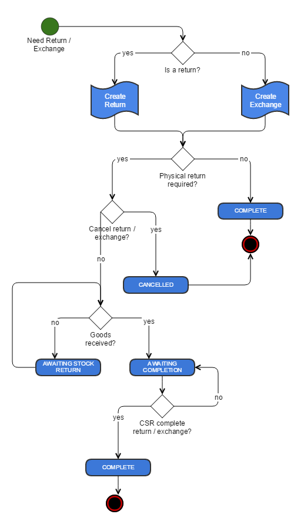

# Appendix A: Workflow Diagrams

## Order Workflow Process

| **Order Workflow State** | **Notes** |
| --- | --- |
| ORDER CREATED | Order submission was successful and is to be processed. |
| FAILED | Submitted order failed to be captured properly and so cannot be processed. |
| ON HOLD | An order can be placed On Hold at any time except if the order is already in a Complete or Partially Shipped state. When released, the order returns to its previous state. |
| CANCELLED | An order can be cancelled at any time except if the order is already in a Complete or Partially Shipped state. |
| IN PROGRESS | Order is in process of being fulfilled. |
| AWAITING EXCHANGE | Order contains items which part of exchanging items from an originating order. This order cannot progress until item from the originating order has been received. Once received the order will automatically take an In Progress state. |
| PARTIALLY SHIPPED | Orders may contain multiple shipments which each shipment being processed separately. |
| COMPLETE | Order is complete. Any further processing of items in an order would need to be managed by initiating a return or an exchange. |

## Shipment Workflow Process

## Returns and Exchanges Workflow Process

