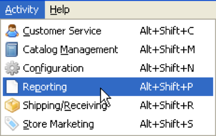
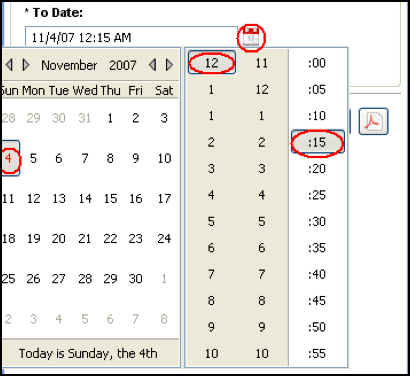
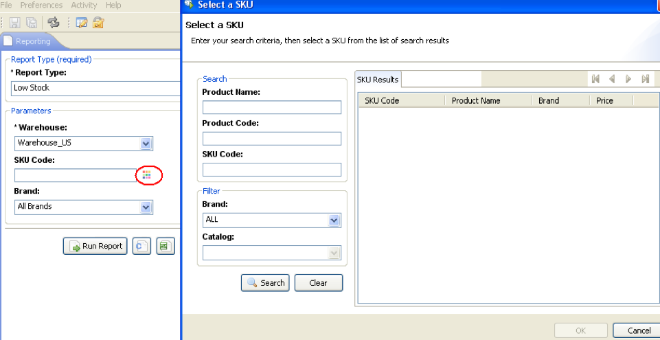

# Chapter 12: Reporting

Various reports can be generated in Elastic Path Commerce. Reports can improve the decisions of both management and front-line personnel. Reports can be generated in the Reporting Activity, accessible from the **Activity** menu.

Elastic Path Commerce uses BIRT (Business Intelligence and Reporting Tools) technology to produce reports in a variety of formats, including HTML, CSV, and PDF. Custom reports can be created and integrated to fit your specific needs. For more information, see the _Developer Guide_ at the Elastic Path documentation site (http://docs.elasticpath.com).

## Customer Registration Report

The Customer Registration report is a summary of a store&#39;s customer registrations during a particular time frame. It is useful for gauging the effectiveness of promotions targeting new customers.

**Note:**         Anonymous registrations may also be included in the summary.

1. Choose **Activity &gt; Reporting**.

2. In the _Report Type_ list, select _Customer Registration_.

3. Choose the store for which you want to generate the report.

4. Specify the date range. _From Date/Time_ is optional, but _To Date/Time_ is required.

    

5. Click **Run Report**. A new pane containing the report appears on the right.

6. (Optional) To export the report to CSV, Microsoft Excel, or PDF format, click the appropriate button.

## Gift Certificate Details Report

This report shows details about the gift certificates sold by a store in a given currency during a particular time frame.

1. Choose **Activity &gt; Reporting**.

2. In the _Report Type_ list, select _Gift Certificate Details_.

3. In the _Store_ list, select the store for which you want to generate the report.

4. In the _Currency_ list, select the currency for which you want to generate the report.

5. Specify the purchase date range. _Purchased From Date/Time_ is optional, but _To Date/Time_ is required.

    

6. Click **Run Report**. A new pane containing the report appears on the right.

7. (Optional) To export the report to CSV, Microsoft Excel, or PDF format, click the appropriate button.

## Gift Certificate Summary Report

The Gift Certificate Summary report is a summary of the gift certificates in a given currency that were sold by a store (or all stores) during a specific period of time. It can useful for calculating outstanding liabilities.

1. Choose **Activity &gt; Reporting**.

2. In the _Report Type_ list, select _Gift Certificate Summary_.

3. In the _Store_ list, select the store for which you want to generate the report, or select _All_ to generate a report for all stores.

4. In the _Currency_ list, select the currency for which you want to generate the report, or select _All_ to generate a report for all currencies.

5. Specify the purchase date range. _Purchased From Date/Time_ is optional, but _To Date/Time_ is required.

    

6. Click **Run Report**. A new pane containing the report appears on the right.

7. (Optional) To export the report to CSV, Microsoft Excel, or PDF format, click the appropriate button.

## Low Stock Report

This report helps determine the products to restock. If a certain product&#39;s Quantity on Hand is less than its Re-Order Minimum amount, it is included in this report.

The user must specify which warehouse the report is for. A brand may also be specified for further filtering; this is useful when a warehouse has to submit an order proposal to a supplier.

If a user has a specific product in mind that he wants to check for low stock levels, he may enter its SKU number at the input screen.

1. Choose **Activity &gt; Reporting**.

2. In the _Report Type_ list, select _Low Stock_.

3. Choose the warehouse you want the report for from the drop-down list.

4. If required, you can select a SKU Code and/or a brand to filter the results. Click the button next to the _SKU Code_ box to display the SKU code selector dialog box.

    

5. Click **Run Report**. A new pane containing the report appears on the right.

6. (Optional) To export the report to CSV, Microsoft Excel, or PDF format, click the appropriate button.

## Order Details Report

This report includes the same set of report parameters as the Order Summary Report and finer details on the individual orders that make up the totals.

Specify store you want the report generated for and for which subset of orders.

1. Choose **Activity &gt; Reporting**.

2. In the _Report Type_ list, select _Order Details_.

3. Enter values in the fields to specify what data the report should be generated on. Use the calendar icon to select the report&#39;s date range.

4. Click **Run Report**. A new pane containing the report appears on the right. Note that you may need to increase the size of Elastic Path Commerce to see this button.

5. (Optional.) To export the report to CSV, Microsoft Excel, or PDF format, click the appropriate button.

## Order Summary Report

This report provides an overview of a store&#39;s performance (in sales) over a particular time frame. Users may specify a range of dates for the report to summarize. By default, the report will encapsulate the sales data for just the current day.

The user may also specify different currencies for the report to be generated in, the source of the payments, and which subsets of orders (as grouped by their status) to include in the report.

1. Choose **Activity &gt; Reporting**.

2. In the _Report Type_ list, select **Order Summary**.

3. Enter values in the fields to specify what data the report should be generated on. Again, you may click the calendar icon next to the Date fields to bring up a utility to help in selecting the range of dates for the report.

4. Click **Run Report**. A new pane containing the report appears on the right. Note that you may need to increase the size of Elastic Path Commerce to see this button.

5. (Optional) To export the report to CSV, Microsoft Excel, or PDF format, click the appropriate button.

## Orders Awaiting Stock Allocation Report

This report provides a list of all products that have been pre-ordered or back-ordered. It can be used for a variety of purposes; for example, identifying which products to order.

The user must specify the store the report is generated for. Results may be filtered by product status (preorder, backorder, or both.)

If a user has a specific product that he wants to check for pre-order or back-order status, she may enter the corresponding SKU number at the input screen.

1. Choose **Activity &gt; Reporting**.

2. In the _Report Type_ list, select _Orders Awaiting Stock Allocation._

2. Specify which store you want the report to be generated for.

3. If required, you may also specify a SKU code to further filter the results in the report.

4. Select which Product Availability Rules you want the report generated for from the drop-down list.

5. Click **Run Report**. A new pane containing the report appears on the right. Note that you may need to increase the size of Elastic Path Commerce to see this button.

6. (Optional) To export the report to CSV, Microsoft Excel, or PDF format, click the appropriate button.

## Returns and Exchanges Report

This report provides a summary of all returns and exchanges during a particular time frame. This could be used to monitor the volume of exchanges/refunds and the reasons for returns/exchanges.

The user must specify which warehouse the report is generated for. The results may be filtered by time frame, the RMA type (return, exchange, or both), or by the status of the refund/exchange (for example, completed, awaiting stock return.)

1. Choose **Activity &gt; Reporting**.

2. In the _Report Type_ list, select _Returns and Exchanges._

3. Enter values in the fields to specify what data the report should be generated on. Again, you may click the calendar icon next to the Date fields to bring up a utility to help in selecting the range of dates for the report.

4. Click the **Run Report** button to view your Returns and Exchanges Report. You may need to increase the size of the window before you can view this button.

5. (Optional.) To export the report as a CSV, Microsoft Excel, or PDF file, click the appropriate button.

## Shopping Cart Promotion Details Report

The Shopping Cart Promotion Details Report contains information about orders where a specific shopping cart promotion was applied, including the order number, coupon code, order total, and customer email. This can be useful for determining the effectiveness of specific promotions.

1. Choose **Activity &gt; Reporting**.

2. In the _Report Type_ list, select _Shopping Cart Promotion Details_.

3. In the _Store_ list, select the store for which you want to generate the report.

4. In the _Currency_ list, select the currency for which you want to generate the report, or select _All_ to generate a report for all currencies.

5. Specify the date range that contains orders you want to include in the report. _Purchased From Date/Time_ is optional, but _To Date/Time_ is required.

    

6. In the _Promotion_ list, select the promotion for which you want to generate the report.

7. If you want to filter the results to include a specific coupon code, enter the code in the _Coupon Code_ box.

8. Click **Run Report**. A new pane containing the report appears on the right.

9. (Optional.) To export the report to CSV, Microsoft Excel, or PDF format, click the appropriate button.

## Shopping Cart Promotion Usage Report

The Shopping Cart Promotion Usage Report contains information about shopping cart promotions, including the number of orders that benefited from promotions, the total generated revenue, and the percentage of total orders. This can be useful for determining the overall effectiveness of promotions.

1. Choose **Activity &gt; Reporting**.

2. In the _Report Type_ list, select **Shopping Cart Promotion Usage**.

3. In the _Store_ list, select the store for which you want to generate the report, or select **All** to generate a report for all stores.

4. In the _Currency_ list, select the currency for which you want to generate the report, or select **All** to generate a report for all currencies.

5. Specify the purchase date range. **Purchased From Date/Time** is optional, but **To Date/Time** is required.

    

    To exclude non-coupon promotions, select the _Include only Promotions with Coupon Codes_ option.

6. Click **Run Report**. A new pane containing the report appears on the right.

7. (Optional.) To export the report to CSV, Microsoft Excel, or PDF format, click the appropriate button.
