# Chapter 3: Application Configuration

Application configuration includes setting up user accounts, shipping regions, tax jurisdictions, payment gateways, and warehouses and similar tasks that are not normally done by business users.

Most application configuration tasks are performed from Elastic Path Commerce _Configuration_ module.


## System Configuration

Most of Elastic Path Commerce configuration information is stored in settings in the database. You can change these settings from within Elastic Path Commerce. Most setting changes do not require restarting the web applications because the changes either take effect immediately or based on their refresh strategy (described further in this section).

### Setting Types

There are several types of settings in Elastic Path Commerce, all of which are configured through the **System Configuration** option. Once selected, the _System Configuration_ tab appears and displays a list of all the _Settings_ in the system. Clicking on a setting displays its associated parameters and their values in the form on the right. You can set and modify those values using the fields and controls on each form.

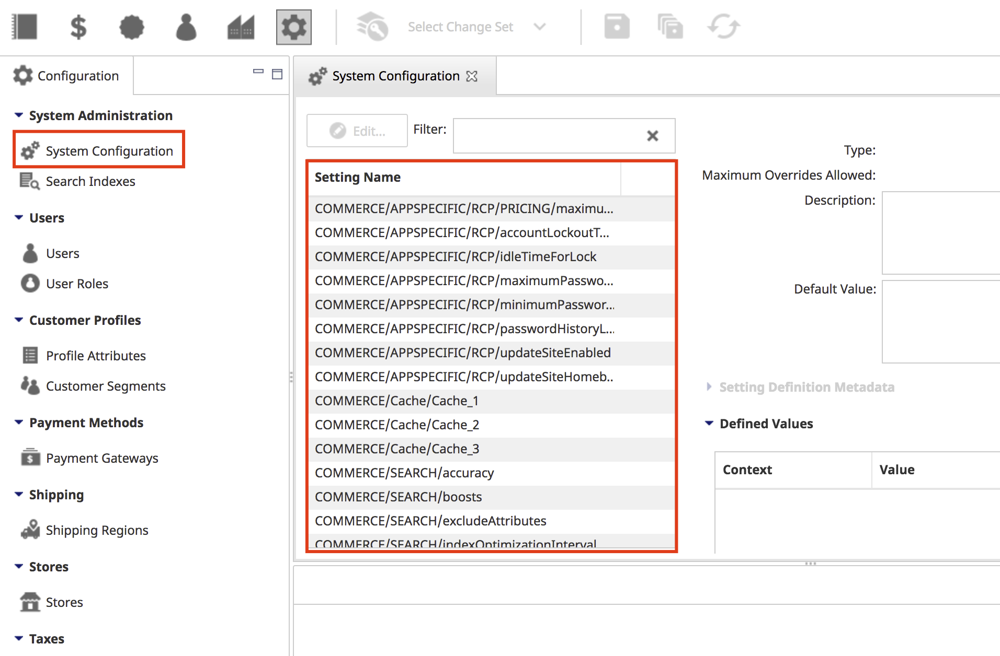

There are five types of settings:

- System settings
- Store-specific settings
- Application-specific settings
- Search settings
- Cache settings

#### System settings

System setting names begin with `COMMERCE/SYSTEM`. These settings have a global scope and only one value each. For example, the assets folder location is a system setting.

> **Note**: System setting names beginning with `COMMERCE/SYSTEM/MESSAGING` require a restart of the JMS servers if changed.

#### Store-specific settings

Store-specific setting names begin with `COMMERCE/STORE`. They can have a different value for each store in the system. For example, enabling auto-complete on search is store specific.

#### Application-specific settings

Application-specific setting names begin with `COMMERCE/APPSPECIFIC/<appName>`. These settings can be configured differently, depending on whether the context is a web service, one of the Elastic Path web applications (commerce server, search server), or Elastic Path Commerce.

#### Search settings

Search setting names begin with `COMMERCE/SEARCH`. These settings are both store-specific and application specific, and can be configured differently for each index; in other words, a search setting can have a different value for each combination of store, application, and index. These settings are described in detail further in this section.

#### Cache settings

Cache setting names begin with `COMMERCE/Cache`. These three settings define the cache timeout values used for the interval-based refresh strategy. Refresh strategies are discussed in detail further in this section.

| Setting name (path)       | Description                |
| ---                       | ---                        |
| `COMMERCE/Cache/Cache_1` | Settings mapped to this cache are refreshed after the defined interval of time (default: 300000 ms). |
| `COMMERCE/Cache/Cache_2` | Settings mapped to this cache are refreshed after the defined interval of time (default: 60000 ms).  |
| `COMMERCE/Cache/Cache_3` | Settings mapped to this cache are refreshed after the defined interval of time (default: 100000 ms). |

### Setting Metadata

A setting may have metadata associated with it. Setting metadata consists of a set of key/value pairs. In Elastic Path Commerce, there is one metadata key/value pair assigned to settings that use a refresh strategy. However, future releases may include additional metadata and customized deployments may also use setting metadata for their custom settings.

### Refresh Strategies

Application administrators can change setting values at any time through the configuration activity in Elastic Path Commerce. Depending on the refresh strategy implemented, changes are implemented at different points during a user's session.

There are four refresh strategies:

- Application
- Session
- Interval
- Immediate

Only settings that have a noticeable effect on the end user's experience implement a refresh strategy other than Immeadiate.

#### Application Refresh Strategy

Settings that use the Application refresh strategy are only updated when the application is restarted.

#### Session Refresh Strategy

Settings that use the session refresh strategy do not change during the lifetime of the user&#39;s session. If an administrator changes the setting value, users will not see the change until their session cookie is removed or expires and a new session is created. This strategy is used for settings that need to remain consistent during the course of a user&#39;s session.

For example, the `COMMERCE/STORE/CATALOG/catalogViewPagination` setting sets the number of rows to display in the front end catalog view. If this setting is changed while a user was browsing the catalog, the number of result pages might suddenly change, causing confusion. Therefore, this setting uses the Session refresh strategy, only showing changes on user sessions created after the setting value was changed.

#### Interval Refresh Strategy

Settings that use the interval refresh strategy are cached and are only refreshed after a specified period of time. Users do not see changes to these settings until the cache interval expires. When this strategy is used for a setting, the setting value must specify the name of one of the cache settings. The value of the specified cache setting indicates the refresh interval.

#### Immediate refresh strategy

Settings that use the immediate refresh strategy are not cached. As soon as the administrator changes a setting, the change is applied. This behavior may be desirable in many situations, but it should be noted that since the values are not cached, the database must be queried every time they are required. This may cause some degradation in performance in high-traffic areas of the system, so this strategy should be used with caution.

> **Note**: Search indices are automatically rebuilt daily by Elastic Path Commerce. If needed, they can be rebuilt manually. To manually re-index the search results, go to **Configuration > System Administration > Search Indexes**, select a search index to rebuild and click the **Rebuild Index** button.

### Adding a Setting Value

1. In the main toolbar, click the **Configuration** icon.

2. in the System Administration section of the left pane, click **System Configuration**.
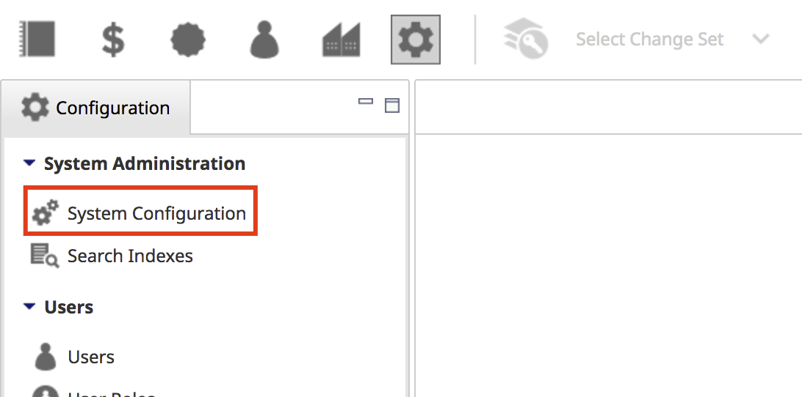

3. In the list of settings of the top right pane, select the setting for which you want to add a value.
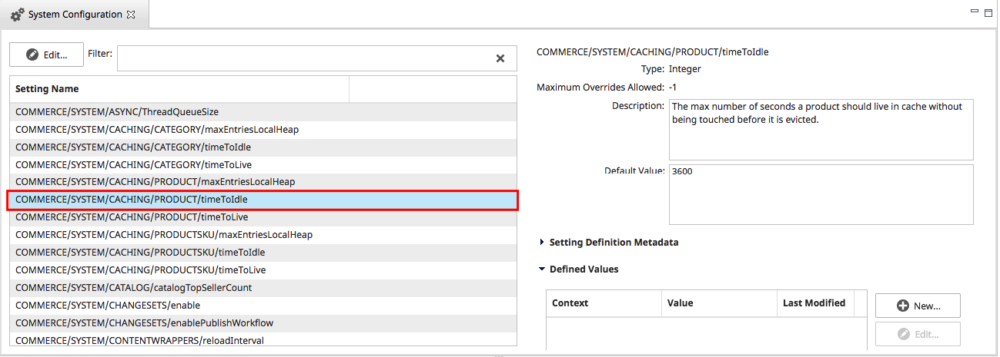

4. In **Defined Values** section, click **New**.

5. In the **Add Configuration Value** dialog box, enter values as described in the following table.

    | Field          | Value |
    | ---            | ---   |
    | **Context**    | The value you specify depends on the type of setting. For an application-specific setting, enter the name of the application. For example, for Elastic Path Commerce, enter RCP. For a store-specific setting, enter the store code. For a store-specific search setting, the value must conform to this format: `STORE/<store_code>/<index_name>` For an application-specific search setting, the value must conform to this format: `APPSPECIFIC/<application_name>/<index_name>` Note that the **Context** box does not appear if you are configuring system or cache settings.|
    | **Value** | The value you want to set for the specified context. |

5. Click **Save**.

    > **Note:** The setting change takes effect immediately. For a setting that affects user experience, its refresh strategy is applied.

### Editing a Setting Value

1. In the main toolbar, click the **Configuration** icon.

2. In the System Administration section of the left pane, click **System Configuration**.


3. In the list of settings of the top right pane, select the setting for which you want to edit a value.


4. Click **Edit**.

5. In the _Edit Configuration Value_ prompt, modify the setting value as required.

6. Click **Save**.

    > **Note:** The setting change takes effect immediately. For a setting that affects user experience, its refresh strategy is applied.

### Removing a Setting Value

1. In the main toolbar, click the **Configuration** icon.

2. In the System Administration section of the left pane, click **System Configuration**.


3. In the list of settings of the top right pane, select the setting for which you want to remove.


4. Click **Remove**.

     > **Note:** The change takes effect immediately and the setting value is removed. If the setting has a default value, any context that relied on the value reverts to using the default value. For a setting that affects user experience, its refresh strategy is applied.

### Configuring Metadata for a Setting

1. In the main toolbar, click the **Configuration** icon.

2. In the System Administration section of the left pane, click **System Configuration**.


3. In the list of setting definition metadata, select the value you want to edit.
    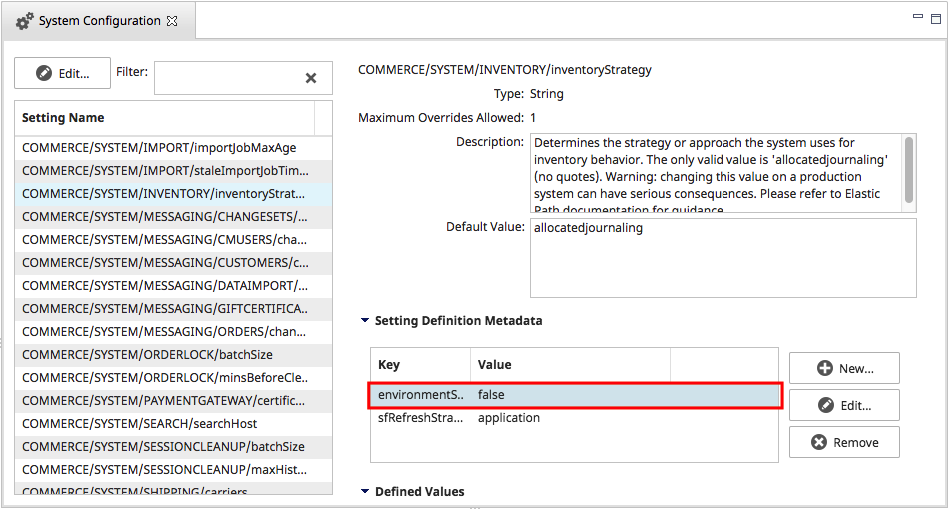

4. Click **Edit**.

5. In the _Edit Metadata_ prompt, modify the metadata value as required:

    **environmentSpecific**

    Indicates the setting is specific to the environment on which Elastic Path Commerce and Commerce Server is deployed. This setting is for visual indication only. Its main purpose is to indicate the setting should be changed when you deploy to a different environment, such as a staging or a production environment.

    TRUE means the setting is environment specific. FALSE means the setting is not environment specific.

    **sfRefreshStrategy**

    The sfRefreshStrategy metadata setting depends on the type of refresh strategy you want to use, as described in the following table.

    | Refresh strategy | Value |
    | ---              | --- |
    | Application      | application |
    | Interval         | The value must conform to this format: `interval:timeout=<cache_setting_name>` For example, to use the timeout value configured for the `COMMERCE/Cache/Cache_2` setting (by default, 60000), enter the following: `interval:timeout=COMMERCE/Cache/Cache_2` |
    | Session          | session |
    | Immediate        | immediate |


### Search Settings

The search settings control the behavior of searching and catalog browsing in Elastic Path Commerce. The following table describes these settings.

| Setting name (path)                         | Description |
| ---                                         | --- |
| `COMMERCE/SEARCH/accuracy`                  | Sets the accuracy of spelling suggestions. This value works the same as `minimumSimilarity`. <br/> Default is 0.75. |
|` COMMERCE/SEARCH/boosts`                    | Optional. Specifies a comma-separated list of field name/value pairs that specify greater importance to values matched in specific fields. For example: `categoryCode=0.5,productCode=0.5, categoryName_en=2.0,description_en=0.2`/ <br/> By default, all search fields are assigned a boost value of 1.0. |
| `COMMERCE/SEARCH/excludeAttributes`         | Optional. Specifies a comma-separated list of attribute keys that should be not be included when searching all fields. For example: `A00981,A01012`. <br/>By default, all attributes are included. |
| `COMMERCE/SEARCH/indexOptimizationInterval` | Specifies how often the index is optimized. Optimization is generally only needed when the index has had a large number of updates (adds/deletes), so if the index is updated frequently, you may want to specify a higher frequency. |
| `COMMERCE/SEARCH/maximumResultsThreshold`   | Used for the spell checker. Results that are above or equal to this number will trigger a spelling suggestion lookup. Default is 10000. |
| `COMMERCE/SEARCH/maximumSuggestionsPerWord `| Used for the spell checker. The maximum number of spelling suggestions to return. Default is 3. |
| `COMMERCE/SEARCH/maxReturnNumber`           | The maximum number of matching items to include in search results. The default is 0, which specifies no limit. |
| `COMMERCE/SEARCH/minimumResultsThreshold`   | Used for the spell checker. Results that are below or equal to this number will trigger a spelling suggestion lookup. Default is 10. |
| `COMMERCE/SEARCH/minimumSimilarity`         | Used for fuzzy searching. This specifies how similar the matching terms must be to the query term. It must be set to a value between 0 and 1, not inclusive. (1 would mean it must be an exact match and 0 would mean the terms do not match need to match at all.) Default is 0.75. |
| `COMMERCE/SEARCH/prefixLength`              | Used for fuzzy searching. Specifies the number of characters at the start of the search term that must be the same in potential matches. Default is 0. |

#### Configuring Search Settings

The following indices are used to optimize searching and browsing:

- category
- cmuser
- customer
- product
- promotion
- shippingservicelevel
- sku

Search settings can have different values for each of these indices, depending on the application (Elastic Path Commerce or web services), so they can have a different value for each combination of index and store. As such, the context of a search setting value must specify the index to which it applies, as well as the appropriate application or store.

For example, the `COMMERCE/SEARCH/maxReturnNumber` setting lets you configure the maximum number of search results to return. To set the maximum number of results when searching for products in Elastic Path Commerce (identified by RCP), the context must be set to the following:

`APPSPECIFIC/RCP/product`

On the other hand, to set the maximum number of results when a customer searches for products in the Snap It Up store (identified by the store code SNAPITUP), the context must be set to the following:

`STORE/SNAPITUP/product`

> **Note:** The context is case-sensitive.

### Filtered Navigation URLs

The `separatorToken` and `fieldSeparator` used in your front end&#39;s filtered navigation URLs are configurable. You can use the following System Configuration settings to configure your front end URLs.

**Note:** Changing URLs can harm your front end. Any hardcoded URLs that link to your site will no longer work because the URLs are different. Making these changes should be done with care.

#### Change the URL Token Separator

The filtered navigation&#39;s `separatorToken` is configurable. The `separatorToken` separates the attribute code from the attribute ID in the URL. For example, the underscore `separatorToken` character in the following URL separates the attribute code, **atA00551** , from the attribute id, **05** :

```
http://demo.elasticpath.com/frontend/digital-cameras/3ccd/compactflash/c90000003-atA00551_05-atA03190_02-p1.html
```

> **Note:** Do not change the separator to any of the following characters: **+** , **$** , or **%**. These characters will break your front end.

> **Note:** If you change the `separatorToken` to **-** , you must change the `fieldSeparator` token, shown above, to use a different character.

| Setting name (path) | Description |
| ---                 | --- |
| `commerce/system/filterednavigation/separatorInToken` | This setting defines the field separator that is used in the filtered navigation. Default value is:\_ (underscore)  |

## User Management and Permissions

Elastic Path Commerce supports hosting multiple stores within a single deployment. Individual stores may be owned and/or operated by different organizations, and different people within those organizations may need to use Elastic Path Commerce to access different features and data.

It is important to ensure that all these different users only have access to the functionality and data that is appropriate for their role and their organization. This section explains the different security considerations that affect Elastic Path Commerce and the steps you need to take to ensure that permissions are correctly configured for all users. Each Elastic Path Commerce user has certain permissions, as defined by their _user role_. These permissions allow or restrict the user&#39;s access to activities within Elastic Path Commerce, such as viewing a customer&#39;s order or adding a new product to a catalog. These permissions allow you to ensure, for example, that Catalog Management is not available to users who do not have Catalog Management related roles.

The following user roles are provided by default:

- _Super User_ – provides access to all activities within Elastic Path Commerce
- _User Login_ – provides only log on permissions for Elastic Path Commerce. To perform any other actions, additional roles must be assigned to the user.
- _Web Services User_ – provides permissions to allow integration with third party applications.

Most organizations will want to add user roles to provide their staff with permissions reflecting only the tasks they perform within Elastic Path Commerce.

All users who work with Elastic Path Commerce must be assigned the _User Login_ role; without that role, users cannot log on to Elastic Path Commerce.

Detailed descriptions of the user roles are provided in the User Roles section of this chapter.

This section is intended to assist Elastic Path Commerce administrators with setting up proper permissions on application data and features. These individuals must at least be able to create Users and User Roles in Elastic Path Commerce, so they must have User Management permissions in Elastic Path Commerce. This section also makes recommendations with regards to permissions at the file system level. In order to implement those recommendations, operating system level administrator privileges are required.

> **Note:** The security measures described in this document only apply to accessing data from within Elastic Path Commerce. These measures do not protect against unauthorized data access from outside Elastic Path Commerce, such as through the Import-Export tool or the Elastic Path database. For securing your database and operating system, your organization should follow IT best practices.

### Permissions

Elastic Path Commerce supports permissions on two levels:

- Data permissions, which determine what data the user can access.
- Functional permissions, which determine what actions the user can perform on that data.

Data permissions are controlled by assigning catalogs, warehouses, and stores to users. A user can only access data if the corresponding catalog, warehouse, or store has been assigned to him.

Functional permissions are controlled by assigning User Roles to users. A User Role is a collection of permissions. A User Role can be assigned to multiple users. Each user can have more than one assigned User Role.

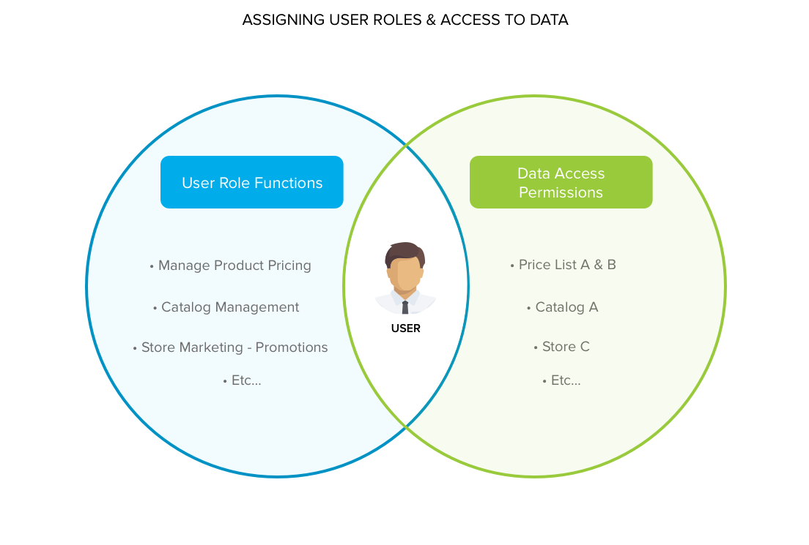

Through the combination of data and functional permissions, you can ensure that Elastic Path Commerce users only have access to the information and features they need.

This model provides considerable flexibility, but in complex environments with multiple stores and catalogs, each with their own distinct sets of users, it is critical to establish best practices for managing permissions.

### Users

Users are the individuals who will be using Elastic Path Commerce and other backend services, such as web services. Users are internal to your organization and must not be confused with front end customers. All individuals in your organization who need access to Elastic Path Commerce should have their own personal user accounts.

Each user has certain privileges, defined by their role, which are specified at the time of the user&#39;s profile creation. These Elastic Path Commerce users should be configured so that they only have access to the data they need to perform their jobs. See the _User Roles_ section for more information.

Further permissions can be applied at the user level to restrict access to specific stores, catalogs and warehouses.

#### Administrator Users

After installation, there is one user in the system with Super User (administrator) privileges. Only administrator users have permission to manage users and user roles.

> **Note:** It is strongly recommended that you create a second user with Super User privileges. If one of the administrator user accounts is locked, the other administrator user will be able to unlock it.

#### Creating a User

When you create a user, you must specify which catalogs, stores, and warehouses the user will be able to access. Unless that user is assigned to the Super User role, he will only be able to access the catalogs, stores, and warehouses that are assigned to them.

> **Important**: It is strongly recommended that you avoid using the Assign All option when assigning catalogs, stores, and warehouses to users. This ensures that, as new catalogs, stores, and warehouses are added to your Elastic Path deployment, existing users don&#39;t automatically get access to them.

When assigning catalogs, warehouses, and stores to a user, consider what that person&#39;s User Roles are and whether they need access to that data. Not all users need each type of assignment. For example, a user working in the shipping and receiving department will likely need access to the Shipping/Receiving activity and warehouse data. This person would need Shipping/Receiving permissions and would need to be assigned to one or more warehouses. He would _not_ need Promotions/Shipping permissions and would _not_ need to be assigned to any Stores.

The following table shows some examples of User Roles that an organization might need and the catalog/store/warehouse assignments that users assigned to those User Roles might have.

| **User Role** | **Permission groups (Activities)** | **Has catalog assignments** | **Has store assignments** | **Has warehouse assignments** |
| --- | --- | --- | --- | --- |
| Administrator | Configuration | No | No | No |
| Catalog Manager | Catalog Management | Yes | No | Yes |
| Customer Service Representative | Customer Service | Yes | Yes | Yes |
| Marketer | Promotions/Shipping | Yes | Yes | No |
| Merchandiser | Promotions/Shipping, Catalog Management, Reporting | Yes | Yes | Yes |
| Receiver | Shipping/Receiving | No | No | Yes |
| Shipper | Shipping/Receiving | No | No | Yes |

1. In the main toolbar, click the **Configuration** icon.

2. In the left pane, select **Users**.

3. In the left pane, select the **User Search** tab and enter your search terms (optional).

4. In the left pane, click the **Search** button.

5. In the top right pane toolbar, click **Create User**.
    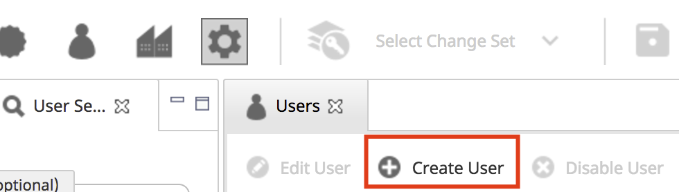

6. In the **Create User** wizard, enter values in the field as described below. Then click **Next**.

    | **Field**     | **Description** |
    | ---           | --- |
    | User Name     | The user name for the new user. |
    | Status        | Specify whether the new user should be Active (the user can sign in and perform tasks) or Disabled (the user account is locked). |
    | First Name    | The first name of the user. |
    | Last Name     | The last name of the user. |
    | Email Address | The user&#39;s e-mail address. |

    > **Note:** When the user is created, a password is automatically generated and sent to the specified e-mail address. The user is able to log on with the random password only once and must change it immediately after logging on. If a user forgets his or her password, use the **Change User Password** button on the Users list to send them a new auto-generated one. When the user logs on, he or she will be prompted immediately to create a new permanent password.

7. In the **Available Roles** list of the **Create User** wizard, select the roles you want to assign to the user. Then click the **&gt;** arrow button.
    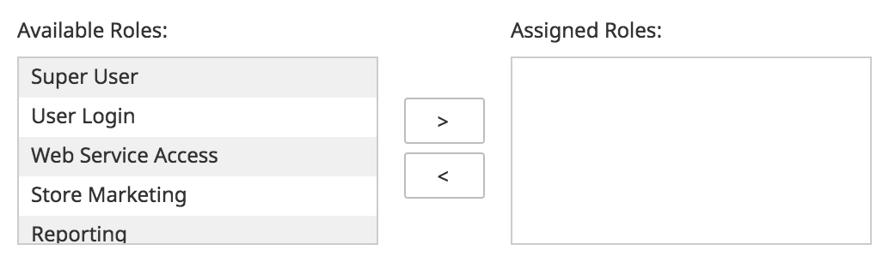

8. Click **Next**.

9. In the **Create User** wizard, specify which catalogs the new user will have permissions to use (depending on their assigned roles).

    > **Note:** By default, the user will have access to all catalogs. To restrict the user to specific catalogs, select **Assign Specific Catalogs** and move those catalogs to the **Assigned Catalogs** list.

    

10. Click **Next**.    

11. In the **Create User** wizard, specify which stores the new user will have permission to use (depending on their assigned roles).

    > **Note:** By default, the user will have access to all stores. To restrict the user to specific stores, select **Assign Specific Stores** and move those stores to the **Assigned Stores** list.

    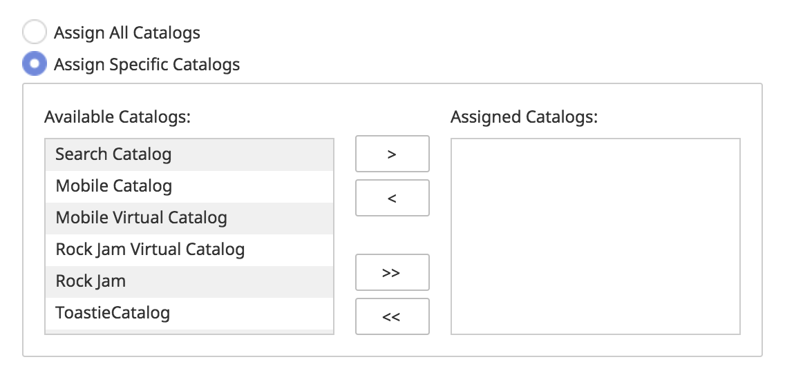

12. Click **Next**.    

13. In the **Create User** wizard, specify which warehouses the new user will have permission to use (depending on their assigned roles).

    > **Note:** By default, the user will have access to all warehouses. To restrict the user to specific warehouses, select **Assign Specific Warehouses** and move those stores to the **Assigned Warehouses** list.

    

14. Click **Next**.

15. In the **Create User** wizard, specify which price lists the new user will have permission to use (depending on their assigned roles).

    > **Note:** By default, the user will have access to all price lists. To restrict the user to specific warehouses, select **Assign Specific Price Lists** and move those stores to the **Assigned Price Lists** list.

    

16. Click **Finish**.

    > **Note:** If the system is unable to send an e-mail (for example, the mail server is not configured or the mail template assets could not be found), a warning will appear and the account will not be created.

#### Editing a User

1. In the main toolbar, click the **Configuration** icon.

2. In the left pane, select **Users**.

3. In the left pane, select **User Search** tab and enter your search terms (optional).

4. In the left pane, click the **Search** button.

5. In the top right pane, select the user account you want to edit.

6. In the top right toolbar, click the **Edit User** button.

7. In the **Edit User** wizard, edit the user information.

8. Click **Finish**.

#### Disabling a User

1. In the main toolbar, click the **Configuration** icon.

2. In the left pane, select **Users**.

3. In the left pane, select **User Search** tab and enter your search terms (optional).

4. In the left pane, click the **Search** button.

5. In the top right pane, select the user account you want to disable.

6. In the top right pane toolbar, click the **Disable User** button.

7. In the **Disable User** prompt, confirm that you want to disable the user.

8. Click **OK**.

#### Changing a User&#39;s Password

1. In the main toolbar, click the **Configuration** icon.

2. In the left pane, select **Users**.

3. In the left pane, select **User Search** tab and enter your search terms (optional).

4. In the left pane, click the **Search** button.

5. In the top right pane, select the user account you want to complete a password reset.

6. In the top right pane toolbar, click the **Change User Password** button.

7. In the **Confirm Change Password** prompt, confirm that you want to reset the password.

8. Click **OK**.

A new password is generated and sent to the user&#39;s e-mail address. The user is able to log on with the new password only once and must change it immediately after logging on.

> **Note:** If the system is unable to send an e-mail (for example, the mail server is not configured or the mail template assets could not be found), a warning will appear and ask you to confirm the password change. If you choose to change the password, the user will be unable to log on. The password will need to be reset again after the e-mail problems have been resolved.

#### Unlocking a User Account

If a user fails to log on to Elastic Path Commerce after a certain number of attempts, the account will be locked automatically and the user will not be able to log on. To unlock the account, the user must contact a Elastic Path Commerce administrator user (Super User). The administrator user can unlock the account by selecting it from the list of users and clicking **Change User Password**. A new password is generated and sent to the user&#39;s e-mail address. The user will be able to log on with the new password only once and must change it immediately after logging on.

> **Note**: By default, an account is locked after six failed logon attempts. You can change this number by modifying the `COMMERCE/APPSPECIFIC/RCP/accountLockoutThreshold` setting. Before changing the setting, make sure the change is compatible with your organization&#39;s PCI compliance policy.

#### User Search

To search for users, choose the **Configuration** icon. Then, click **Users** to display the **User Search** tab.

The user search has been enhanced with new _Sorting_ filters that allow you to sort your search results by Column (user name, first name, last name, status, or e-mail) and to display them in ascending or descending order.

Once your search results appear, you can click a column header to sort them by that column.

### User Roles

In order to access features in Elastic Path Commerce, users must first be granted permissions. You can grant permissions to users indirectly by assigning User Roles to them in Elastic Path Commerce. For security reasons, CSRs and other non-administrator users should have access to different subsets of Elastic Path Commerce as defined by their User Role. This ensures that only authorized users can perform administrative functions.

Users can be assigned multiple User Roles. The creation of a new User Role includes specifying which Permissions it has. _Permissions_ refer to the access rights of a user to a particular feature in Elastic Path Commerce or a web service.

#### Built-in User Roles

Elastic Path Commerce includes the following User Roles:

- **Super User** (also referred to as the administrator user role) - grants all permissions to all areas of Elastic Path Commerce. Do not assign this User Role unless you want the user to have full access to all areas and all application data.
- **User Login** - grants the ability to log on to Elastic Path Commerce. It does not give access to any areas of the application. All users who need access to Elastic Path Commerce must have this User Role.
- **Web Services User** - allows external applications to connect to Elastic Path Commerce via its web services (if web services are enabled). This role does not grant the ability to log on to Elastic Path Commerce via the application.

These User Roles cannot be modified.

> **Note** :The _Web Services_ User role is used to access Elastic Path Commerce via a web service. Granting the _User Login_ role to a user account that only interacts with the system via a web service is not recommended because the user must reset their password periodically. This can only be done via Elastic Path Commerce.

#### Default and Optional Permissions

When a user is assigned to a catalog, store or warehouse, that user has _default permissions_ on that object. This usually means that the user can view that object and its related data. In order to perform additional actions on the object, such as modifying or deleting it, the user needs to be granted the appropriate _optional permissions_.

For more details on these _optional permissions_, see _Appendix F: Permissions_.

#### Creating a User Role

When you create a User Role, you must specify the permissions and privileges that role will have.

For details on the different permissions available, see _Appendix F: Permissions_.

1. In the main toolbar, click the **Configuration** icon.

2. In the left pane, select **User Roles**.

3. In the top right pane, click **Create Role**.

    

4. In the **Create Role** wizard, enter a name and optional description for the role.

5. Click **Next**.

5. In the **Create Role** wizard, select the permissions and privileges the new role should have. Click the **&gt;** button to add them.

    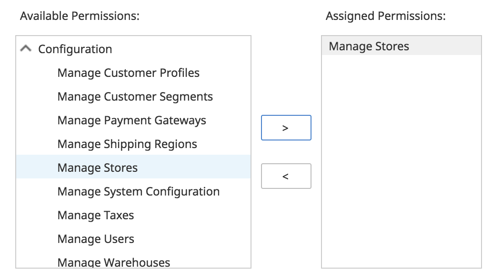

6. Click **Finish**.

#### Editing a Role

If you modify a User Role that currently has users assigned to it, your changes will affect those users as well as any users assigned to that role in the future. Make sure your changes are appropriate for all users currently assigned to the User Role.

1. In the main toolbar, click the **Configuration** icon.

2. In the left pane, select **User Roles**.

3. In the top right pane, click **Edit Role**.

4. In the **Edit Role** wizard, edit the role information.

6. Click **Finish**.

#### Assigning Multiple User Roles to a User

For users that perform multiple roles, Elastic Path Commerce allows you to assign multiple User Roles to them.

#### Deleting a Role


1. In the main toolbar, click the **Configuration** icon.

2. In the left pane, select **User Roles**.

3. In the top right pane, click **Delete Role**.

4. In the **Delete Role** prompt, lick **Yes**.


### Activities

Permissions determine which activities and functionality the user can access. The following sections discuss each activity, which permissions are required to access it, and what users are able to see and do based on the catalogs, stores, and warehouses that are assigned to them.

> **Note** : If a user does not have any permissions within an activity, the user will not be able to access that activity in Elastic Path Commerce.

| Activity Name | Permissions Required |
| --- | --- |
| Customer Service | This activity is accessed if the user has a User Role with at least one Customer Service permission. |
| Order Search | The search results in the _Order Search_ tab show orders in stores that are assigned to the user. |
| Customer Search | The search results in the _Customer Search_ tab show customers in stores that are assigned to the user. |
| Customer Import Jobs | The Customer Import Jobs list contains import jobs for the stores that are assigned to the user. The store list in the Create Import Job wizard contains stores that are assigned to the user. |
| Orders in the Customer Profile | The list of stores next to the **Create Order** button contains stores that are assigned to the user. |
| Assign Customer Segments | The **Add Segment** and **Remove Segment** buttons are enabled on the Customer Segments tab in the Customer account for customers in stores assigned to the user. |
| Catalog Management | This activity is accessed if the user has a User Role with at least one Catalog Management permission. Catalog Management permissions determine which of the following content appear. |
| Master Catalogs and Virtual Catalogs | If a user has permissions on a virtual catalog but not the corresponding master catalog, the user can only make the following product changes: <br/> - Prices <br/>- Product associations (including up-sells and cross-sells) <br/>- Category assignments. <br/> **Important** : If you assign a master catalog to a user, that user can make changes that could affect virtual catalogs based on that master. |
| Catalog Browse | The catalog list in the _Catalog Browse_ tab contains catalogs that are assigned to the user. |
| Catalog Search | The search results in the _Catalog Search_ tab include products in catalogs that are assigned to the user. <br/> **Note:** The brand filter in the _Catalog Search_ tab contains brand names from all catalogs, including those not assigned to the user. If the user searches for a brand name that is not in an assigned catalog, no matches will be found. |
| Advanced Search | The _Advanced Search_ tab is only displayed if the user has a User Role with at least one Query Management permission. |
| Catalog Import Jobs | The catalog list in the Create Import Job wizard contains catalogs that are assigned to the user. |
| Configuration | This activity is accessed if the user has a User Role with at least one Configuration permission. <br/><br/> **Important** : Users with access to the Configuration activity can perform actions that affect multiple stores, catalogs, and and warehouses, even if they are only assigned to a subset of those objects. |
| Shipping/Receiving | This activity is accessed if the user has a User Role with at least one Shipping/Receiving permission. |
| Receive Inventory | Users can receive inventory for warehouses that are assigned to them. |
| Complete Shipment | Users can complete shipments if the inventory is located in a warehouse assigned to them. |
| Warehouse Import Jobs | The warehouse list in the Create Import Job wizard contains warehouses that are assigned to the user. |
| Switch Warehouse | The list of available warehouses in the **Shipping/Receiving &gt; Switch Warehouse** menu contains warehouses that are assigned to the user. |
| Inventory | Users can access inventory in warehouses that are assigned to them. |
| Returns and Exchanges | Users can access returns and exchanges for inventory in warehouses that are assigned to them. |
| Promotions/Shipping | This activity is accessed if the user has a User Role with at least one Promotions/Shipping permission. |
| Promotions | Users can only search for catalog promotions created in catalogs assigned to them. Users can only search for cart promotions in stores assigned to them. |
| Shipping Service Levels | Users can only search for shipping service levels in stores assigned to them. |
| Settings | Users can only view settings in stores assigned to them.

<!-- | Create Order | When the user creates an order from Elastic Path Commerce, a list appears, containing stores that are assigned to the user. |

#### Reporting

This activity is accessed if the user has a User Role with at least one Reporting permission. Users can run reports on the stores and warehouses that are assigned to them.-->

## Controlling Access to File System Assets

There are several places in Elastic Path Commerce where the user is able to interact with resources in a file system.

- In the Customer Service activity, the user can upload CSV files from their local file system to the assets directory.
- In the Configuration activity, the user can indirectly select resources from the assets directory (themes, gift certificates).
- In the Shipping/Receiving activity, the user can upload CSV files from their local file system to the assets directory.
- In the Promotions/Shipping activity, the user can upload CSV files from their local file system. The user can select resources from the assets directory.

Elastic Path Commerce does not restrict access to file system resources. It is the responsibility of your organization&#39;s system administrators to ensure that the appropriate permissions are configured at the file system level.

If you want to control access to resources within the assets directory, you must configure permissions at the file system level.


## Changing Your Password

Elastic Path Commerce users must change their passwords in the following situations:

- After first logon to Elastic Path Commerce
- After the password expires

> **Note:** By default, passwords expire every 90 days. To change the password expiry period, modify the `COMMERCE/APPSPECIFIC/RCP/maximumPasswordAge` setting. Before changing the setting, make sure the change is compatible with your organization&#39;s PCI compliance policy. For more information, see Passwords and PCI Compliance.

To change your password, do the following:

1.  In the main toolbar, click the admin dropdown in the top right corner.

    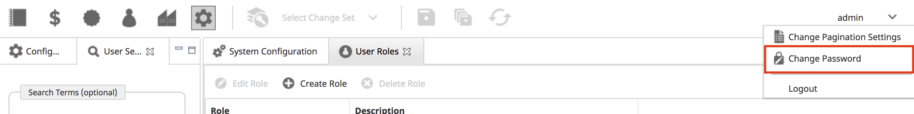

2. Select **Change Password**.

2. In the _Change Password_ prompt, enter your old password. Then enter and confirm your new password.

    By default, passwords must meet the following conditions:

      + Must contain both letters and numbers.
      + Must be at least 8 characters long. To change the minimum password length, modify the `COMMERCE/APPSPECIFIC/RCP/minimumPasswordLength` setting.
      + Must not be the same as any of the previous four passwords. To change the number of previous passwords that are checked against the new password, modify the `COMMERCE/APPSPECIFIC/RCP/passwordHistoryLength` setting.

    Before changing these settings, make sure the changes are compatible with your organization&#39;s PCI compliance policy. For more information, see Passwords and PCI Compliance.

    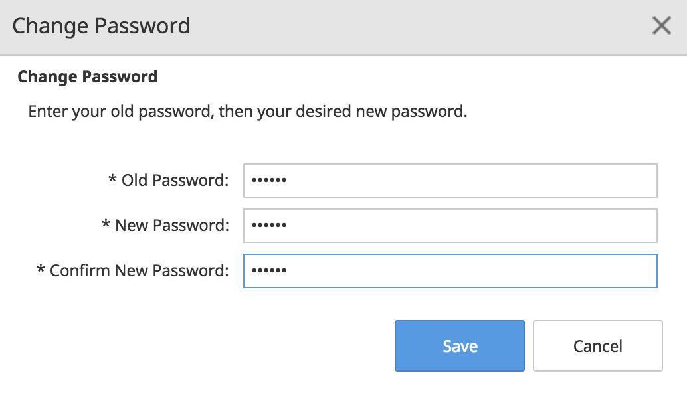

3. Click **Save**.

### Passwords and PCI Compliance

The default values for password history size, password length, and password expiry period are compliant with the password security guidelines established by the Payment Card Industry Security Standards Council (PCI SSC). Changing these values could result in your system becoming non-compliant.

For more information, see the PCI SSC web site ( [https://www.pcisecuritystandards.org/security\_standards/pci\_dss.shtml](https://www.pcisecuritystandards.org/security_standards/pci_dss.shtml)).

> **Note** :To maintain PCI compliance, the system administration configuration `COMMERCE/APPSPECIFIC/RCP/accountLockoutThresholdsetting` should be kept at the default value of &quot;6&quot;. Increasing the account lockout threshold will make your system non-PCI compliant.

## Pagination Setting

The _Pagination_ setting in Elastic Path Commerce allows users to change the number of results displayed on the search and filter results screen. For example, the following image shows a results screen when pagination is configured for 10 results per page:

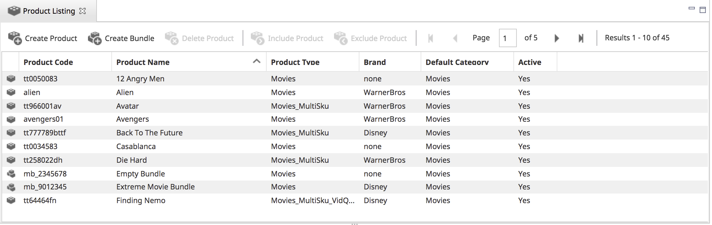

Pagination setting changes apply only to the current user.

### Changing the Pagination Setting

1.  In the main toolbar, click the admin dropdown in the top right corner.

    

2. In the admin dropdown, select **Change Pagination Settings**.

    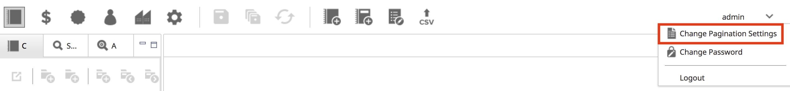

2. In the _Change Pagination Settings_ prompt, choose the number of results to display per page in the dropdown list.

    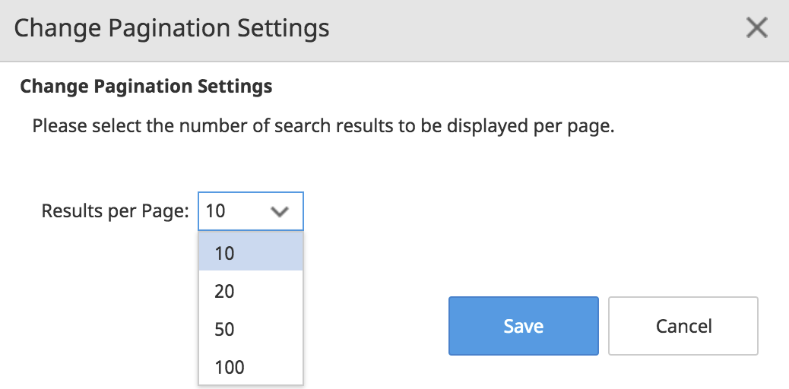

3. Click **Save**.

## Session Idle Timeout

By default, users are automatically logged out of Elastic Path Commerce if the session is idle for more than 15 minutes. To change the timeout period, modify the `COMMERCE/APPSPECIFIC/RCP/idleTimeForLock` setting.sess
