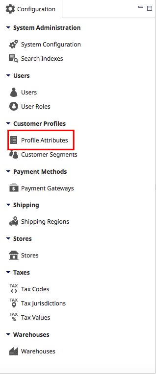
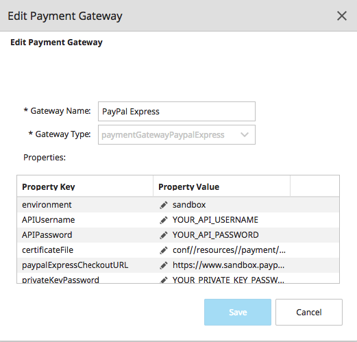
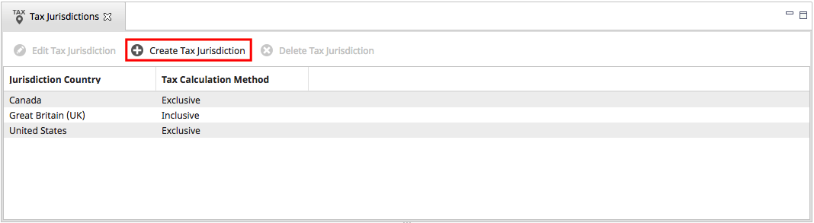

# Chapter 4: eCommerce Configuration

The topics in this chapter describe activities performed in the initial configuration and maintenance of store operations in Elastic Path Commerce. These include configuring stores and warehouses, payment gateways, shipping regions, tax codes, and customer profile attributes.

## Stores

A Store in Elastic Path Commerce represents the web page (_frontend_) that lets customers shop for products drawn from a particular catalog. The most common elements of a store are configured through the Stores configuration settings. These settings include localization, associated catalogs and warehouses, themes for the look and feel, and search filtering for product display. While Elastic Path Commerce allows you to configure these settings, many of these settings are more appropriately controlled by your frontend.


When setting up or managing a store, you may need an administrator to set up or modify Shipping settings under **Configuration** &gt; **Shipping**. When creating a shipping service level, the administrator must specify the stores the service level applies to. Customers can only access the shipping service levels in the store they are shopping in.

### Store States

Every store has a state. The store&#39;s state determines who can access the store and what actions they can perform. Users with the appropriate permissions can change the state of a store.

The following three states can be assigned to a store:

- Under Construction
- Restricted Access
- Open

The following table describes the store states:

| **Store State**    | **Description** |
| ---                | ---             |
| Under Construction | A store in the &quot;Under Construction&quot; state has the following characteristics:<br/>- It cannot be viewed in Elastic Path Commerce or a web browser.<br/>- It cannot be referenced by other objects in the system, including the Core API and Web Services.<br/>- It does not appear in any store lists in Elastic Path Commerce except the store list view.<br/>- It does not include store-related data when the search indexes are built.<br/>- It does not accept orders.<br/>When the store is in the &quot;Under Construction&quot; state, it cannot be changed to another state until all required settings have been configured. <br/><br/>**Note**: Once all the settings have been configured, the store cannot be changed back to the &quot;Under Construction&quot; state.  |
| Open | A store in the &quot;Open&quot; state has the following characteristics:<br/>- It can be viewed in Elastic Path Commerce and a web browser.<br/>- It can be referenced by all other objects in the system, including Cortex and Web Services.<br/>- It appears in all store lists within Elastic Path Commerce.<br/>- It includes store-related data when the search indexes are built.<br/>- It accepts orders.<br/>A store in the &quot;Open&quot; state can be changed to the &quot;Restricted Access&quot; state at any time using the **Change State** button in the store pane.  |

### Store Tabs

The Stores pane has multiple tabs which you can use to configure store settings including currencies, appearance, and applicable taxes. These settings are either required or optional.

After making changes in these tabs, be sure to click **Save**.


The Stores pane has the following buttons:

- **Change Store State** : use this button to switch the store state from &quot;Restricted Access&quot; to &quot;Open&quot;.
- **View Store**: usethis button to open the storefront in Elastic Path Commerce&#39;s web browser.

#### Summary Tab

Use this tab to enter basic store information.

|**Field**    |  **Description**  |
| --- | --- |
| Store Code | The unique identifier for the store. The code cannot be changed once the store is created. <br/><br/> **Note:**  Due to a limitation in Cortex, the code must consist of only alphanumeric characters. Special characters are incompatible. |
| Store Name | The name of the store. |
| Store Description | The description of the store. This field is optional and is not displayed to customers. |
| Store URL | The URL that will be used by customers to access the store. If you are running Elastic Path on your local machine and you have modified your hosts file to map host names to local IP addresses, make sure the host name in the store URL matches the host name you mapped in the hosts file. For example, if your hosts file has mapped mystore.example.com to 127.0.0.1, enter the following: [http://mystore.example.com](http://mystore.example.com) |
| Store State | The read-only field displaying the current state of the store. A store state can be &quot;Under Construction&quot;, &quot;Restricted Access&quot;, or &quot;Open&quot;. You can change the store state by clicking **Change Store State**. |
| Operational Timezone | The time zone used for setting timestamps. |
| Store Country | The country where the store is located. |
| Store Sub-Country | The sub-country (state or province) where the store is located. This is only displayed if the selected _Store Country_ has sub-countries. |

#### Localization Tab


Use this tab to specify the supported languages and currencies for the store.

The specific language that a shopper sees is determined by a number of factors. If the shopper has a language preference set in their customer account and logs on to the store, the system will show the store in the preferred language (if there is a version of the store localized in that language).  Otherwise, the default language will be used.

The currency shown to shoppers is the default currency for the store. Alternate currencies appear to shoppers only if they have the alternate currency set as a preference in their customer profile and are logged on to the store.

To add languages and currencies to the store, select items in the _Available Languages_ and _Available Currencies_ lists, then click **&gt;** to add them to the _Selected Languages_ and _Selected Currencies_ lists, respectively.

| Field | Description |
| --- | --- |
| Language Selection | The list of languages supported by the store. |
| Currency Selection | The list of currencies supported by the store. |
| Defaults | The default language and currency in the store. |

#### Catalog Tab

Use this tab to view the assigned catalog for an existing store, or to assign a catalog to a new store.

A store can only have one assigned catalog. To assign a different catalog to a store, you must delete and recreate the store.

#### Warehouse Tab

Use this tab to view the assigned warehouse for an existing store, or to assign a warehouse to a new store.

A store can have only one assigned warehouse. To assign a different warehouse to a store, you must delete and recreate the store. A warehouse may be shared by multiple stores.

#### Taxes Tab

Use this tab to specify the tax jurisdictions and tax codes for the store.

Tax jurisdictions, tax codes, and tax values are set up under **Configuration &gt; Taxes**.


#### Payments Tab

Use this tab to configure payment options for the store.

| **Field** | **Description** |
| --- | --- |
| Payment Gateway | The payment gateway that the store will use to process payments.|
| Paypal Express Payment Gateway | The drop-down list that enables or disables Paypal Express for the store. |
| Gift Certificates Payment Gateway | The drop-down list that enables or disables gift certificates for the store. |

#### Shared Customer Accounts Tab

Use this tab to share registered customers&#39; profile information (for example, accounts or shipping addresses) with other stores. By default, customer profiles are not shared.

Account sharing is bi-directional: accounts created in one store can log on to another store and vice versa.


To share customer accounts between stores, select items in the _Available Stores_ list, then click **&gt;** to add them to the _Linked Stores_ list.

#### Marketing Tab

Use this tab to configure marketing settings for a store.

To change a setting, select it in the list and click **Edit Value**. Make your changes in the _Edit Setting_ dialog box and click **Save**.

To remove a setting value, click **Clear Value**.

| **Field** | **Description** |
| --- | --- |
| `COMMERCE/STORE/CATALOG/CatalogSitemapPagination` | The maximum number of products listed on a page in the sitemap. |
| `COMMERCE/STORE/CATALOG/CatalogViewPagination` | The maximum number of items to display per page when browsing the catalog in the store. |
| `COMMERCE/STORE/CATALOG/featuredProductCountToDisplay` | The number of featured products to display when browsing a catalog with zero or one filter applied. |
| `COMMERCE/STORE/PRODUCTRECOMMENDATIONS/number OrderHistoryDays` | The number of days of historical order data to use when calculating product recommendations. For example, if the value is 3, product recommendations are calculated based on all orders created during the past three days. |
| `COMMERCE/STORE/PRODUCTRECOMMENDATIONS/numberMaxRecommendations` | The maximum number of product recommendations to display. |
| `COMMERCE/STORE/SEARCH/searchCategoriesFirst` | Specifies whether searches in the store will search categories before searching products. If a category match is found, the first matching category page will be displayed instead of the search results page. |
| `COMMERCE/STORE/SEARCH/showBundlesFirst` | Specifies whether to display product bundles before other products in search results. |
| Display Out Of Stock Products | Required setting. Specifies whether to display products with 0 items in inventory in the catalog and in catalog searches. |
| Store Admin Email Address | Required setting. The store administrator&#39;s e-mail address.<br/><br/> Example:  administrator@snapitup.com |
| Store From Email (Friendly Name) | The sender name on all outgoing e-mails generated by the store. Example:  SnapItUp Sales &amp; Service |
| Store From Email (Sender Address) | Required setting. The e-mail account used to send out system-generated e-mails for the store. <br/><br/>Example:  Sales@snapitup.com |

#### System Tab

Use this tab to change system-related settings for a store.

To change a setting, select it in the list and click **Edit Value**. Make your changes in the _Edit Setting_ dialog box and click **Save**.

To remove a setting value, click **Clear Value**.

* **Store HTML Encoding**: The character set encoding. The default encoding for various Elastic Path components is UTF-8.

### Store Setup Overview

When you set up a store in Elastic Path Commerce, there are some eCommerce configuration tasks you must perform using Elastic Path Commerce. These are done through the _Configuration_ activity and are described in this guide.

- Configure **Shipping Regions** and options.

- Set user roles and permissions.

- Configure catalog attributes, data types, and brands.

- Set Tax Configuration.

- Import or create a catalog.

- Import or create products.

### Creating a Store

1. In the main toolbar, select the **Configuration** icon.

2. In the left pane , click **Stores**.

    

3. In the top right pane, click the **Create Store** icon.

    

4. In the _Summary_ tab, enter values in the following fields:

    | **Field** | **Description** |
    | --- | --- |
    | Store Code | The unique identifier for the store. The code cannot be changed once the store is created. <br/><br/> **Note:** Due to a limitation in Cortex, the storefront code must consist of only alphanumeric characters. Special characters are incompatible. |
    | Store Name | The name of the store. |
    | Store Description | The description of the store. This field is optional and is not displayed to customers. |
    | Store URL | The URL that will be used to access the store. If you are testing locally, the host name must match the host name specified in the hosts file. For example, if your hosts file contains the mystore.example.com host name, enter the following: http://mystore.example.com |
    | Store Timezone | The time zone used for setting timestamps. |
    | Store Country | The country where the store is located. |
    | Store Sub-Country | The sub-country (state or province) where the store is located. This is only displayed if the selected _Store Country_ has sub-countries. |

5. In the _Localization_ tab, configure the following settings:

    | **Field** | **Description** |
    | --- | --- |
    | Selected Languages | The list of languages supported by the store. Select and add at least one language from the _Available Languages_ list. |
    | Selected Currencies | The list of currencies supported by the store. Select and add at least one currency from the _Available Currencies_ list. |
    | Default Language | The default language used to display content in the store. <br/><br/> **Note:** When selecting a language, make sure you also select the correct locale. Depending on the locale, your prices will be displayed differently. For example: With US locale, your price will appear as $14.25. With Finland as your locale, your price will appear as 14.25$, following the European format. |
    | Default Currency | The default currency used to display pricing information in the store. |

6. In the _Catalog_ tab, select the catalog that the store will use.

    > **Note:** The store&#39;s catalog cannot be changed after the store is created.

7. In the _Warehouse_ tab, select the warehouse that the store will use.

9. In the _Taxes_ tab, select the tax jurisdictions and tax codes to apply to the store.

10. In the _Payments_ tab, configure the payment options that the store will support.

11. In the _Shared Customer Accounts_ tab, select the stores whose existing customers can log on to the new store with.

    > **Note:** Customers of the store you are creating will not be allowed to log on with their accounts to any other stores, unless otherwise specified in the other stores&#39; configuration options.

12. In the _Marketing_ tab, configure the following settings:

    | **Field** | **Description** |
    | --- | --- |
    | Store From Email (Friendly Name) | Specifies the sender name on all outgoing e-mails generated by the store. |
    | Store From Email (Sender Address) | Specifies which e-mail account will be used to send out system-generated e-mails. |
    | Store Admin Email Address | Specifies the store administrator&#39;s e-mail address. |
    | Display Out Of Stock Products | Specifies whether you want the store to display out of stock products. |

13. In the _System_ tab, select _Store HTML Encoding_.

14. Click the **Edit Value** icon.

15. In the _Edit Setting_ prompt, enter _Value_.

16. Click **Save**.

17. In the bottom right pane, click **Change Store State** and choose one of the following:

    |Store State | Description|
    | --- | --- |
    | Open | The store can be accessed by customers. |

18. In the _Configuration_ tab of the left pane, click **System Configuration**.

19. In the _Setting Name_ table, select `COMMERCE/STORE/storefrontUrl`

20. In the _Defined Values_ section of the top right pane, click **New**.

21. In the _Add Configuration Value_ prompt, enter the following:

    |Context|Value|
    |---|---|
    | The store code. For example, for the Snap It Up store, enter SNAPITUP. | The secure (HTTPS) storefront URL. If the store URL is [http://mystore.example.com:8080](http://mystore.example.com:8080), enter [https://mystore.example.com:8080/storefront](https://mystore.example.com:8080/storefront). |

22. Click **OK**.

#### Manually Rebuilding the Search Index

**Note**: After a new store is created, the product search index must be rebuilt before any existing products become visible in the store. The index rebuild is scheduled automatically, but a manual rebuild can occur by following these steps:

1. In the left pane, click **Search Indexes**.

2. Select the product index you want to rebuild.

3. Click **Rebuild Index**.

### Editing a Store

1. In the main toolbar, select the **Configuration** icon.

2. In the left pane, click **Stores**.

3. In the top right pane, select the store you want to edit.

4. In the top right pane, click **Edit Store**.

5. Make the required changes and in the main toolbar, click **Save**.

### Deleting a Store

1. In the main toolbar, select the **Configuration** icon.

2. In the left pane , click **Stores**.

3. In the top right pane, select the store you want to delete.

4. In the top right pane, click **Delete Store**.

5. In the _Delete Store - Confirm_ prompt, click **OK**.

> **Note**: If a store is in use, you cannot delete it.

## Customer Profile Attributes

Customer profile attributes store information about a customer (such as name, address and email address) within the Elastic Path Commerce database. They are used by Customer Service Representatives (CSRs) to record information about customers during the customer creation and maintenance processes.

### Tax Exemption Profile Attributes

Two attributes are available as Customer Profile Attributes which are used during tax exemption scenarios.  Values for these fields can be manually entered by CSRs.  When integrating with a Tax Provider, these values are available to be passed along to the tax provider indicating taxes for the given order are not to be calculated.  There are two scenarios as to how or where exemption is indicated.

In the first scenario, companies supporting tax exemption order processing are required to collect, validate, and store values for their customers.  In this scenario, the following fields are available in the Customer Profile to collect and store the information.  Orders for these customers then pass the given customer information to the tax provider.  Generally, these numbers, if visible to the customer at the time of checkout would be non-editable.

1. **Business Number** to record the customer&#39;s business identification number.
2. **Tax Exemption** to record the number provided by the government for use by the given customers on orders where taxes are not to be charged or collected

In the second scenario, a tax exemption number is provided by the customer at the time of checkout.  This value must be manually entered with each transaction as there is no tie between a value provided at checkout and that stored within a Customer Profile.  Similarly, values available in the Customer Profile are not used to auto-populate any tax exemption fields presented at the time of checkout or purchase.

> **Note:**  The Elastic Path tax engine currently does not factor in exemption.  If using Elastic Path Tax Tables, taxes are calculated regardless of entering exemption codes. Tax Exemption functionality only applies when integrating with a Tax Provider.


### Creating a Customer Profile Attribute

You can add customer profile attributes in Elastic Path Commerce. However, adding an attribute does not automatically cause it to appear during store customer account creation or editing. The store must be customized in order for additional fields to appear within it.

1. In the main toolbar, select the **Configuration** icon.

2. In the _Customer Profile_ section of the left pane, select  **Profile Attributes**.

    

2. In the top right pane, click **Create Attribute**.

    

3. In the _Create Attribute_ window, enter values in the following fields:

    | Field | Description |
    | --- | --- |
    | Attribute Key | The unique identifier for the attribute. |
    | Attribute Name | The display name of the attribute. |
    | Attribute Type | The format of the attribute&#39;s data (for example, Date, Text, Integer, or Decimal). |
    | Required | Specifies whether the new attribute is required or optional. |

    

4. Click **Save**.

### Editing a Customer Profile Attribute

1. In the main toolbar, select the **Configuration** icon.

2. In the _Customer Profile_ section of the left pane, select  **Profile Attributes**.

3. In the top right pane, select the profile attribute you want to edit.

    > **Tip:** To find attributes more quickly, click a column header to sort the column by that header.

4. In the top right pane, click **Edit Attribute**.

    

5. In the _Edit Attribute_ window, complete the required changes to the attribute name and click **Save**.

### Deleting a Customer Profile Attribute

1. In the main toolbar, select the **Configuration** icon.

2. In the _Customer Profile_ section of the left pane, select  **Profile Attributes**.

3. In the top right pane, select the profile attribute you want to delete.

4. In the top right pane, click **Delete Attribute**.

5. Click **OK**.

> **Note:** If data has already been entered for a profile attribute, then the **Edit Attribute** and **Delete Attribute** buttons will be disabled. This prevents corruption and loss of data.

# Customer Segments

Customer Segments enable marketers to group customers together and create conditions for delivering price lists, dynamic content, and cart promotions. Customer Segment tags determine if the customer belongs to a segment and if they are entitled to different content, prices, and promotions for the storefront.

An example of a customer segment is where a store employee is assigned to an employee segment so they receive employee pricing when shopping.

### Creating a Customer Segment

A default PUBLIC customer segment is available and applies to all customer accounts.

1. In the main toolbar, select the **Configuration** icon.

2. In the _Customer Profile_ section of the left pane, select  **Customer Segments**.

    

3. In the top right pane, click **Create Customer Segment**.

    

4. In the bottom right _New Customer Segment_ tab, enter the values for the following fields:

    | Field | Description |
    | --- | --- |
    | Customer Segment Name | The customer segment&#39;s unique identifier. |
    | Description | The customer segment&#39;s description. |
    | Enabled | Activates the segment. If disabled, conditions using this tag or the customer segment are not triggered. |

    

5. In the main toolbar, click **Save**.

### Editing a Customer Segment

1. In the main toolbar, select the **Configuration** icon.

2. In the _Customer Profile_ section of the left pane, select  **Customer Segments**.

3. In the top right pane, click **Edit Customer Segment**.

    

4. In the bottom right pane, make the required changes to the customer segment.

5. In the main toolbar, click **Save**.

### Deleting a Customer Segment

1. In the main toolbar, select the **Configuration** icon.

2. In the _Customer Profile_ section of the left pane, select  **Customer Segments**.

3. In the top right pane, select the customer you want to delete.

    > **Note:** The PUBLIC customer segment cannot be deleted.

4. Click **Delete Customer Segment**.

5. Click **OK**.

> **Note:** If the customer segment has a customer association or is used as a condition, then a **Customer Segment in Use** message is displayed indicating the segment cannot be deleted.  Either remove the associations or condition or disable the customer segment.

# Payment Gateways

A payment gateway processes and authorizes payments made from a customer to a retailer. Payment gateways encrypt sensitive information (such as credit card numbers) and ensure that the information is transferred securely.

Some payment gateways issue a certificate file to the merchant and require the merchant to use the certificate in all transactions. Define the certificate file&#39;s location using the steps below in Setting a Payment Gateway Certificate.

> **Important**: Changes to payment gateway settings do not take effect until you restart the web applications.

### Creating a Payment Gateway

1. In the main toolbar, select the **Configuration** icon.

2. In the left pane, select  **Payment Gateways**.

    

3. In the top right pane, click **Create Gateway**.

    

4. In the _Create Payment Gateway_ window, enter a _Gateway Name_ and a _Gateway Type_.

    > **Note:** The **Gateway Type** setting cannot be changed once the gateway has been created.The parameters in the **Properties** table vary depending on **Gateway Type** , and can be configured by developers.

    

5. Click **Save**.

### Editing a Payment Gateway

1. In the main toolbar, select the **Configuration** icon.

2. In the _Payment Methods_ section of the left pane, select the payment gateway you want to change.

3. In the top right pane, click **Edit Payment Gateway**.

4. Make your modifications:

    

5. Click **Save**.

### Deleting a Payment Gateway

1. In the main toolbar, select the **Configuration** icon.

2. In the _Payment Methods_ section of the left pane, select the payment gateway you want to change.

3. In the top right pane, click **Delete Gateway**.

4. In the _Delete Payment Gateway - Confirm_ prompt, click **OK**.

### Setting a Payment Gateway Certificate

Some payment gateways provide the merchant with a certificate. Use the following System Configuration setting to define the certificate&#39;s location.

| Setting Name | Description |
| --- | --- |
| `COMMERCE/SYSTEM/PAYMENTGATEWAY/certificatesDirectory` | Defines the base directory where the payment gateway certificates are. |


When setting the payment gateway, the path to the certificate should be relative to the base directory. For example, in the case of PayPal, if the key resides in `/var/ep/payment/paypal/cert.p12`, set the `certificatesDirectory` setting to `/var/ep/payment/`, and set the `certificateFile` setting in the payment gateway to to `paypal/cert.p12`.

# Shipping Regions and Service Levels

In Elastic Path Commerce, a shipping region is a geographical entity (for example, country, state, or province), while a shipping service level determines what shipping services are available to customers at each store.

### Shipping Regions

A shipping region is a geographical entity (for example, country, state, province) that your store ships to. Shipping service levels are the delivery services available in a given shipping region (for example, Ground Shipping, Overnight Shipping, etc.)

A customer&#39;s shipping cost depends on the shipping region they reside in and which shipping level they choose. A shipping region should use a single set of shipping service levels and costs. Shipping Regions must be configured before the store&#39;s checkout process can work.

> **Note**: If your shipping service levels and shipping costs are identical for all locations, you only need to create one shipping region. If you use non-global service levels (that is, they are available only in some parts of the world) or if shipping cost calculations vary between regions, you need to create multiple shipping regions.

#### Creating a Shipping Region

1. In the main toolbar, select the **Configuration** icon.

2. In the left pane, click **Shipping Regions**.

    

3. In the top right pane, click **Create Shipping Region**.

    

4. In the _Create Shipping Region_ window, enter a name for the region.

5. In the _Available Countries_ table, select countries or sub countries to include in the region.

    

    - To Select multiple countries or sub-countries, hold the **CTRL** or **Shift** keys and click to select your choices.

6. Click **&gt;** to add the countries or sub-countries.

    

7. Click **Save**.

#### Editing a Shipping Region

1. In the main toolbar, select the **Configuration** icon.

2. In the _Shipping_ section of the left pane, click **Shipping Regions** on the _Configurations_ tab.

3. In the top right pane, click **Edit Shipping Region**.

4. In the _Create Shipping Region_ window, make your changes.

5. Click **Save**.

#### Deleting a Shipping Region

> **Note:** If tax values have been configured for a region, you cannot delete it until the tax values have been removed.

1. In the main toolbar, select the **Configuration** icon.

2. In the _Shipping_ section of the left pane, click **Shipping Regions** on the _Configurations_ tab.

3. In the top right pane, select the shipping region you want to delete.

4. Click **Delete Shipping Region**.

5. Click **OK**.

### Shipping Service Levels

Shipping service levels determine the shipping services available to customers at each store. For example, customers for a store selling high-value items may be offered overnight shipping at a reduced rate, while customers shopping at a discounted storefront may be offered slower surface delivery options.

Shipping service levels are configured under **Promotions/Shipping**.

#### Searching for Service Levels

1. In the main toolbar, select the **Promotions/Shipping** icon.

2. In the _Shipping_ tab of the left pane.

    

3. In the _Filters_ section of the left pane, select a _Shipping Service Level State, Shipping Region,_ and _Store_ filters.

4. In the _Sorting_ section, select a _Sort by Column_ header and the _Sort Order_ for the returned search results. (Optional.)

5. Click **Search**.

#### Sorting Search Results

The shipping service level search results can be sorted by clicking on a column header.

#### Pagination of Search Results

By default, the search results show 10 items per page. You can change this by clicking **Preferences &gt; Change Pagination Settings**. Choose a _Results Per Page_ value from the drop-down list, then click **Save**.

#### Creating a Service Level

1. In the main toolbar, select the **Promotions/Shipping** icon.

2. In the _Shipping_ tab of the left pane, perform a shipping service level search with default values.

3. In the top right pane, click **Create Service Level**.

    

4. In the _Create Shipping Service Level_, set the values for your new shipping region.

    > **Note:** A _Unique Code_ is required for data importing and exporting.

    

5. Click **Save**.

#### Editing a Service Level

1. In the main toolbar, select the **Promotions/Shipping** icon.

2. In the _Shipping_ tab of the left pane, perform a shipping service level search with default values.

3. In the the top right pane, select the service level you want to edit.

4. In the top right pane, click **Edit Service Level**.

5. In the _Edit Shipping Service Level_, edit the values for your new shipping region.

6. Click **Save**.

#### Deleting a Service Level

1. In the main toolbar, select the **Promotions/Shipping** icon.

2. In the _Shipping_ tab of the left pane, perform a shipping service level search with default values.

3. In the the top right pane, select the service level you want to delete.

4. In the top right pane, click **Delete Service Level**.

5. Click **OK**.

# Tax Configuration

Store administrators need to configure taxes for jurisdictions that are &quot;tax nexuses&quot; (jurisdictions with the right to impose a tax on taxpayers).

To configure a tax system for their store, administrators must configure:

- Tax Codes: Products are connected to taxes through tax codes. Tax codes define what type of tax is applicable to a product (for example, Shipping vs Goods vs Digital taxes), and are visible to customers.
- Tax Categories: Tax Categories or Taxes determine the taxes are applicable for each Tax Jurisdiction. For example, the &quot;PST&quot; (the Provincial Sales Tax) or &quot;State Tax&quot; (the state taxes) or &quot;VAT&quot; rates may be different from one region to the next.
- Tax Jurisdictions: Tax Jurisdictions are hierarchical, so it is possible to have different Tax Categories applied at various levels. These include country, sub-country (state or province), city, and zip code.  Tax Jurisdictions are either Inclusive or Exclusive.
- Tax Values: The tax rate applied to a Tax Category in a particular jurisdiction

## Tax Configuration Hierarchy

Taxes must be configured in a specific hierarchy:

- First, configure the **Tax Juristictions**. These are the countries in which you need to  calculate a tax for.
- Next, configure the **Country level tax** if required. These are taxes like the UK's VAT or Canada's GST. Note that some countries do not have country-level taxes.
  - A country can have multiple country level taxes.
- Next, configure the **Sub-country level tax**. These are taxes like Canada's PST, which is calculated at a different rate based on the region in the country.
- Finally, configure each sub-country's **Tax Values**. These are tax rates for specific types of goods (as defined by your **Tax Codes**) that can be different rates based on the sub-country.  
  > **Note**: A country (tax jurisdiction) may have multiple country-level taxes, but each country level tax cannot define tax value. Tax values can only be assigned to sub-country taxes.


## Inclusive and Exclusive Tax Calculations

Inclusive and exclusive taxes refer to whether or not taxes are included in the shown or advertised price of an item. Inclusive taxes are included in the price, while exclusive taxes are not.

For example, the advertised price for gasoline in Canada is inclusive. It includes the GST (Goods and Service Tax). However, most other goods sold in Canada are exclusive. The GST and other sales taxes are added to the advertised price of the item when the purchase is made. See Tax Exemption

### Inclusive tax calculation example

The customer is buying 1 tennis racket which costs £75. The VAT tax rate is 15%. Shipping is £5 and is also subject to VAT.

| **Line Item** | **Amount** | **Calculation** |
| --- | --- | --- |
| Subtotal | £75.00 | (sum of item prices) |
| Item tax | £9.78 | (VAT/1 + VAT)\*item price |
| Shipping tax | £0.65 | (VAT/1 + VAT)\*shipping price |
| Total tax | £10.43 | (item tax + shipping tax) |
| Total | £80.00 | (subtotal + shipping price) |

### Inclusive tax calculation example with cart discount

The customer is buying 1 tennis racket which costs £75. The VAT tax rate is 15%. Shipping is £5 and is also subject to VAT. There is a discount of 10% off the subtotal.

| **Line Item** | **Amount** | **Calculation** |
| --- | --- | --- |
| Subtotal | £75.00 | (sum of item prices) |
| Discount | £7.50 | (subtotal \* discount percentage) |
| Item tax | £8.80 | (VAT/1 + VAT)\*(item price - discount) |
| Shipping tax | £0.65 | (VAT/1 + VAT)\*shipping price |
| Total tax | £9.45 | (item tax + shipping tax) |
| Total | £72.50 | (subtotal + shipping price) |

### Exclusive tax calculation example

The customer is buying 1 tennis racket which costs $75. The GST is 5% and PST is 7%. Shipping is $5 and is also subject to GST and PST.

| **Line Item** | **Amount** | **Calculation** |
| --- | --- | --- |
| Subtotal | $75.00 | (sum of item prices) |
| Item tax | $9.00 | (item price \* (GST + PST)) |
| Shipping tax | $0.60 | (shipping price \* (GST + PST) |
| Total tax | $9.60 | (item tax + shipping tax) |
| Total | $89.60 | (subtotal + shipping price + total tax) |

### Exclusive tax calculation example with cart discount

The customer is buying 1 tennis racket which costs $75. The GST is 5% and PST is 7%. Shipping is $5 and is also subject to GST and PST. There is a discount of 10% off the subtotal.

| **Line Item** | **Amount** | **Calculation** |
| --- | --- | --- |
| Subtotal | $75.00 | (sum of item prices) |
| Discount | $7.50 | (item price \* discount percentage) |
| Item tax | $8.10 | (item price - discount) \* (GST + PST) |
| Shipping tax | $0.60 | (shipping price \* (GST + PST) |
| Total tax | $8.70 | (item tax + shipping tax) |
| Total | $81.20 | (subtotal - discount + shipping price + total tax) |

## Calculating Multiple Taxes

For multiple taxes, there is a different formula for calculating the tax depending on whether the prices are tax inclusive or tax exclusive. In the tax exclusive case, the system multiplies the taxes against the price of each item and sums the results. In the tax inclusive case, the calculation is more complex, as shown below:

Calculating multiple inclusive taxes, for example VAT and an environmental tax (ENV):

```
vatTaxes = (VAT/(1 + VAT + ENV))\*price, envTaxes = (ENV/(1 + VAT + ENV))\*price
```

### Taxes and Discounts

Subtotal discounts apply to the sum of the line item prices. If the discount is given as a dollar amount (for example, $10 off your cart) then that dollar amount is removed from the price sum. If the discount is given as a percentage (for example, 25% off your cart subtotal), the system computes the dollar amount by taking the percentage of the sum of the prices.

- In the tax exclusive case, the discount is taken from the pre-tax price.
- In the tax inclusive case, the discount is taken from the tax inclusive price.

### Taxes and Order Returns

If the customer is returning the entire order, the system refunds all the taxes paid. If they are returning only a portion of the order, Elastic Path Commerce returns only a portion of the taxes. This is determined by looking at the total item taxes paid on the line item they are returning and then multiplying those taxes by the portion they are returning.

For example, a customer buys three tennis rackets having total item taxes of $29.34. They then return one tennis racket. The system will return (1/3)\*29.34=9.78 in taxes. If they are returning two tennis rackets they will get (2/3)\*29.34=19.56 in taxes. The line item amounts are summed to give the total taxes to return. By default, shipping costs and taxes are not refunded.

## Tax Codes

### Creating a Tax Code

1. In the main toolbar, select the **Configuration** icon.

2. In the _Taxes_ section of the left pane, select **Tax Codes**.

3. In the top right pane, click **Create Tax Code**.

4. In the _Create Tax Code_ window, enter the Tax Code value.

5. Click **Save**.

### Editing a Tax Code

1. In the main toolbar, select the **Configuration** icon.

2. In the _Taxes_ section of the left pane, select **Tax Codes**

3. In the top right pane, select the tax code you want to edit.

4. In the top right pane, click **Edit Tax Code**.

5. In the _Edit Tax Code_ window, make your changes

6. Click **Save**.

### Deleting a Tax Code

1. In the main toolbar, select the **Configuration** icon.

2. In the _Taxes_ section of the left pane, select **Tax Codes**

3. In the top right pane, select the tax code you want to delete.

4. In the top right pane, click **Delete Tax Code**.

5. Click **OK**.

## Tax Jurisdictions

### Creating a Tax Jurisdiction

1. In the main toolbar, select the **Configuration** icon.

2. In the _Taxes_ section of the left pane, select **Tax Jurisdictions**.

    

3. In the top right pane, click **Create Tax Jurisdiction**.

    

4. In the _Create Tax Jurisdiction_ window, enter values in the following fields:

    | Field | Description |
    | --- | --- |
    | Jurisdiction Country | The country to which this tax applies. |
    | Tax Calculation Method | Specify whether the prices in this jurisdiction include taxes (inclusive), or whether they exclude taxes (exclusive). |
    | Configure Taxes | Specify the taxes that apply to this jurisdiction. In the _Create Tax_ dialog box, specify the _Tax Name_ and _Address Field_. |

4. Click **Save**.

### Editing a Tax Jurisdiction

1. In the main toolbar, select the **Configuration** icon.

2. In the _Taxes_ section of the left pane, select **Tax Jurisdictions**.

3. In the top right pane, select the tax jurisdiction you want to edit.

4. In the top right pane, click **Edit Tax Jurisdiction**.

5. In the _Edit Tax Jurisdiction_ window, make your changes.

6. Click **Save**.

### Deleting a Tax Jurisdiction

1. In the main toolbar, select the **Configuration** icon.

2. In the _Taxes_ section of the left pane, select **Tax Jurisdictions**.

3. In the top right pane, select the tax jurisdiction you want to delete.

4. In the top right pane, click **Delete Tax Jurisdiction**.

6. Click **OK**.

## Tax Values

### Creating a Tax Value

1. In the main toolbar, select the **Configuration** icon.

2. In the _Taxes_ section of the left pane, select **Tax Values**.

    

3. In the _Manage Tax Values_ window, configure the filter settings and click **Filter** to retrieve the tax values.

    

3. Click **Add**.

    

4. In the _Add Tax Rate_ window, enter values in the fields.

5. Click **Save**.

### Editing a Tax Value

1. In the main toolbar, select the **Configuration** icon.

2. In the _Taxes_ section of the left pane, select **Tax Values**.

3. In the _Manage Tax Values_ window, configure the filter settings and click **Filter** to retrieve the tax values.

3. Click **Edit**.

4. In the _Edit Tax Rate_ window,edit the values in the fields,

5. Click **Save**.

### Deleting a Tax Value

1. In the main toolbar, select the **Configuration** icon.

2. In the _Taxes_ section of the left pane, select **Tax Values**.

3. In the _Manage Tax Values_ window, configure the filter settings and click **Filter** to retrieve the tax values.

3. Click **Remove**.

4. Click **OK**.

## Tax Exemption

Companies who sell in B2B type scenarios or who have non-profit, charity, or government customers often require the processing of sales where taxes are not calculated or collected.  In these scenarios, a tax exemption code, and possibly a business identification number, is collected and stored along with the order for audit purposes.  The selling company must be able to prove their due diligence in the non-collection of taxes for a given order.  The selling company may need to enable the tax exemption code and/or the business identification number to be either provided by the customer at the time of the sale or recorded in their Customer Profile.

When an exemption number is provided, the information can be passed along to any integrated Tax Provider service so the request can be recorded and taxes are not calculated.

> **Note:** The Elastic Path tax engine currently does not factor in exemption.  If using Elastic Path Tax Tables, taxes are calculated regardless of entering exemption codes. Tax Exemption functionality only applies when integrating with a Tax Provider.

# Warehouses

The Warehouse configuration settings in Elastic Path Commerce let you set up a warehouse entity that you can then associate with a store. Once a warehouse has been associated with a store, you can track inventory for shipped and received products.

### Creating a Warehouse

1. In the main toolbar, select the **Configuration** icon.

2. In the _Warehouses_ section of the left pane, click **Warehouse**.

    

3. In the top right pane, click **Create Warehouse**.

4. In the _Create Warehouse_ window, enter values for your new warehouse as described in the following table. Click **Save** when you are done.

    

    | **Field** | **Description** |
    | --- | --- |
    | Warehouse Code | The unique identifier for the warehouse. The code cannot be changed once the warehouse is created. |
    | Warehouse Name | The name of the warehouse. |
    | Address Line 1 | The address of the warehouse. |
    | Address Line 2 | If necessary, the remaining address information of the warehouse. |
    | City | The city the warehouse is located in. |
    | State/Province/Region | The state, province, or region the warehouse is located in, if applicable. |
    | Zip/Postal Code | The postal code of the warehouse. |
    | Country | The country the warehouse is located in. |

### Editing a Warehouse

1. In the main toolbar, select the **Configuration** icon.

2. In the _Warehouses_ section of the left pane, click **Warehouse**.

3. In the top right pane, select the warehouse you want to edit.

4. In the top right pane, click **Edit Warehouse**.

5. In the _Edit Warehouse_ window, make your changes.

6. Click **Save**.

### Deleting a Warehouse

1. In the main toolbar, select the **Configuration** icon.

2. In the _Warehouses_ section of the left pane, click **Warehouse**.

3. In the top right pane, select the warehouse you want to delete.

4. In the top right pane, click **Delete Warehouse**.

5. Click **OK**.
