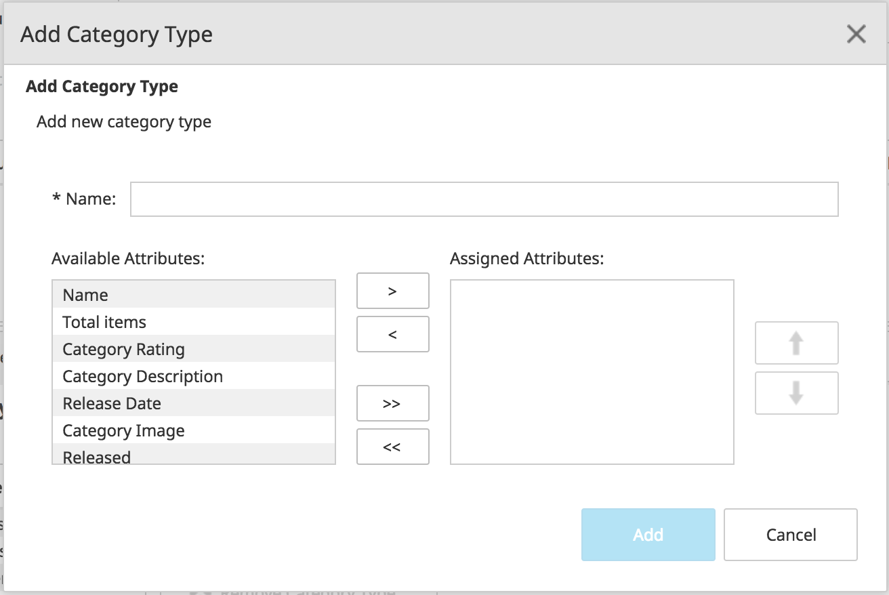
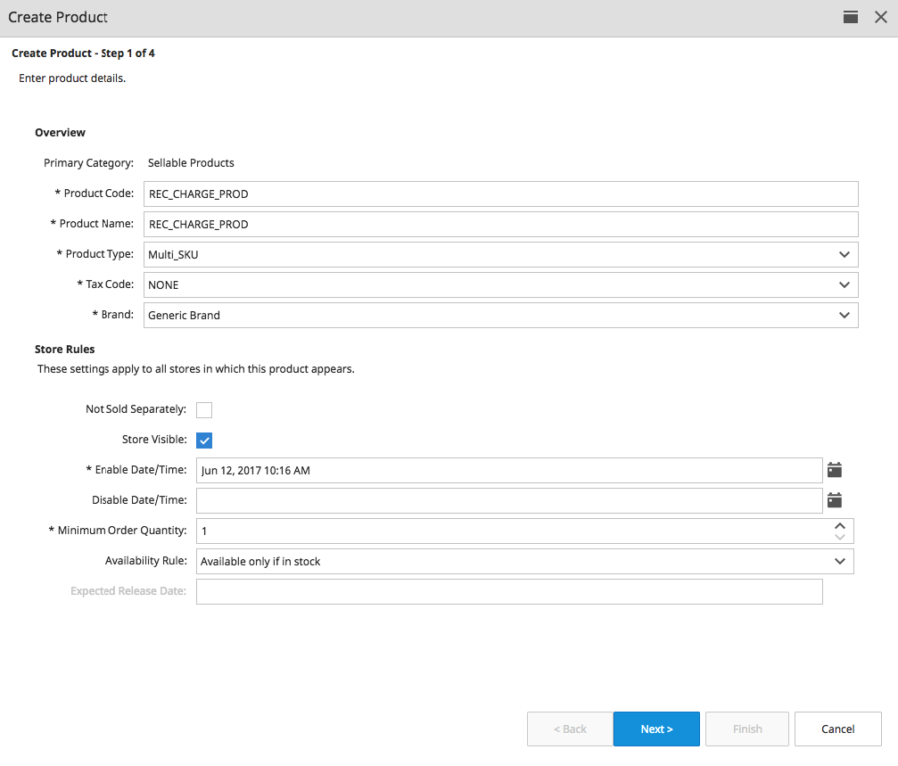
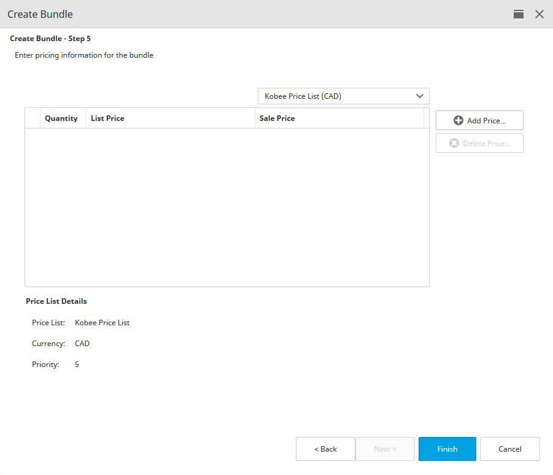

# Chapter 5: Catalog Management

The Catalog Management Activity provides users with the ability to import, create, and manage catalogs, product categories, and products. You can access it from the main toolbar.

## Catalogs and Virtual Catalogs

Catalogs are collections of products. They are independent from one another, and you may have as many catalogs as required.

Virtual catalogs are conceptual creations that make the management of store catalogs easier. The products in a virtual catalog are inherited from regular catalogs; virtual catalogs may be constructed from any combination of catalogs and catalog products.

For example, a clothing retailer may build a virtual catalog for the Fall shopping season that consists of specific products from a number of different regular catalogs (for example, warm jackets from Coats or gloves from Accessories).

### Catalogs

Each catalog has a unique name and is independent from the other catalogs. Besides choosing a name, the store administrator must also decide the languages the new catalog supports.

Catalogs should be used in the following situations:

- A manufacturer may operate a number of different brands or product lines. Each brand or product line should have its own catalog of all the offerings for that category.
- A retailer may have a number of different suppliers. Each supplier will have their own catalog, populated with the goods they offer.

**Note** :If you have recurring charge products in your Elastic Path deployment you may only have them in one (master) catalog.

#### Creating a Catalog

To create a catalog, select the **Create Catalog** button in the toolbar:

When creating a catalog, you will see the following dialog box:

| **Field** | **Description** |
| --- | --- |
| Catalog Code | The unique identifier for the catalog. The code cannot be changed once the catalog is created. |
| Catalog Name | The name of the catalog being created. |
| Selected Languages | The languages supported by the catalog. You must add at least one language to this list. |
| Default Language | The default display language for the product and category information. This drop-down list is populated from languages in the _Selected Languages_ list. |

> **Note:** After the catalog is created, you can add languages to the _Selected Languages_ list box. After a language is added, it cannot be removed.

#### Editing a Catalog

To edit a catalog, double-click it in the left-hand pane to open it.

When editing a catalog, you will see a screen similar to the one below. Click the tabs at the bottom of the screen to view and modify the attributes within each tab:

 

##### Summary Tab

Use this tab to set the Catalog Name as well as the languages in which catalog text can be displayed.

| **Field** | **Description** |
| --- | --- |
| Catalog Code | A unique identifier for the catalog. The code cannot be changed once the catalog is created. |
| Catalog Name | The name of the catalog. |
| Default Language | The default display language for product and category information. |
| Available/Selected Languages | Languages supported by the catalog. At least one language must appear in the _Selected Languages_ list. |

##### Attributes Tab

Use this tab to add, change or delete attributes for the selected catalog. (Note: If you want to set attributes that apply to all catalogs, you must create global attributes using the **Catalog Management &gt; Edit Global Attributes** feature.)

Catalog attributes are descriptive aspects of a product or category in a catalog. For example, if your storefront sells luggage, you could add an attribute called _Material_. The possible values for this attribute are vinyl, leather, and canvas.

Note that adding an attribute allows you to set values for that attribute in the catalog from within Elastic Path Commerce, but the attribute will not be visible in the frontend unless it is used by the CMS template controlling the frontend . For more information, refer to the _Elastic Path Commerce Developer Guide_.

| **Field** | **Description** |
| --- | --- |
| Attribute Key | The _Attribute Key_ should follow the Attribute Key naming convention used by your organization. For example, a six character alpha-numeric string beginning with an &quot;A&quot;.   |
| Attribute Name | The _Attribute Name_ is a short text entry. |
| Attribute Usage | The _Attribute Usage_ specifies which item in the catalog hierarchy the attribute is associated. For example, the &quot;Material&quot; attribute would apply to _Products_, but not to _SKUs_. The possible usage types are: Category, Product, SKU, Customer Profile |
| Attribute Type | The _Attribute Type_ tells the system what types of characters are valid for the attribute (for example, string or integer). |
| Multi-Language | Specifies whether you can enter multi-language text for the attribute when setting up a product. For example, in a store configured for English and French, you would be able to enter text descriptions for a product in both languages. |
| Required Attribute | Specifies whether a value must be entered for this attribute when a user is setting up a product. |
| Multiple Values Allowed | Specifies whether a long or short text attribute can accept multiple values shown in a drop-down list. For example, an attribute describing 35 mm camera film speed would be easier to use if the film speed values were presented in a drop-down list. |

##### Cart Item Modifier Groups Tab

Use this tab to add, change or delete groupings of fields used when collecting data from your customer for a given product when adding it to the cart. That is, these fields are associated with products making them &#39;configurable&#39; by the customer when purchasing.

Configurable products are useful when you need to collect information from the customer regarding the specific product in order to complete the purchase.  For example, when purchasing a personalized t-shirt, the customer must provide the name they want to be imprinted on the shirt.  Or, when purchasing a gift certificate, the customer must provide the name and email address to send the gift certificate code to. Or, when purchasing carpet cleaning services, the customer must provide the date and address they are requesting the service.

You are not required to create Cart Item Modifier Groups; however, if you have products requiring input from the customer before purchase, these groupings allow you to create different groupings of product metadata to be collected.

| **Field** | **Description** |
| --- | --- |
| Group Code | The _Group Code_ should follow the naming convention used by your organization. |
| Group Name | The _Group Name_ is name assigned or the working name for this grouping of fields.  Note, this field value can be provided the languages supported by this catalog so this value could be displayed to the customer |

You are able to add as many fields as are appropriate to a group and the fields may be of various types.

| **Field** | **Description** |
| --- | --- |
| Code | The _Code_ should follow the naming convention used by your organization for configurable fields. |
| Display Name | The _Display Name_ is name displayed to the customer. |
| Field Type | Select the type of value to be provided. Selection of a given type may provide additional configuration fields.  For example, selection of &quot;short-text&quot; requires a maximum field size value to be configured. |
| Required | Indicates whether or not the field will require a value before it can be added to the cart |

Cart Item Modifier Groups cannot be shared between master catalogs.  If you have the same groupings in multiple maser catalogs you will need to create each independently.

Similarly, Cart Item Modifier fields cannot be shared between groups.  If you have the same field to be used in multiple groups, you will need to add the field independently to each group.

##### Category Types Tab

A category type defines the set of attributes for a category. Use this tab to add, modify, and delete category types in a catalog.

In a relatively simple catalog, you may only need one category type. More complex catalogs may require several category types. For example, if your business offers electronics and kitchen supplies, you may want to have two category types: electronics attributes and kitchen-related category attributes.

| **Field** | **Description** |
| --- | --- |
| Name | The name for the category type |
| Category Image | Indicates that a category type has an image assosciated with it. |
| Available Attributes and Assigned Attributes | Assigned attributes become available on the _Attributes_ tab for a selected category when a user creates or edits a category of that category type. Click **&gt;** to add available attributes to this category type. |

##### Product Types Tab

A Product Type defines the set of attributes for a product and the template used to display that product in the frontend. Use the _Product Types_ tab to add, modify, and delete Product Types in a catalog.

Once you have created a Product Type, you can associate it with the necessary product attributes that describe that type of product.

 

| **Field** | **Description** |
| --- | --- |
| Name | The name of the product type. |
| Default Tax Code | The applicable tax code for this Product Type. Tax Codes are added to Elastic Path Commerce by your store administrator via the _Configuration_ activity.   |
| Available Attributes and Assigned Attributes | The list of system attributes is on the left. The attributes in the _Assigned Attributes_ list appear as fields to be completed when creating or modifying a product of this product type.    Click **&gt;** to add available attributes to this Product Type. |
| Available / Assigned Cart Item Modifier Groups | The list of Cart Item Modifier Groups is on the left. The groups in the _Assigned Cart Item Modifier Groups_ list appear as fields to be completed when adding the product of this product type to the cart.    Click **&gt;** to add available Cart Item Modifier Groups to this Product Type. |
| Product type has multiple SKUs | Specifies whether the product type requires SKU Options or is a recurring charge product. SKU Options allow multiple attribute values for a product, so that the shopper can select a combination of those attributes for a single product.   The attribute combinations for the product are recorded as separate SKUs. For a recurring charge Product Type, you must select _Frequency_ as one of the SKU options. For more information, see _SKU Options Tab_.|
| Product type is discountable | Specifies whether the Product Type can be discounted. |

##### SKU Options Tab

Use this tab to add, edit or remove SKU options for multi-SKU and recurring charge products. For example, if your store sells a camera bag with product code &quot;123&quot; that comes in large, medium and small, as well as blue, black and green, you would set up the size and color attributes on this tab so that the product size and color combinations can be accessible from the bag&#39;s product SKU.

| **Field** | **Description** |
| --- | --- |
| SKU Option/Value | The options for multi-SKU products in the category, and the values that can be selected for each option.   If the catalog contains gift certificates, you must add the following two SKU options: **GC\_Theme**, **GC\_Denomination**. The image of **GC\_Theme** specifies a design theme that customers can choose when purchasing a gift certificate. **GC\_Denomination** specifies a gift certificate amount that customers can choose when purchasing a gift certificate.   If the catalog contains recurring charge products, you must add the following SKU option: **Frequency**. Enter **Frequency** in the **Code** field and the billing frequency term in the **Display Name** field (for example, &quot;Billing Cycle&quot;). The payment frequencies would be SKU options under Frequency. For example, an option with SEC for the code and per second for the display name would have per second billing frequency. A one-time charge SKU option must have the code NA. |
| Display Name | (Required.) The name of the option that appears to shoppers in the frontend. |
| Image | The image associated with the SKU option. |
| Code | (Required.) The shortened version of the option and value. For example, the code for the option Bag Size with a value of medium could be &quot;BSM&quot;. This field cannot be modified in the **Edit SKU Option Value** dialog box. |

The buttons on this tab allow you to manage both the attributes and the attribute values.

##### Brands Tab

Use this tab to add, edit or remove Brands from a catalog.

To add a brand to the catalog, click **Add Brand** and complete the fields in the following table.

| **Field** | **Description** |
| --- | --- |
| Brand Code | The identifier for this brand. |
| Brand Name | The Brand name.   |

#### Deleting a Catalog

To delete a catalog, right-click on it on the left-hand pane and select **Delete**:

> **Note:** A catalog can only be deleted if it does not contain any categories or products.

### Virtual Catalogs

A virtual catalog must have a unique name that differentiates it from other virtual catalogs and regular (master) catalogs. Virtual catalogs are built with products and categories from master catalogs. However, one cannot add products from one virtual catalog to another.

A virtual catalog may have unique categories not found in the master catalog it is inheriting its products from. This allows more flexibility in structuring a virtual catalog&#39;s categorical hierarchy. However, the products in a virtual category must already exist in a master catalog. Virtual catalogs can inherit any subset of a master catalog.

Note that virtual catalogs provide you only with a _view_ of the products from the master catalogs. You cannot modify the actual product data (other than its price) in a virtual catalog. Instead, you must modify the product&#39;s details from its master catalog. This also means that if a change is made to a product in a master catalog, any virtual catalogs that inherited that product will also be changed. (Note that this does **not** include _Merchandising Associations_ or _Category Assignments_, as those attributes are separate from the master catalog and are not inherited from it.)

Whether a virtual catalog is required or not depends on the requirements of your stores. Typically virtual catalogs may be required in the following cases:

- To support secondary or tertiary stores that sell a subset of the main store&#39;s catalog. For example, a company may operate a general-purpose electronics store, [www.electronics.com](http://www.electronics.com), as well as two niche stores, [www.digitalcameras.com](http://www.digitalcameras.com) and [www.camcorders.com](http://www.camcorders.com). The two niche stores only sell a subset of the products sold in [www.electronics.com](http://www.electronics.com), and may have different pricing structures. In this case, a master catalog will support the main store, and two virtual catalogs would support each of the niche stores.
- To support geographical stores where individual operating countries may sell a subset of the product range and pricing may differ between countries. In this case, a master catalog would reflect the company&#39;s worldwide catalog, and a virtual catalog would be used for each geographical store. If geographical stores are similar (for example, two countries in the European Union), they may both use the same virtual catalog.
- To allow suppliers to manage their own catalogs. In this case each supplier can have their own master catalog. As the store operator you can have a single virtual catalog that consumes the categories and products you want to sell in your store from each of the supplier master catalogs.

#### Creating a Virtual Catalog

To create a virtual catalog, click the **Create Virtual Catalog** button in the main toolbar.

When creating a virtual catalog, the following dialog box appears:

#### Editing a Virtual Catalog

You can edit the display name of a virtual catalog by right-clicking on it and selecting **Open**.

#### Deleting a Virtual Catalog

Like a regular catalog, you can access the main controls for managing virtual catalogs from the main toolbar and the _Catalog Browse_ tab toolbar.

### Global Attributes

A global attribute can be shared across multiple catalogs. Administrators do not have to recreate the same attribute for every new catalog.

#### Creating a Global Attribute

1. Click **Edit Global Attributes**.

    

2. Click **Add Attribute**.

    

3. Set the attributes and values for your new global attribute. Click **Add** when you are done.

4. In the _Edit Global Attributes_ dialog box, click **Save**.

#### Editing a Global Attribute

1. Click **Edit Global Attributes**.

2. Select the global attribute you want to edit.

3. Click **Edit Attribute**.

4. Make your changes and click **OK**.

5. In the _Edit Global Attributes_ dialog box, click **Save**.

#### Deleting a Global Attribute

1. Click **Edit Global Attributes**.

2. Select the global attribute you want to delete.

3. Click **Remove Attribute.** A prompt appears to confirm deletion.

4. Click **OK**.

5. In the _Edit Global Attributes_ dialog box, click the **Save** button.

## Categories

Categories are used to organize the contents of catalogs. They can contain products and other categories.

> **Note:** New categories appear in the store immediately. Only top level categories will not appear until the server is restarted.

### Browsing Categories and Products

1. Select **Activity &gt; Catalog Management** to open the _Catalog Browse_ tab.

2. Categories are arranged in a tree structure and can be expanded and collapsed.

3. To view the products in a category, double-click its entry in the _Catalog Browse_ tab. The products will be displayed in the _Product Listing_ tab.

### Creating a Category

1. Select a catalog entry in the **Catalog Browse** tab.

2. Click **Create Category**.

    

    > **Note:** If **Create Category** is unavailable, your Elastic Path Commerce system may be using the Change Set feature. You must select a Change Set before creating a category.

3. Enter values in the following fields:

    | Field | Value |
    | --- | --- |
    | Category Code | (Required.) The unique identifier for the category. |
    | Category Name | (Required.) The category name that appears in the store. |
    | Category Type | (Required.) The attributes associated with the category. |
    | Enable Date/Time | (Required.) Specifies when the category becomes Store Visible. This is useful for seasonal catalogs. |
    | Disable Date/Time | Specifies when the category no longer appears in the store. |
    | Store Visible| Specifies whether the category appears in the store. It is recommended that a newly created category does not appear until products are added to it. |

4. Click **Finish**.

### Creating a Sub-Category

1. Select the category that you want to contain the sub-category.

2. Click **Create Sub-Category**.

    

3. Enter values in the required fields.

4. Click **Finish**.

### Adding a Linked Category

A linked category is a category in a virtual catalog that is inherited from a master catalog. The inherited category contains links to all of the products from the source category in the master catalog. All product attributes are inherited with each product, except for Merchandising Associations and Category Assignments.

1. Select a virtual catalog in the **Catalog Browse** tab.

2. Click **Add Linked Category**.

    

3. Enter search terms into the _Category Name_ or _Category Code_ fields and click **Search**.

4. Click on the category you wish to link to, and then click **OK**.

The category in the master catalog is added as a link to the virtual catalog.

### Deleting a Category

> **Note:** Categories can only be deleted if they do not contain products or sub-categories.

1. Select the category you want to delete.

2. Right-click and select **Delete**.

    

3. Click **OK**.

### Organizing Categories

To change the order of a category, right-click the category and select either **Move Up** or **Move Down**

### Featured Products

Featured Products appear in the fronted when shoppers view product pages by category.

 <!--DIAGRAM-->

Featured Products are controlled at the _Category_ level in Elastic Path Commerce. To set up and manage Featured Products, use the _Featured Products_ tab within a catalog category.

> **Note:** The Data Sync Tool does not sync Featured Product information.

#### Adding Featured Products

1. In the main toolbar, select **Catalog Management**.

2. In the **Catalog Browse** tab, expand the catalog to show the category containing the product you want to feature.

3. Right-click the category and select **Open**.

    

4. Click the **Featured Products** tab.

5. Click **Add**.

    

6. Use the _Search_ fields to find the product you want to feature for this category.

    

7. Click **OK**.

### Changing Featured Product Display Order

To change the order in which Featured Products show up in your store, use the **Move Up** and **Move**** Down** buttons.

#### Removing Featured Products

1. In the main toolbar, select **Catalog Management**.

2. In the **Catalog Browse** tab, expand the catalog to show the category containing the product you want to feature.

3. Right-click the category and click **Open**.

    

4. Click the **Featured Products** tab.

5. Click on the product that you want to remove as a Featured Product.
    

6. Click **Remove**.

7. Review the confirmation text, then click **OK**. The product is removed from the Featured Products list.

## Products

A Product in Elastic Path Commerce corresponds to a real-life product. Each product has characteristics, can be sold, and belongs to a product type group.

Every Product is assigned to a Product Type_._ A product type defines how a particular set of products is displayed, the Tax Codes that apply to it and the attributes and SKU options that are available for products to that type.

### Browsing for and Viewing a Product

You view Products by doing a Catalog Search, or by browsing the catalog and double-clicking a category to display a list of all the products within it. The _Product Listing_ tab displays the products.

To display details for a listed product, double-click it. The _Summary_ tab appears.

### Single and Multi-SKU Products

Every product in an Elastic Path Commerce catalog has at least one SKU (Stock Keeping Unit number). An SKU identifies a specific version of a product. A product can have multiple SKUs, with each SKU corresponding to a particular offering of the product.

For example, a portable MP3 audio player product is configured with multiple SKUs representing different combinations of color and storage capacity.

The Product Type assigned to a Product defines whether the Product has one or more SKUs. If you are setting up a multi-SKU product, you must assign it to a Product Type that allows multiple SKUs. In the example shown here, any product assigned the &quot;Pod Pouch {Multi SKU}&quot; Product Type has been configured for multiple SKUs.

Multiple SKU products are identified with a colored icon in the _Product Listings_ tab, while single SKU products do not have a colored icon.

When you open a multiple SKU product you can view the parent SKU and the child SKUs beneath it on the SKU Details tab as shown below. The child SKU is identified by a barcode on the tab.

For information on setting up products, refer to _Creating a Product_ in this chapter.

### Using Catalog Search

You can search for products and SKUs using the _Catalog Search_ and _Advanced Search_ tabs.

#### Searching for Products

1. Click the  **Search** tab.

    

2. In the _Products &amp; Bundles_ tab, enter a _Product Name_, _Product Code_ or _SKU Code_ into the _Search Term_ fields. You must enter a value in at least one of these boxes.

3. Under _Filters_, select a brand and catalog to search within.

4. Under _Sorting_, choose the column to sort the search results and whether to sort in ascending or descending order.
    

    You can also sort the results of your search by clicking a column header in the results list.

5. Click **Search**.

#### Searching for SKUs

1. Click the _Catalog Search_ tab.

    

2. Click the _SKUs_ tab.
    

3. Enter a _SKU Code_, _Product Name_, or _Product Code_ into the _Search Term_ fields. If you do not specify any SKU option filters, you must enter a value in at least one of these fields.

4. Under _Filters_, select a brand and catalog to search within.

5. Under _SKU Option Filters_, select a SKU option and the SKU option values you want to search for.

    

6. To configure additional SKU options filters, click **Add Another Filter** and repeat Step 5.

7. Click **Search**. The matching SKUs are displayed in the _SKU Search Results_ tab.

    

    To view the details for a SKU, double-click it or select it and press Enter.

#### Pagination

By default, search results lists show only 10 items per page. You can change this to show a more items by using the pagination setting. In the main toolbar, click the right-hand admin menu and select **Change Pagination Settings**.

#### Advanced Search (Product)

The advanced search feature allows you to perform more complex product searches. You can create search queries and save them for execution at a later time.

The _Advanced Search_ tab has two tabs:

- The _Query Builder_ tab allows you to create queries using the query language.
- The _Saved Queries_ tab contains a list of previously saved queries, including public queries created by other users. Use this tab to edit, delete, and run previously created queries.

#### Creating a Product Query

1. In the _Advanced Search_ tab, click the _Query Builder_ tab.

2. In the _Query_ box, enter the query you want to execute. For example, to search for all products that have the name Canon - Camera accessory kit, enter the following:
    ProductName[en] = &#39;Canon - Camera accessory kit&#39;

3. Click **Validate Query**. An error message is displayed if there are any errors in the query. Correct the errors if necessary.

4. Click **Run Query**. The products that match the query are displayed in the _Advanced Search Results_ tab.

#### Saving a Product Query

1. In the _Advanced Search_ tab, click the _Query Builder_ tab.

2. Create and validate a query.

3. Click **Save As**.

4. Enter a name and description for the query.

5. Choose **Public** if you want other users to be able to run the query. Otherwise, choose **Private**.

6. Click **Save**. The query can now be run from the _Saved Queries_ tab.

#### Editing a Saved Product Query

**Note** :If you are not an administrator in Elastic Path Commerce, you can only edit queries that you created. Administrators can edit all public and private queries.

1. In the _Advanced Search_ tab, click the _Saved Queries_ tab.

2. Select the query you want to edit.

3. Click **Edit Query**. The _Query Builder_ tab is displayed and the _Query_ field contains the query text.

4. Make the necessary changes to the query.

5. Click **Save** to save the changes, or click **Save As** to save it as a different query.

#### Deleting a Product Query

1. In the _Advanced Search_ tab, click the _Saved Queries_ tab.

2. Select the query you want to delete.

3. Click **Delete Query**. A prompt appears to confirm deletion.

4. Click **OK**.

### Creating (Adding) a Product

1. Right-click the category that will contain the new product and click **Create Product**. The Create Product wizard appears.  

    

    > **Note:** If **Create Category** is unavailable, your Elastic Path Commerce system may be using the Change Set feature. You must select a Change Set before creating a category.

Enter a _Product Code_ for the new product. The code should follow your organization&#39;s convention for product codes.

1. Type a descriptive _Product Name_ for the product.

2. Select a _Product Type_ from the drop-down list.

3. Select a _Tax Code_ from the drop-down list.

4. Select a _Brand_ from the drop-down list.

5. In the _Store Rules_ section, select _Not Sold Separately_ if the product is only to be sold as part of a bundle.

6. Select the _Store Visible_ check box if you want the product to appear in the store. (Note that a product&#39;s visibility is superseded by the settings of its parent category.)

7. Set an _Enable Date/Time_ for the product. This is the date and time that the product will become visible in the store. Set a _Disable Date/Time_ if you want.

8. Enter a _Minimum Order Quantity_ value. Customers must order at least this many products.

9. Select an _Availability Rule_ for the product.

10. Enter the _Expected Release Date_ if applicable.

11. Click **Next**.

2.  Enter values for attributes associated with this Product Type. A typical example is a long or short text description of the item.

    

    > **Note**: If an attribute you want is not listed you will need to add it to the Product Type.

3. Click **Edit Attribute Value** , and enter a value for the attribute. Click **OK**.

4. Click **Next**.

5. Enter a _SKU Code_ for the product.

    

    Select the _Shippable_ option if the product will be shipped to customers. If selected, the _Shipping and Inventory Details_ section becomes active. Enter weight and dimension information that can be used to calculate shipping charges in the available fields.

    Select the _Digital Asset_ option if the product is a digital asset, and provide a URL where the file may be downloaded from.

    In the _Download Limit_ field, select a value for the number of times that the customer can download the digital asset. In the _Download Expiry_ field, select the number of days after the order was placed that the customer will have to download the digital asset.

1. Click **Next**.

    

    Add base prices to each of the applicable price lists.

    > **Note** :This page will only be visible if you have been assigned the _Manage Price Lists_ permission and at least one price list associated with the product&#39;s master catalog.

2. Click **Finish**.

### Creating a Multi-SKU Product

1. Right-click the category that will contain the new product and click **Create Product**.

    

2. Enter a _Product Code_ for the new product. The code should follow your company&#39;s convention for product codes.

3. Type a descriptive _Product Name_ for the product.

4. Select a _Product Type_ that is configured for multi-SKU products from the drop-down list. The multi-SKU attribute that permits products to have more than one SKU is set at the Product Type level. If the Product Type you want to associate with this product does not accept multiple SKUs you will need to either select a different Product Type or modify the selected Product Type to accept multiple SKUs. (For more information on modifying a Product Type, see Product Types Tab.)

5. In the _Store Rules_ section, select _Not Sold Separately_ if the product is only sold as part of a bundle. Select the _Store Visible_ check box if you want the product to appear in the store. (Note that a product&#39;s visibility is superseded by the settings of its parent category.)

6. Set an _Enable Date/Time_ for the product. This is the date and time that the product will become visible in the store. Set a _Disable Date/Time_ if you want.

7. Enter a _Minimum Order Quantity_ value. Customers must order at least this many products.

8. Select an _Availability Rule_ for the product.

11. Click **Next**.

    

    Use this page to enter values for attributes associated with this Product Type. If an attribute you want is not listed, you will need to add it to the Product Type. Attributes entered for a Product Type apply to all products associated with that type. If the attribute you are seeking is specific to the product rather than to the Product Type, you can add it later as a SKU option. For example, color and size information for a T-shirt that is available in different colors and sizes should be entered as SKU Options.

12. Click **Edit Attribute Value** and enter a value. Click **OK** and then enter values for any other listed attributes. Click **Next** when you are done.

    > **Note**: In this section of the _Create Product_ wizard you configure the SKU entries for each variant of a multi-SKU product. For example, if you are selling a T-Shirt that is available in multiple sizes and colors, you create an entry for each size/color combination using the _Add SKU_ pages. In addition, you can add more SKUs to the product later using the _SKU Details_ tab in the product&#39;s record.

    

13. Click **Add SKU** to display the Add SKU wizard.
    

14. Specify the following in the _Add SKU_ wizard

    | **Field/Column/Button** | **Description** |
    | --- | --- |
    | SKU Code | The SKU (Stock Keeping Unit) code represents the exact variant of an item being sold in the store. It is linked to available inventory. |
    | Enable Data | Specify when the SKU should be available in the store. |
    | Disable Date | Specify when the SKU is not available in the store. |
    | SKU Options | Select a value for each option from the drop-down lists. If the value you want is not available, click **Add Value**. |
    | Shippable Type | Define whether the product is a shippable product or a Digital Asset |
    | Shipping Details | If the product is shippable, define the shipping details: Weight, Width, Length, and Height. |
    | Digital Assets | Available when the product Shippable Type is Digital Asset and Downloadable is selected.  |
    | File | The file (digital asset) the product represents. |
    | Download Limit | The maximum number of times a customer can download the asset. |
    | Download Expiry | The time frame when the user is allowed to download the asset, defined as the number of days after the order was placed. |

15. Enter SKU attribute values. Click on a listed attribute and then click **Edit Attribute Value**. Type in a value, and click **OK**.

    > **Note:** SKU attributes listed as &quot;Required&quot; must have values.

16. Click **Finish**.

    

17. Optionally, click **Add SKU** to add more child SKUs for this product. Click **Next** when you are done.

    

18. Add base prices to each of the applicable price lists.

    > **Note** :This page will only be visible if you have been assigned the _Manage Price Lists_ permission and at least one price list associated with the product&#39;s master catalog.

19. Click **Finish**.

### Creating a Recurring Charge Product

Before you can create a recurring charge product, you must configure the Frequency SKU option and SKU option values and create multi-SKU Product Types with the Frequency SKU option. For more information, see

SKU Options Tab and Product Types Tab.

**Note** :You may only have recurring charge products in one master catalog.

1. Right-click the category that will contain the new recurring charge product and click **Create Product**.

2. Enter a _Product Code_ for the new product. The code should follow your company&#39;s convention for product codes.
    

3. Type a descriptive _Product Name_ for the product.

4. Select a _Product Type_ that is configured for multi-SKU products from the drop-down list. The Multi SKU attribute that permits products to have more than one SKU is set at the Product Type level. If the Product Type you want to associate with this product does not accept multiple SKUs you will need to either select a different Product Type or modify the selected Product Type to accept multiple SKUs. (For more information, see Product Types Tab.)

5. In the _Store Rules_ section, select _Not Sold Separately_ if the product is only to be sold as part of a bundle. Select the _Store Visible_ check box if you want the product to appear in the store. (Note that a product&#39;s visibility is superseded by the settings of its parent category.)

6. Set an _Enable Date/Time_ for the product. This is the date and time that the product will become visible in the store. Set a _Disable Date/Time_ if you want.

7. Enter a _Minimum Order Quantity_ value. Customers must order at least this many products.

8. Select an _Availability Rule_ for the product.

9. Click **Next**.

10. Click **Select Image** to selecta display image for the product. This image will appear as the main image for the product, but you can add more images for any other SKUs associated with the product. For example, the image selected here may be of the black version of a camera bag available in black, blue and red colors. You would include images showing the blue and red bags when you set up their individual SKUs.

11. Click **Next**.
    On Step 3 of the wizard, enter values for attributes associated with this Product Type. If an attribute you want is not listed, you will need to add it to the Product Type. Attributes entered for a Product Type apply to all products associated with that type. If the attribute you are seeking is specific to the product rather than to the Product Type, you can add it later as a SKU option. For example, color and size information for a T-shirt that is available in different colors and sizes should be entered as SKU Options.

12. Click **Edit Attribute Value** and enter a value. Click **OK** and then enter values for any other listed attributes. Click **Next** when you are done. 
    **Note**: In this section of the _Create Product_ wizard you configure the SKU entries for each variant of a multi-SKU product. For example, if you are selling a T-Shirt that is available in multiple sizes and colors, you create an entry for each size/color combination using the _Add SKU_ pages. In addition, you can add more SKUs to the product later using the _SKU Details_ tab in the product&#39;s record.

13. Click **Add SKU**.

14. In the _Add SKU_ dialog box, enter a _SKU Code_ for one variant of the product, then click the _Enable Date_ calendar to specify when the SKU should be available in the store. Select a _Disable Date_ if you want.
    

15. In the _SKU Options_ section, select a value for each option from the drop-down lists. To add more values, click **Add Value**. Click **Save** when you have finished adding the new value.
    

    The frequency with code &quot;NA&quot; is used to provide a one-time charge payment option to your recurring charge products. For instance, if you are selling a camera for $1200, use &quot;NA&quot; for the lump sum payment option of $1200 while using &quot;per month&quot; for monthly payments of $100 for the next 12 months. The &quot;NA&quot; code therefore makes it unnecessary to create a separate single-SKU Product Type with a one-time charge payment option for your recurring charge products.

16. Click **Next**.

17. Enter SKU attribute values. Click on a listed attribute and then click **Edit Attribute Value**. Type in a value, and click **OK**.

    > **Note:** SKU attributes listed as &quot;Required&quot; must have values.

18. Click **Finish**.

19. If you want, click **Add SKU** to add more child SKUs for this product. Click **Next** when you are done.

20. Click **Finish**.

    > **Note** :Do not add any base prices at this step. Prices for recurring charge products must be defined at the SKU level. Any base prices added at the product level will be ignored.

#### Setting Up a Recurring Charge Product

After creating a recurring charge product, you must complete additional steps:

1. Change the _Shippable type_ setting in the _SKU Details_ tab of each SKU to _Digital Asset_ as shippable recurring charge products are not currently supported.

2. Set prices for each SKU. Product-level prices of recurring charge products are always ignored. Therefore, product-level pricing will not be used if SKU-level pricing is left undefined.

#### Label Text Sources for Recurring Charge Products

It is important to note the sources of certain text labels in a recurring charge product description page. Consider the following recurring charge product shown in the fictional frontend below:

The payment frequency label next to the monthly charge is from the productTemplate.properties file, while the payment frequency label in the drop-down list is from the _Display Name_ entered when creating the SKU option value in Elastic Path Commerce. This allows for different text labels for the two areas if needed. Moreover, the Frequency SKU option _Display Name_ is the source of &quot;Billed&quot; in the figure above.

### Creating a Configurable Product

Configurable products are those products where the customer must provide data regarding that product in order to make the purchase.  For example, if you are selling carpet cleaning services, you need the customer to indicate the date and address they want these services to occur.  Similarly, if you are selling monogramed t-shirts, you need the customer to provide the name to be embroidered on the t-shirt.

Before you can create a configurable product, you must create Cart Item Modifier Groups in your master catalog and assign them to the desired Product Type.  The Cart Item Modifier Group defines the configurable fields associated with the product when purchasing.  Any product assigned to a product type with associated Cart Item Modifier Groups will present the associated fields for input.

#### Creating a Cart Item Modifier Group

When creating a Configurable Product you must first ensure you have the appropriate Cart Item Modifier Group.  It is this step that determines what fields the configurable product contains.

1. Right-click the master catalog and click on the _Cart Item Modifier_ tab.

2. Click the **Add Group** button. In the Add Cart Item Modifier Group window, enter the Group Code, and Group Name values.

    

    > **Note:** you are able to enter localized values for the **Group Name** as you may opt to display this information to the customer in the frontend.

3. Select the **Add Field** button.

4. Enter values for **Code** and **Display Name**.

    

    >**Note:** you are able to enter localized values for the **Group Name** as you may opt to display this information to the customer in the frontend.

5. Select the **Field Type** from the list provided.

6. Check or uncheck the **Required** field.  If this field is checked, the customer must provide a value before the product can be added to the cart.

7. Select the **Add** button.

8. Click the **Add Field** button again to add additional fields to the Cart Item Modifier Group.

9. Once all the fields have been added for this Cart Item Modifier Group, click the **Add** button to save the group

#### Adding a Cart Item Modifier Group to a Product Type

Once you have your Cart Item Modifier Group(s), you need to add them to the appropriate Product Type(s).  It is the act of adding the group to the product type which makes the fields available for any product assigned a given product type. The steps below outline adding a Cart Item Modifier Group to an existing Product Type; however, it is the same process for adding it to a new product type.

1. Right-click the master catalog and click on the _Product Type_tab.

2. Find the desired type in the **Product Type** table and click the **Edit Product Type** button.
    

3. In the _Edit Product Type_ wizard, note the Cart Item Modifier Groups listed in the **Assigned Cart Item Modifier Groups** list.
    

4. Select the desired Cart Item Modifier Group from the **Available Cart Item Modifier Groups** list and select the **&gt;** button to assign the group to the Product type.
    **Note** : Use the same steps using the &lt; button to remove or unassign the group from the Product Type.

5. Continue configuring the Product Type and click the **Finish** button to save your group assignment.
    **Note** : Any product assigned the given Product Type is considered a **Configurable Product** and will have the fields in the corresponding Cart Item Modifier Group(s) available to the customer in the frontend to complete when adding the item to their cart.

#### Edit a Cart Item Modifier Group

To edit an existing Cart Item Modifier Group:

1. Right-click the master catalog and open it.  Click on the _Cart Item Modifier Groups_ tab.

2. Select the corresponding group from the **Cart item Modifier Groups** table and click the **Edit Group** button.

    

3. The configurable fields are listed in the table.

    

    > **Note:** the Display Name, the type of data to be provided, and whether or not a field value must be provided are listed in the table.

4. Select the **Add Field** button to add a new field to the group or select the **Edit Field** button to change an existing field in the group.

5. Click the **Add** or **Ok** button to save your additions or changes.

6. Click the **Ok** button to close the edit window.

#### Change Configurable Product Field Label

The fields added to the **Cart Item Modifier Group** are made available to the customer in the front end so they can provide the corresponding values.  You will need to determine how you want these fields displayed through your CMS.  Cortex provides these fields to the CMS as &#39;dynamic fields&#39;, which can be validated using Coretx _Studio_.

This screen shot shows the **Cart item Modifier Group** associated with the product via its Product Type assignment and that same group fields displayed in _Studio_ when selecting the _addtoCart_ resource for a product assigned to that Product Type.

When configuring the fields associated with a **Cart Item Modifier Group** , you are able to provide the _Display Name_ value in the languages supported by the master catalog.  By using these configuration setting, you are able to communicate with the CMS what the name of the field displayed to customer should be.  That is, the customer will see the values indicated in the Display Name column rather than the code value which is what Studio is displaying.  For example &#39;_Recipient Email&#39;_ instead of &#39;_giftCertificate.recipientEmail&#39;_.

To change the field Display Name:

1. Right-click the master catalog and open it.  Click on the _Cart Item Modifier Groups_ tab.

2. Select the corresponding group from the **Cart item Modifier Groups** table and click the **Edit Group** button.

3. The configurable fields are listed in the table.

4. Select the desired field from the list and click the **Edit Field** button

5. Select the language from the _Display Name_ list.
    

6. Enter or edit the _Display Name_ value.

7. Select the **Ok** button.
    Additional configuration setting allow you to control other display features:
    1. Field Ordering - By using the **Up** and **Down** arrow buttons, you are able to control the order in which these fields are displayed.

#### Creating a Configurable Product

Once the Cart Item Modifier Group has been added to a **Product Type** , creation of a Configurable product is no different than creation of any other product and assigning it to that product type.  Products assigned to a **Product Type** which have Cart Item Modifier Group(s) assigned to them will have the corresponding fields displayed to the customer for completion when adding the item to their cart.

### Editing a Product

1. Double-click the product you want to edit. The product details appear in a tab at the bottom.

2. Make your changes.

3. Click **Save**.

### Deleting a Product

You can delete a product by following these instructions. Note that deleting a product also removes prices for that product from all price lists containing that product.

1. Select the product you want to delete.

2. Click **Delete Product**. A prompt appears to confirm deletion.
    

3. Click **OK**.
    

### Product Bundles

A bundle is a product that contains one or more items, and is sold as a single product. An item can be a product or another bundle. Like a regular product, they can be searched for in Elastic Path Commerce and stores, and have associated Search Engine Optimization terms and merchandising associations assigned to them. Inventory is tracked either by bundle or by the items within a bundle, according to the business policy of your organization.

#### Fixed and Dynamic Bundles

Fixed bundles must be purchased with all bundle items. Dynamic bundles allow the customer to choose a subset of bundle items to purchase. For example, if your company is selling cable television subscriptions, you can use a dynamic bundle at a fixed price to offer the customer any combination of 20 channels offered from a selection of 100 channels.

A bundle can contain single or multi-SKU items. Multi-SKU items allow a shopper to configure a bundle, by selecting, for example colors, sizes, and other attributes for an item within the bundle.

The bundle shown above consists of a colored camera, a camera case, and a battery. In this example, the camera is a multi-SKU item. The shopper must select a color for the camera.

A bundle appears in the store as a single item just like any other product. A bundle description and detailed information appear for each item within the bundle.

As shown below, a bundle appears in the customer&#39;s shopping cart as a main line item. Beneath this main line item is an &quot;Includes&quot; section that displays the details of each item in the bundle. The order of bundle items can be set when configuring the bundle in Elastic Path Commerce.

There is a single price set for the entire bundle. The prices of the individual items in a bundle are not shown.

Similarly, the prices of each item within a bundle do not appear in the shopping cart or the customer&#39;s order. Instead, the customer can be shown the total price savings gained by purchasing the items within a bundle rather than individually. These &quot;You Saved&quot; prices are calculated by subtracting the sale price of the bundle from the total of the sale prices for each item within the bundle.

#### Inventory Availability for Bundles

The _Availability Rule_ field sets the product&#39;s available for purchase in the store depending on its inventory levels. For product bundles, this field is not active. This is because bundles have the same availability as their least available bundle item. For example, you have a bundle that contains the following:

| **Bundle Item** | **Availability Rule** |
| --- | --- |
| camera | always available |
| camera lens | available for backorder |
| camera case | available for pre-order |

The least available inventory condition for these items is &quot;available for pre-order&quot;. As a result, the entire bundle will appear in the store as &quot;available for pre-order&quot;.

The possible availability conditions and their ranking from least to most available are shown in the following diagram:

#### Taxes, Shipping and Bundle Item Price Apportioning

Taxes are calculated against the price for the entire bundle, not against the prices of the bundle items.

Shipping is calculated as a single fee per shipment.

For _refunds, returns and exchanges_, taxes are apportioned to each item within a bundle, according to the proportional base price value of each bundle item. In the case of bundles that are shipped in partial shipments (split-shipped), shipping costs are applied as flat fees, based on the normal shipping costs that would be charged for the item if purchased and shipped individually.

#### Nesting Bundles

Bundles can contain other bundles. This allows you to include smaller bundles, for example a camera case and extra battery bundle, within other bundles, such as one comprised of a camera and an additional lens.

By using different combinations of Selection Rules, you can also create dynamic bundles where customers can choose which products they want to include in the bundle they are purchasing.

Nesting bundles can lead to very complex product configurations and related problems. For example, you may attempt to add an item to a bundle, only to find that the item you are adding already contains another item from the parent bundle. Elastic Path Commerce will not allow you to save bundles containing circular references to products.

#### Bundles in Orders

When viewing an order containing a bundle using the _Customer Service_ activity, each bundle item is shown as a line item. The name of the bundle containing the item appears in the _Bundle Name_ column. The apportioned price of each item within the bundle appears in the _Invoice Price_ column. This value represents the price that would be credited back to the customer if the item was returned.

#### Creating a Product Bundle

There are two types of bundles you can create:

- Assigned price bundle
- Calculated price bundle

An assigned price bundle gets its price set (assigned) by the store marketer. It can be fixed or dynamic.

A calculated price bundle gets its price by adding up the prices of all its bundled items. It can also be fixed or dynamic.

1. Click the **Catalog Management** icon in the main toolbar.

2. On the _Catalog Browse_ tab, double-click the category you are adding the product bundle into. The _Product Listing_ tab appears.
    

3. Click **Create Bundle**. The _Create Bundle_ wizard appears.
    

4. Enter a product code, name, type, and brand. Also, choose the type of _Bundle Pricing_ you want to use. Select _Assigned_ to create an assigned price bundle or _Calculated_ to create a calculated price bundle.

    > **Note** :If you are including recurring charge products in your bundle, you must select _Calculated_ since recurring charge products cannot be added to assigned price bundles.

5. In the _Store Rules_ section, select _Not Sold Separately_ if the bundle is only to be sold as a bundle nested within another bundle.

6. Select the _Store Visible_ check box if you want the bundle to be displayed in the store.

7. Click the calendar icon to set _Enable Date/Time_ for the bundle and enter a _Disable Date/Time_ if you want. Click **Next**.

8. This page allows you to add items to the bundle. Click **Add Item**.

    

9. In the _Add Item_ dialog box, choose _PRODUCT_ or _SKU_ for the _Type_.

    

10. Use the Code selector to search for a product or SKU. Select the item and click **OK**.

    - In the **Product Name** field, enter a product name to search for. Alternately, use the **Product Code** or **SKU Code** fields to search or refine your search.
    - Click the **Search** button and select a search result to add a product to a bundle.

    

11. Enter the quantity of the item and click **OK**. The selected product is added to the list of bundled items.

12. Repeat steps 8 to 11 to add more items to the bundle.

    > **Note** :Bundles should only be nested within bundles of the same pricing type (that is, calculated price bundles in calculated price bundles and assigned price bundles in assigned price bundles).

13. When you are done adding products to the bundle, you can adjust the order in which they appear in the list, since it is the same order that they will be displayed in the store. Select an item and click **Move Up** or **Move Down**.

14. Use the _Allow the Shopper to_ drop-down list to set the minimum number of items that the customer must select in order to purchase the bundle (the selection rule). For example, you can create a bundle consisting of three similarly-priced camera bags. For that bundle, you would set the selection rule to _Select 1_. You could then use that bundle within a camera Starter Kit bundle, consisting of a camera, a camera lens and the camera bags sub-bundle. You would set the Starter Kit bundle&#39;s selection rule to _Select All_. When the shopper selects the Starter Kit bundle in the store, they would need to choose 1 of the 3 available camera bags. If you choose _Select n_, enter the value of _n_ in the _Where n is_ field. Click **Next** when you are done.'

15. Select an image to represent the bundle. Click **Next**.

16. Configure the bundle attribute values. To modify an attribute value, select it in the list and click **Edit Attribute Value**. Click **Next** when you are done.

    

17. Enter a SKU Code for the bundle. If you are creating an assigned price bundle, click **Next** to add base prices. Otherwise, click **Finish**.

    > **Note** :Do not assign a price to a calculated price bundle, since it will be ignored. You must ensure that each bundle item has a price defined in the relevant price lists, unless the item is also a calculated price bundle. If a calculated price bundle contains an item without a defined price, the price of the whole bundle becomes undefined and shows up as a blank in the store. Moreover, filtered navigation and sorting may function incorrectly if there is not at least one price list containing prices for all of the items in the calculated price bundle.

18. Enter pricing information for the bundle. You should configure at least one base price for each catalog. To add a base price, click **Add Base Price**.

    

19. Click **Finish**. The new bundle is added to the catalog.

#### Modifying a Bundle

1. In the main toolbar, select **Catalog Management**.

2. Use either the _Catalog Browse_ or _Catalog Search_ tab to locate the bundle you want to edit. Double-click the bundle in the _Product List_ or _Product Search Results_ tab. Note that when editing a bundle, there are two tabs that do not appear when editing a product: _Bundle Items_ and _Price Adjustment_. If you are editing a calculated price bundle, the _Pricing_ tab will not appear since prices cannot be assigned to such a bundle.

    

3. Select the _Bundle Items_ tab.

    + To view and edit an item&#39;s details, such as description, availability or SKU details, select the item and click **Open Product**.
    + To add items to the bundle, click **Add Item**. In the dialog box, click the product selector button to choose the product you want to add. Click **OK** to close the product selector after you have made a selection and click **OK** to add the new item to the bundle.
    + To change an item to a different product or to change the quantity of the item included in the bundle, select the item and click **Edit Item**. Click **OK** when you are done to save your changes to the bundle.
    + To remove an item from the bundle, select it and click **Remove Item**. A confirmation dialog box will appear. Click **OK** to confirm removal. The product is removed from the bundle and no longer appears in the bundle item list.
    + To change the order of a bundle item, select it and click **Move Up** or **Move Down**. By default, bundle items appear in the store in the same order that they appear in Elastic Path Commerce. When you add a new product to a bundle, it is added to the end of the list.

    > **Note** : It is not recommended to modify the structure of a bundle while it is visible to a customer.

4. Click the **Save** button to save your changes.

#### Adjusting a Bundle Price

When you create a dynamic assigned price bundle (that it, you are using either _Select 1_ or _Select n_ as the selection rule), shoppers can choose one or more items from a list of products. You may want to allow them to choose from a set of similar items with different prices. Also, you may want to adjust the bundle price depending on the item or items the shopper has chosen.

For example, you have created a bundle containing a camera, a case and a sub-bundle containing three memory cards with storage capacities of 1GB, 2GB and 4GB. This sub-bundle uses the _Select 1_ selection rule, which allows the shopper to choose any one of the three memory cards. The 4GB card is considerably more expensive than the 1GB card, so you want the overall price of the bundle to be higher when a shopper selects it.

For calculated price bundles, price adjustments can be made to both dynamic and fixed bundle types. A price adjustment applied to a calculated price bundle item can only be negative but the magnitude of the adjustment should never exceed the value of the item. Such a price adjustment will decrease the price of the item used in calculating the overall cost of the bundle. Consider a calculated price bundle containing an item priced at $20 with a price adjustment of -$5 applied to it. As far as the calculation of the bundle price is concerned, the item has a price of $15. Worth noting is the fact that price adjustments in calculated price bundles apply to the individual items, whereas they apply to the overall price in assigned price bundles.

To make this type of adjustment, use the _Price Adjustment_ tab of the product editor.

1. Choose **Activity &gt; Catalog Management**.

2. Use either the _Catalog Browse_ or the _Catalog Search_ tab to locate the bundle you want to modify.

3. Double-click the bundle in the _Product List_ or _Product Search Results_ tab.

4. Open the _Price Adjustment_ tab.

5. In the _Price List_ drop-down list, select the price list that contains the price you want to modify. In the list of bundle items, the _Item Prices_ column is automatically updated to display the individual item prices for those items in that price list.

    

6. In the list of bundle items, select the item whose price you want to modify. If you are making price adjustments to an assigned price bundle you will also see the following information beneath the list:

    + the selected item&#39;s list price
    + the bundle&#39;s list price
    + the amount that the shopper will save by purchasing the item as part of the bundle instead of on its own.

7. Click the _Price Adjustments_ cell next to the item price you want to adjust.

8. In the _Price Adjustment_ column, enter the amount of the price adjustment. For example, to increase the bundle price by 9 dollars when the item is selected by the shopper, enter &quot;9&quot;.

    > **Note** :Only positive price adjustments (that is, adjustments that increase the bundle price) are permitted on assigned price bundle items, whereas only negative price adjustments (that is, adjustments that decrease the bundle price) are permitted on calculated price bundle items.

    > **Note** :You can only edit the price adjustment amount for items that display the Edit icon.

9. On the Elastic Path Commerce toolbar, click **Save**.

##### Price Adjustments and Nested Bundles

When modifying a bundle that contains other bundles, you cannot adjust prices of items within these nested bundles. You can only adjust the prices of items one level into the bundle. Additionally, any calculated price bundle contained within another calculated price bundle may not have any price adjustments applied to it. Only the non-bundle items within calculated price bundles may have their prices adjusted.

#### Deleting a Bundle

**Important:** You cannot delete a bundle if it has been included in incomplete orders. (After the orders&#39; statuses have been changed to _Complete_, the bundle can be deleted.)

1. Click the **Catalog Management** icon.

2. Use either the _Catalog Browse_ or the _Catalog Search_ tab to locate the product bundle you want to delete. Select the bundle and click **Delete Product**.

    

3. A confirmation message asks you to confirm the deletion. Click **OK** to confirm deletion. The bundle is removed from the catalog.

### Including or Excluding a Product in a Virtual Catalog

1. Select the Virtual Catalog containing the product you want to include or exclude.

2. Select the product you want to include/exclude.

3. Click **Include Product** or **Exclude Product**:

    

    

> **Note:** Only one of the two buttons will be active for a given product. A product can be included in the virtual catalog only if it is not already part of that same virtual catalog, while exclusion is only enabled when the product is included in a virtual catalog.

### Product Tabs

Product information is represented in the following tabs.

#### Summary Tab

The _Summary_ tab contains the following fields:

| **Field** | **Description** |
| --- | --- |
| Product Code | (Required.) A unique, internal identifier for a product. It is not displayed to customers. |
| Product Name | (Required.) The name of the product. This will see displayed in the store. |
| Product Type | Specifies how the product will be displayed and taxed, and what attributes and SKU options are available to it. |
| Tax Code | Specifies the tax codes that apply to the product. |
| Brand | (Required.) The product&#39;s brand. |
| Not Sold Separately | Specifies whether the product can only be added to a shopping cart as a bundle item. Such a product can still be visible in the store, but may not be added to a cart on its own. |
| Store Visible | (Required.) Specifies whether shoppers can view the product in the store. Note that a product&#39;s visibility is superseded by the settings of its parent category. For example, if a digital camera is visible but the camera category is not visible in the store, then the digital camera will not be visible in the store. |
| Enable Date/Time | (Required.) Specifies when the product will be visible in the store (assuming the &quot;Store Visible&quot; attribute is activated.) |
| Disable Date/Time | Specifies when the product will no longer be visible in the store. |
| Minimum Order Quantity | Specifies how many items of the product a customer must order before the transaction is allowed. |
| Availability Rule | Specifies whether the product appears in the store when it is currently not in stock.Customers can pre-order a product if the item is not yet available for sale; they commit to buying the product when it becomes available. Back orders are used when customers wish to buy out-of-stock products; buyers can reserve the product and commit to purchasing the item once new shipments arrive. Products can be created with the following availability rules:   - _Available only if in stock_ (default)   - _Available on pre order_   - _Available on back order_   - _Always Available_ __ Assumes this is a digital product, like a software or a game, where tracking the product&#39;s inventory is not applicable.   If &quot;Available on pre order&quot; is selected, the following field is required:   - _Expected Availability Date_ (the date that the item is expected to be available) |

#### Pricing Tab

Use this tab to view and edit price list information for a product. The tab shows all entries for the product in the selected price list.

The _Pricing_ tab contains the following fields, columns, and buttons:

| **Field/Column/Button** | **Description** |
| --- | --- |
| Price List | The price list that the currently displayed pricing information is from. |
| Product Code | A unique, internal identifier for a product. It is not displayed to customers. |
| SKU Code | The SKU (Stock Keeping Unit) code represents the exact variant of an item being sold in the store. It is linked to available inventory. |
| SKU Configuration | The names of the different SKU options if applicable (for example, different color variants of a product). |
| Quantity | (Required.) The minimum quantity a customer is required to order before the given price tier applies. This value implies a range. For example, if price tiers have been defined for the two quantities &quot;1&quot; and &quot;3,&quot; the first tier would apply to quantities from 1 to 2 while the second tier would apply to quantities of 3 or more. |
| List Price | (Required.) The regular price of a product or SKU. |
| Sale Price | The sale price of a product or SKU. |
| Payment Schedule | The payment frequency (for example, _per month_) of a recurring charge. For non-recurring charge items, either a blank or _NA_ would be displayed in this column. |
| Add Tier | Create a price tier that applies different prices to different quantities being purchased (for example, volume purchasing discounts). |
| Edit Tier | Edit an existing price tier. |
| Remove Tier | Delete an existing price tier. |
| Open Item | Opens a tab for the selected item. |

You can define price tiers for the product. Tiered pricing allows you to establish volume discounts for a product. This is particularly useful in promoting larger volume purchases, for example a wholesale or e-procurement/B2B situation. Multiple price tiers can be defined for a product, as long as the item ranges do not conflict with one another.

For example, a clothing retailer may offer T-shirts at different prices depending on the quantity being purchased. The following price tiers could be established: 1-5 T-shirts at $20 each, 6-10 T-shirts at $17 each, and 11 or more T-shirts at $15 each. This encourages customers to buy more products to get the lower unit pricing.

#### Price List Manager and the Catalog Product Pricing Tab

Changes to a product price or SKU price can be made in a price list or on the product&#39;s _Pricing_ tab. If you change the price in one, the other is updated automatically.

#### Image Tab

The _Image_ tab lets you specify the default image for the product. This image is optional.

The selected image will be displayed on both the product&#39;s details page and as its thumbnail image in search results. Additional images can be specified in the _Attributes_ tab, depending on the template layout.

The system will automatically adjust the dimensions of submitted images for display within the store.

The image is uploaded using the Asset Manager tool. For more information, see the _Assets_ section.

#### Attributes Tab

The _Attributes_ tab lets you assign values to attributes for the product.

Attributes specific to the Product Type that the product belongs to will be displayed here. An attribute is any descriptive feature of the product that factors into a customer&#39;s purchase decision.

#### SKU Details Tab

Product SKUs identify specific versions of a product. Every product can have multiple SKUs, with each SKU corresponding to a particular offering of the product.

For example, a portable mp3 audio player product could be configured using multiple SKUs, representing different combinations of color and storage capacity.

Whether a product can have single or multiple SKUs is determined by its associated Product Type. You cannot change a product from a single SKU product to a multi-SKU product. Instead, you must create a new product with the same information as the single SKU product, and assign it to a multi-SKU Product Type.

| **Field** | **Description** |
| --- | --- |
| SKU Code | (Required.) A unique identifier for a product, visible to the store and other external systems. |
| Shippable | Specifies whether the product is physically shippable or not. This should be enabled for all products (except digital goods and recurring charge products). The information specified below can be used by integrated shipping systems (for example, UPS) to calculate real-time shipping rates. |

The Add SKU dialog box for multi-SKU products has the following fields:

| **Field** | **Description** |
| --- | --- |
| Enable Date | The date when the SKU becomes visible in the store. |
| Disable Date | The date when the SKU is not visible in the store. |
| SKU Pricing | Specifies the price tiers for a product SKU. Multi-SKU products may have a different price tier for each SKU. |
| SKU Attributes | The attributes specific to the SKU option. |

##### Shipping and Inventory Details (for single SKU products only)

The following fields appear in the _Shipping and Inventory Details_ section:

- Shipping Weight (kg)
- Shipping Width (cm)
- Shipping Length (cm)
- Shipping Height (cm)

##### Inventory Tracking Details

Specifies whether the system should track this product&#39;s inventory or not. This should be activated unless the product has &quot;infinite stock&quot; (for example, a digital good.)

| **Field** | **Description** |
| --- | --- |
| On Hand | The total quantity of inventory in a warehouse. This is synchronized with the company&#39;s warehouse or ERP system so the quantity stays up to date. |
| Available | The quantity available in a warehouse that can be purchased. For example, if On Hand was 100 and Reserved was 10, Available would be 90. |
| Allocated | Quantity allocated to fulfill current (pending) orders. |
| Reserved | Quantity of goods unavailable for sale in the store. |
| Re-Order Minimum | Specifies when an item should be included in the Low Stock report (when the _On Hand_ is less than the _Re-order Quantity_.) |
| Re-Order Quantity | This field is intended as a visual reminder to the warehouse person to order this amount of stock when the stock On Hand gets low. |
| Expected Re-Order Date | The date when stock is expected to come in. |

##### Digital Asset Details

Digital goods are products in digital format. For example, e-books, digital photos, MP3 files, PDF reports, and software downloads are digital assets. These types of goods are assumed to have unlimited inventory.

Products that have been defined as digital goods can be optionally downloaded. Security is automatically set to prevent unauthorized users from retrieving the content.

| **Field** | **Description** |
| --- | --- |
| File | The file (digital asset) the product represents. |
| Download Limit | The maximum number of times a customer can download the asset. |
| Download Expiry | The time frame when the user is allowed to download the asset, defined as the number of days after the order was placed. |

#### Category Assignment Tab

Categories are groupings of products that are used when filtering products in the fronted.

Different categories can be assigned for each master and virtual catalog.

Select a _Primary Category_ for the product. Add secondary categories by clicking **Add Category** and selecting another category.

While a product may belong to more than one category, it must have a &quot;default&quot; primary category.

#### Merchandising Associations Tab

**Tip:** For online tutorials on this topic, see the Elastic Path Documentation page [http://developers.elasticpath.com](http://developers.elasticpath.com).

Use this tab to add types of associations with other products, such as cross sells, up sells, warranties, and accessories.

Merchandising refers to the practice of displaying related items on product pages. The store&#39;s administrators must define what a &quot;related&quot; product means and specify the nature of the association here. See the **_Merchandising Associations_** section for more information.

Merchandising associations are extremely effective at increasing the average order size for e-commerce sites. They allow store administrators to promote related products on the same page that the customer is currently viewing. The goal is to increase the size of the customer&#39;s shopping cart, or to encourage the purchase of a higher profit item.

There are five types of merchandising associations you can create:

- **Cross Sells** promote alternative purchasing options that are similar to the product the customer is currently viewing. Store merchandisers often use this feature to increase sales of higher profit or overstocked items. For example, a customer viewing a Canon camera could be recommended an overstocked Sony camera by the cross selling feature.
- **Up Sells** promote more expensive versions of the currently viewed product. It encourages customers to purchase more higher-end models, which could be from any manufacturer. For instance, a customer who is looking at the iPod Nano product page could be recommended the iPod Classic and iPod Touch, two products that are more expensive than the iPod Nano. However, the iPod Shuffle should not be included in these recommendations, since it is a cheaper product.
- **Warranties** promote &quot;add-on&quot; products (for example, extended service plans.)  As warranty products are usually sold with a product, recommendations on the product page are the most sensible way to sell this type of product.
- **Accessories** promote complementary goods to the currently viewed product. This method encourages buyers to purchase more items and increases the average transaction per order. For example, a customer who adds a camera to their cart should be encouraged to purchase a 1 gigabyte memory card, a carrying case, and a second set of batteries.
- **Replacements** recommend substitute goods when a product has been discontinued or is out of stock. This increases your store&#39;s conversion rate, as a customer who may have purchased nothing instead purchases a similar product. For instance, the iPod mini was replaced by the iPod. Although the store no longer has iPod minis, leave the product page visible to prevent dead links and to maximize the value of a high search engine ranking. When customers looking for an iPod mini come to the store, they will see that it is discontinued; they will notice the iPod being recommended to them, which may create a successful conversion.

The Merchandising Associations tab displays sub-tabs for the master and virtual catalogs in your system. The associations can be configured differently for each catalog.

Each merchandising association has the following fields:

| **Field** | **Description** |
| --- | --- |
| Product Code | The code for the product to be recommended: cross sell, up sell, warranty, accessories, and replacement. |
| Merchandising Type | The type of merchandising association to be created. |
| Default Quantity | (Required.) The quantity of the product to be recommended. For example, if a camera requires four AA batteries, then the _Default Quantity_ of the associated product (batteries) should be set to 4. **Note:** Only applies to accessories. |
| Enable Date | (Required.) Specifies when the association should become active. |
| Disable Date | Specifies when the association should end. If no disable date is entered, the association will exist until it (or one of the products it is linking) is deleted. |

### Gift Certificates

A gift certificate is a code associated with an amount already collected.  This code can be entered to redeem the paid amount, either in full or partial, as payment when placing an order. Any unused amount is carried forward to the customer&#39;s next purchase.

Gift certificates are configured as multi-SKU Configurable Products.  The amount of the certificate must be predefined when created in the catalog where each SKU represents a different gift certificate denomination.  Gift Certificates are a unique product type and require specific configuration in order to work properly.

Some of the key things to note when configuring a gift certificate are:

- **Product Type** must have the following name must start with &#39;_Gift Certificate&#39;_
- **Cart Item Modifier Group** associated with Gift Certificate product  type must have the following _text_ type field _codes_:

giftCertificate.recipientEmail  for recipient email

giftCertificate.recipientName  for recipient name in email

giftCertificate.senderName  for senders name in email

giftCertificate.message  for optional email message

**Note** :Cart Item Modifier Group fields must be unique throughout the environment; meaning, the above field codes can only be used once.  Consequently, only one master catalog can be configured to enable Gift Certificate products.
Use virtual catalogs if your gift certificate products are to be available in different catalogs.

Gift Certificates are considered digital goods requiring no shipping information at the time of purchase.  The information needed to deliver and manage a gift certificate is collected as part of the _Cart Item Modifier Group_ fields.

Multiple gift certificates may be purchased in the same order.  If different field information is to be used, add the gift certificate to the cart multiple times, completing the field information for each unique instance.

Customer Service Representatives have the ability to resend gift certificates. This capability is useful for situations when customers accidentally delete the e-mail containing the code or when their e-mail provider rejects the incoming mail.

**Note** :Gift certificates do not expire and are tax-exempt, but must be redeemed within the store they are purchased.

#### Creating a Gift Certificate

If Gift Certificates can be purchased in various, but designated, denominations, these can be configured as a multi-SKU Configurable product, where the SKU option specifies the gift certificate amount (the &quot;denomination&quot;).  Or, each denomination can be configured as a single SKU product.  Also, the Cart Item Modifier Group defines the information collected and used in processing the gift certificate.

For gift certificates where each each SKU of a single product is a different denomination you may want to set up SKU Options such as:

- GC\_Theme  determines picture associated with the gift certificate (such as birthday, anniversary, etc.).  The image specifies the design theme image file sent to the recipient in the gift certificate email.
- GC\_Denomination  display name determines the gift certificate amount or monetary value. Ensure the display name and the actual price configured in the Price List for that SKU are the same.

When configuring a master catalog for Gift Certificates:

1. Create a _giftCertificate_ **Cart Item Modifier**** Group**.

2. Add the following _Cart Item Modifier Group_ fields with the indicated configuration settings:

    | **Field Code** | **Field Type** | **Max Size** | **Required?** |
    | --- | --- | --- | --- |
    | giftCertificate.recipientEmail | Short Text | 255 | checked |
    | giftCertificate.recipientName | Short Text | 255 | checked |
    | giftCertificate.senderName | Short Text | 255 | checked |
    | giftCertificate.message | Short Text | 255 | unchecked |

3. Click the **Save** button.

4. Create a _Gift Certificate_ **Product Type** with the following configuration settings:

    | **Field** | **Configuration** |
    | --- | --- |
    | Name | Gift Certificate |
    | Assigned Cart Item Modifier Group | _giftCertificate_ |

    

5. Click the **Save** button.

6. Right click on the desired category and select the **Create Product** button.

7. Select the _Gift Certificate_ **Product Type.**

    

8. Configure the remaining fields and attributes accordingly.

9. Click the **Finish** button.

## Importing Categories and Products

Store administrators usually import product and category data via the import manager tool. The data is imported from comma-separated value (CSV) files. This is an alternative to manually creating them, especially for large amounts of catalog data.

> **Note:** CSV files may use characters other than commas to separate values. You can create CSV files from an Excel spreadsheet or a text editor.

> **Note:** A new record (customer, order, category, product, or SKU) does not appear right away in search results. This occurs because new records are indexed only at scheduled intervals. The intervals are configured during the initial store setup by the administrator, and can be re-indexed manually via in the **System Configuration** activity.

Before you can import catalog data, you must create a catalog import job. The import job describes the column structure of the import data files and how the columns are mapped to the data fields.

**Tip:** For online tutorials on this topic, see the Elastic Path Documentation page [http://developers.elasticpath.com](http://developers.elasticpath.com).

### Creating a Catalog Import Job

1. Create a CSV template file that describes the structure of the data you want to import. This file must contain one line of comma-separated values, and each value should be the column name or a description of column data. For example, the CSV files that you need to import are structured as follows:

    &lt;category code&gt;,&lt;parent category code&gt;,&lt;display name&gt;

    The line should look similar to the following:

    Category Code,Parent Category Code,Display Name

2. Click **View Catalog Import Jobs**.
    

3. Click **Create Import Job**.

4. Configure the following settings:

    | **Field** | **Description** |
    | --- | --- |
    | Catalog | The catalog which the data will be imported into. |
    | Data Type | The type of data you are importing. The data type depends on the selected catalog, the type of object (category, product, product SKU, product association), and the Product Type (for products). |
    | Import Type | _Insert &amp; Replace_: inserts objects from the data file. If there is a conflict between an existing object and an object being imported, the existing object is overwritten with the object being imported. _Update:_ only updates existing objects based on data in the data file. New objects are not imported. _Insert_: inserts data from the data file. If there is a conflict between an existing object and an object being imported, the existing object remains unchanged and the object in the data file is ignored. _Delete_: deletes objects specified in the data file. |
    | Import Name | The name of the list of catalog import jobs. |
    | CSV Import File | The path of the CSV template file created in Step 1. |
    | Column Delimiter | The character that separates each value in a line. All text values must begin and end with the text delimiter character. |
    | Text Delimiter | The character that surrounds text values in a line. |
    | Max errors during import (default) | The number of non-fatal errors that can occur before an import of this type is terminated. If the import is aborted, it does not rollback the import already completed to that point. |

5. Click **Next**. Elastic Path Commerce will verify that the CSV file contains valid data and report any errors. If there are any errors, correct them and click **Back** to repeat this step.

6. In the _Map Data Fields_ screen, specify how the data in the CSV file is mapped to fields in the database. For each data field to be mapped, select the field in the _Data Fields_ list. Then select the appropriate column in the _CSV Columns_ list and click **Map**.

    

    > **Note:** It is not necessary to map all data fields to all CSV columns. Only the fields marked by an asterisk (\*) in the _Data Fields_ list must be mapped.

7. Click **Finish**.

### Executing a Catalog Import Job

1. Click **View Catalog Import Jobs**.

    

2. Select the job you want to run.

3. Click **Run Import Job**.

    

4. Click the browse button next to the _CSV Import File_ field and locate the CSV file that contains the inventory data you want to import.

5. Click **Next**. Elastic Path Commerce verifies that the CSV file contains valid data and reports any errors. If there are any errors, correct them and click **Back** to repeat this step.

6. Click **Finish**. The import may take a few minutes, depending on the amount of data in the file.
