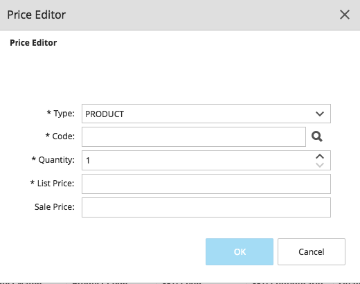

# Chapter 6: Price List Manager

The Price List Manager allows authorized users to work with:

- Price Lists
- Price List Assignments

## Price Lists

In Elastic Path Commerce, a Price List is a set of pricing details that can be associated with products. Prices are stored in a price list, and a price list is associated with a catalog and a currency. The product code or SKU code links the price in a price list to the product or SKU in a catalog.

When a shopper views an item in a store, the system looks at the applicable price list assignments to determine which price list should be used to retrieve the product price.


### Price List Manager

You create Price Lists as well as add Products and SKUs to Price Lists using the Price List Manager. The Price List Manager contains the Price List Summary and Prices tabs.


In the Prices tab, you can add list and sale prices for products and SKUs. A single price entry for a product forms the default price for a certain quantity of the product. The required minimum quantity is &quot;1&quot;. Subsequent price entries for the same product apply to higher quantities, creating price tiers.

For example, the price for one t-shirt is entered on a price list as $7. A second price list entry for the t-shirt is listed at $5 with a Quantity of &quot;3&quot;. This means that a customer will pay $7 per t-shirt if she buys one or two t-shirts. However, if she buys three t-shirts, she will pay only $5 per item.

### Price List Manager and the Product Pricing Tab

Changes to a product price or SKU price can be made either in a Price List or on the product&#39;s Pricing tab. If you change the price in one, the other is updated automatically.

### Change Sets and Price Lists

If the Change Set feature is enabled in your Elastic Path Commerce deployment, you must select a Change Set before adding or removing prices in a Price List.

### Viewing a Price List

1. In the main toolbar, click the **Price List Manager** icon.

    

2. On the _Price Lists_ tab, click the **Search** button.

3. In the upper right hand pane, double-click the price list you want to view.

    

4. In the lower right hand pane, perform any of the following actions if required:
    - To add a new price to the Price List, click the **Add Price** button.
    - To edit an existing price on a Price List, select an item and click the **Edit Price** button.
    - To delete an existing price on a Price List, select an item and click the **Delete Price** button.
    - To open an item's SKU Details in a new tab in the lower pane, select an item and click the **Open Item** button.  
5. If required, click the **Save** or **Save All** icons in the main toolbar to save your changes.

### Creating a Price List

1. In the main toolbar, click the **Price List Manager** icon.

2. In the upper right pane, click **Create Price List**.

    


3. In the lower right pane, enter a price list name, description, and currency code for the new price list. Be sure that the code is an ISO 4217 currency code, for example, USD for US dollars or GPB for Great British pounds.

    

4. Click the **Save** or **Save All** icons in the main toolbar to save.

5. Click the **Prices** tab.

6. Click the **Add Price...** button. The _Price Editor_ dialog box appears.

7. Complete the fields as described in the following table:

    |Field|Description|
    | --- | --- |    
    | **Type** | From the drop-down list, select whether the price is for a SKU or a product. |
    | **Code** | Enter the SKU or product code for the item if known. You can click the **Search** icon (represented as a magnifying glass) to the right-hand-side to search for the product or SKU you want. |
    | **Quantity** | This value specifies the minimum quantity of the item that must be ordered for the List or Sale price to take effect. Typically, every catalog item should have at least one price list entry with a quantity of &quot;1&quot; to provide a default price. Note that you can create additional Price entries for the same SKU/Product using different Quantity and Price values. Doing this creates volume-discount (tiered) pricing for an item based on the quantity bought by a customer. |
    | **List Price** | Often this is MSRP (Manufacturer&#39;s Suggested Retail Price). If this is the only price list entry for the product, this price will be the default price. |
    | **Sale Price** | Optional. In a typical store, this amount would be the &quot;our price&quot; selling price as opposed to the MSRP specified in the **List Price** field. |

8. Click the **OK** button.

### Adding Products/SKUs to a Price List

> **Note:** If the **Add Price** button is not active, your Elastic Path Commerce system may be using the Change Set feature. In that case you must select a Change Set before adding a product/SKU.

1. In the main toolbar, click the **Price List Manager** icon.

2. On the **Price Lists** tab, click the **Search** button.

3. In the upper right hand pane, double-click the price list you want to add a price to.

    The price list will appear in the lower right hand pane with the **Prices** tab active.

4. Click the **Add Price...** button.

    

5. Complete the fields as described in the following table:

    |Field|Description|
    | --- | --- |   
    | **Type** | From the drop-down list, select whether the  price is for a _SKU_ or a _product_. |
    | **Code** | Enter the SKU or product code for the item if known. You can click the **search icon** (represented as a magnifying glass) to the right-hand-side to search for the product or SKU you want. |
    | **Quantity** | This value specifies the minimum quantity of the item that must be ordered for the List or Sale price to take effect. Typically, every catalog item should have at least one price list entry with a quantity of &quot;1&quot; to provide a default price. You can create additional Price entries for the same SKU/Product using different Quantity and Price values, creating volume-discount (tiered) pricing for an item based on the quantity bought by a customer. |
    | **List Price** | Often this is the MSRP (Manufacturer&#39;s Suggested Retail Price). If this is the only price list entry for the product, this price will be the default price. |
    | **Sale Price** | Optional. In a typical store, this amount would be the &quot;our price&quot; selling price as opposed to the MSRP specified in the **List Price** field. |

6. Click **OK**.

### Editing Prices in a Price List

1. In the main toolbar, click the **Price List Manager** icon.

2. On the **Price Lists** tab, click the **Search** button.

3. In the upper right hand pane, double-click the price list you want to edit.

    The price list will appear in the lower right hand pane with the **Prices** tab active.

4. Locate the price you want to edit.

    - You can use the search boxes to find prices that match a specific tier, price range, or SKU/product code.

      

    - You can use the filter boxes to further the matches.

      

5. Select the product/SKU whose price you want to edit, and then click **Edit Price...**.

    

6. In the **Price Editor**, make changes as required.

    > **Note**: Some fields are not editable after the price is created. Type and code are not editable. You cannot change the quantity either, because it would effectively change the price tier. (You can delete the price and recreate it with a different quantity.)

    

8. Click the **OK** button.

### Deleting a Price from a Price List

You can delete a price from a price list using the Price List Manager.

> **Note**: You can also delete a price from the price list from the **Pricing** tab of the product. If you delete a product/SKU from a catalog, all price list entries for that product/SKU are automatically removed from the corresponding price list.

1. In the main toolbar, click the **Price List Manager** icon.

2. On the **Price Lists** tab, click the **Search** button.

3. In the upper right hand pane, locate the price list that contains the price you want to delete and double-click it.

4. Select the product/SKU whose price you want to delete and then click **Delete Price...**.

6. Click the **OK** button.

### Deleting a Price List

1. In the main toolbar, click the **Price List Manager** icon.

2. On the **Price Lists** tab, click the **Search** button.

3. In the upper right hand pane, locate the price list that you want to delete and select it.

4. In the upper right hand pane toolbar, click **Delete Price List**.

5. Click **OK** in the confirmation dialog box to delete the price list.

    > **Note:** You cannot delete a price list that is being used by a Price List Assignment. To delete a price list that is associated with a Price List Assignment, you must either delete the Price List Assignment or associate it with a different price list.

### Importing a Price List

Many organizations create and maintain price lists in external applications. Elastic Path Commerce can import price list data from files in CSV (comma separated value) format. CSV files are supported by most popular spreadsheet applications, including Microsoft Excel.

> **Note:** Before you can import price list data, the destination price list must already exist in Elastic Path Commerce. For a new price list, simply create a price list without adding any prices and then perform the import.

#### CSV Import File Format

The CSV Import file must contain column headings as well as the price data that you want to import. The structure of the CSV import file must meet the following requirements:

- The first row must contain column headings.
- The headings for columns 7 and 8 must be suffixed with the target price list name and currency in the following format:

```
_<priceListName>_<currencyCode>
```

For example, if the name of the price list in Elastic Path Commerce is &quot;My Price List&quot; and the currency is GBP, then the heading for column 7 would be the following:

```
listPrice_My Price List_GBP
```

- Column 1 is either **product** (if it&#39;s a product) or **SKU** (if it&#39;s a SKU) and is mandatory.
- Column 2 is the **product name** and is optional.
- Column 3 is the **product code** and is mandatory for single-SKU products.
- Column 4 is the **SKU code** and is mandatory for multi-SKU products.
- Column 5 is the **SKU configuration** and is optional.
- Column 6 is the **quantity** (maximum price tier quantity) and is mandatory.
- Column 7 is the **list price** and is mandatory.
- Column 8 is the **sale price** (if any) and is optional.

#### Running a Price List Import Job

> **Important:** You may experience problems importing and exporting price list data if your product codes or SKU codes are numeric values. Before importing or exporting a CSV file with numeric product/SKU codes, open the CSV file in a text editor and make sure that all product and SKU codes are enclosed in the text delimiter character. By default, this is a double quote `"`. For example: `"SKU123"`.

1. In the main toolbar, click the **Price List Manager** icon.

2. In the main toolbar, click the **Run Price List Import Job** icon .

3. Complete the fields on this page of the wizard as described in the following table.

    | Field | Description |
    | --- | --- |
    | CSV Template File | Click the magnifying glass icon to locate the CSV file containing the price list data you want to import. <br/><br/>  **Important:** Make sure the file meets the format requirements described in _CSV Import File Format_ section above. |
    | Column Delimiter | Select the column delimiter that was used in the CSV Import file. (Default is a comma, `,`.) |
    | Text Delimiter | Select the text delimiter that was used in the CSV Import file. (Default is the double-quote, `"`.) |
    | Preview data | Select this option if you want to see a preview of the data before it is imported. This can be useful for detecting subtle errors in the data, such as data appearing in the incorrect column due to misplaced delimiters. |

4. Click the **Next** button. The price list file data is validated to ensure there are no errors. If you selected the **Preview Data** option, the price list data is displayed in spreadsheet format. Otherwise, a message appears indicating the validation results.

5. If validation was not successful, you will need to correct the errors in the CSV file. Then click back and select the file again. If it was successful, click **Finish**.

    The price list import job runs. When it is finished, verify that the new price data was imported successfully. To do this, open the target price list and check that the prices were added or updated.

### Exporting a Price List

From within Elastic Path Commerce, you can export Price Lists to comma-delimited (CSV) files, which can be opened in Microsoft Excel or another spreadsheet application.

1. In the main toolbar, click the **Price List Manager** icon.

2. On the **Price Lists** tab, click the **Search** button. The search results appear in the **Price Lists** tab that opens in the upper right hand pane.

3. In the upper right hand pane, locate the price list that you want to export and select it.

4. In the upper right hand pane toolbar, click **Export to CSV** button.

    

The Price List data is exported to a CSV file, which is then downloaded to your computer. Typically this will be saved to a location based on your web browser's settings, for example your Downloads folder. The name of the file is the name of the price list.

Your computer will attempt to open the file using the default associated application. For example, if Microsoft Excel is installed and you haven&#39;t changed the CSV file association, the Price List will open in Excel.

## Price List Assignments

Price List Assignments link price lists to products for a specific catalog. They determine the price list from which a product price is retrieved for shoppers. However, price list assignments can do much more than simply provide default list and sale prices for products. This feature allows you to provide custom prices to targeted shoppers, based on shopper characteristics such as age, gender, geographic location and searched terms.

For example, a used car reseller can create two different price list assignments. Each assignment would provide different prices to customers based on the customer&#39;s attributes, such as age. For example, customers who match a &quot;college student&quot; profile might receive deeper price discounts on economical vehicles, while customers matching &quot;55 years of age and older&quot; profiles would get preferred pricing on small luxury vehicles.

### Price List Stack

The price list stack is the set of price lists assigned to a shopper. For example, Price List A has prices for all products in a catalog and is assigned to all shoppers. Price List B has different prices for certain products and is only assigned to shoppers who meet specific conditions (as configured in the price list assignment). Price List B is configured with a higher priority that Price List A. When a shopper accesses the frontend, the system builds the shopper&#39;s price list stack by evaluating the price list assignment conditions of all price lists. Some shoppers have a price list stack containing only Price List A. Other shoppers have both Price List A and B. When the shopper views a product, the system examines the price lists in the stack and retrieves the price from the price list with the highest priority. If the price list does not contain a price for that product, then the system will descend the price list stack until it locates a price list that contains a price for the product.

### Considerations

Working with price list assignments involves assigning price lists to shoppers based on a set of conditions. The primary consideration is in deciding which conditions should apply to which people, and when.

To determine the conditions under which a particular price list will be shown, you need to ask the following questions:

- Who should have access to the price list? (based on shopper information such as age, gender, and geo-location)
- When is the price list available? (the period of time that the price list is active)
- Where is the price list available? (in which store or stores)

Once you&#39;ve decided which price list to show a set of shoppers and you&#39;ve decided on the conditions you want the content to display, you&#39;re ready to set up a price list assignment.


### Creating a Price List Assignment

You can create a price list assignment from the **Price List Manager**.

1. In the main toolbar, click the **Price List Manager** icon.

2. In the main toolbar, click **Create Price List Assignment**.

  


3. Enter a **Name** and **Description** for the new price list assignment.

    

4. Click and drag the **Priority** slider to determine whether this price list assignment will take precedence over other applicable price list assignments. Click the **Next** button.

5. Select the price list that will be used to retrieve prices when the conditions are met for this price list assignment. Click **Next**.

6. Select the catalog that will be used for the selected price list. Click **Next**.

7. Set the conditions that will determine whether or not the selected price list is used to a group of shoppers.

    + Select **All Shoppers** if this price list assignment should apply to all shoppers.
    + Select **Only Shoppers who match the following conditions** to set up a specific shopper segment who will see the price list.

    

8. If you selected **Only Shoppers who..**, Click  to add a new statement block.

9. In the **Shopper who** section, click **Add Statement** and select a condition from the pop-up menu (for example &quot;are of age&quot;).

10. Select an **operator** and a **value** for the condition (example &quot;is greater than&quot; and &quot;45&quot;).

11. Repeat steps 9 to 10 to add more condition statements as required. Click **Next** when you are done.

    

11. Set the time period during which the price list assignment will be active.
    - Selecting **All the time** makes the assignment immediately active.
    - Selecting **Only within the following specific date range.** to specify a date range for the assignment.

    Click **Next**.

12. Select the stores where you want to use the price list. To select specific stores, select the Available Stores option. Next, click the store(s) you want to use from those listed in the _Available Stores_ list, and click the **Add** button (represented by the symbol &gt;) to add them the _Assigned Store(s)_ list.

    

13. Click **Finish**. The new Price List Assignment appears in the list panel.

### Modifying a Price List Assignment

You can change a price list assignment by opening it from a search results list and then updating the pages in the Price List Assignment wizard.

1. In the main toolbar, click the **Price List Manager** icon.

2. In the **Price List Search** panel, select the **Price List Assignments** tab and click **Search** to return a list of all price list assignments in the system.

3. Double-click the price list assignment you want to change.

4. Make your changes. Click the **Finish** button when you are done.

### Deleting a Price List Assignment

You can delete a price list assignment even if it is currently being used.

1. In the main toolbar, click the **Price List Manager** icon.

2. In the **Price List Search** panel, select the **Price List Assignments** tab and click **Search** to return, in the upper right hand pane, a list of all price list assignments in the system.

3. Double-click the price list assignment you want to delete.

4. In the upper right hand pane toolbar, click the **Delete Price List Assignment** button. If a price list is currently in use, a message will appear.

5. Click **OK**.

### Searching for a Price List Assignment

1. In the main toolbar, click the **Price List Manager** icon.

2. In the **Price List Search** panel, select the **Price List Assignments** tab

3. Enter the **Name** of the price list assignment you want to view and select a **Catalog** from the drop-down list (optional).

4.  Click **Search** to return a list of matching price list assignments.

> **Note**: To return a list of all price list assignments in the system, leave the **Price List Name** field blank and click **Search**.
