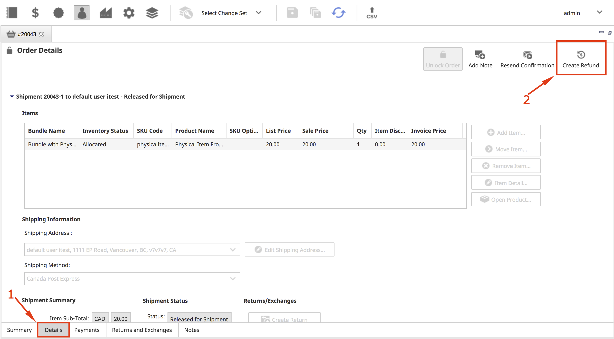

# Chapter 7: Customer Service

Customer Service is intended for the use of customer service representatives (CSRs). It enables users to manage all aspects of orders and customer profiles. It can be accessed on the main toolbar by clicking on the **Customer Service** icon.

Every processed customer order is assigned to the store in which it was created. Administrators and CSRs can only access orders from stores that they have permission to view or manage.

## Order Workflow Process

### Searching for an Order

1. In the main toolbar, click the **Customer Service** icon.

2. In the left pane of the _Customer Service Search_ window, enter values in the search term fields.

    > **Note**: When searching for customer information (first and last name, email, postal code, etc.), values are compared against each order&#39;s billing address.

3. In the sorting section, select a field name from the **Sort By** drop-down list, and set the **Sort Order** (ascending/descending).

    

4. Click **Search**.

#### Sorting Order Search Results

_Customer Service Order List_ search results are listed by Order ID by default. You can sort the results by clicking a column header. The results will be sorted according to the column header selected.

You can sort by the following column headers:

- Customer Name
- Date/Time
- Order #
- Order Status
- Store
- Total

### Viewing and Editing an Order

**Tip**: For an online tutorial on this topic, see the Elastic Path Documentation page [http://docs.elasticpath.com](http://docs.elasticpath.com).

1. In the main toolbar, click the **Customer Service** icon.

2. In the left pane of the _Customer Service Search_ window, enter values in the search term fields.

3. Click **Search**.

4. In the _Order Search Results_ in the top right pane, double-click the order you want to view.

5.  In the bottom right pane and depending on the state of the order and your privileges, you may edit an order&#39;s details as required:

    | **Tab** | **Order Information and Functions** |
    | --- | --- |
    | Summary | Cancel the order, place the order on hold, remove the order hold, edit the customer profile, edit the customer&#39;s address. |
    | Details | Modify contents of the order (if shipment has not been released yet), edit shipping address(es) (if shipment has not been released yet), cancel the shipment, create return, create exchange, and viewing the products in the order.If there is personalization information attached to order items, you can access it from this tab by selecting the item and clicking **Item Detail**. Note that personalization information cannot be edited from within Elastic Path Commerce. |
    | Payments | View payment history and summary. |
    | Returns and Exchanges | View and manage returns and exchanges. |
    | Notes | View order notes in detail. |

6. Click **Save**.

    

## Order Auditing

Information about the various events that occur in an order&#39;s lifetime is tracked for auditing purposes. This includes details about returns, exchanges, and refunds.

Events are recorded regardless of who initiated the action or how it occurred. Everything from order creation in the store to a CSR&#39;s modifications is tracked. CSRs may add their own comments to orders, and these comments will also be included in the auditing information.

Any user with the appropriate authorization may view the entire audit history of an order. The system will provide a reverse chronological display of events, detailing the date-time, event creator, and event action. This allows CSRs to quickly scan the entire history of an order.

## Call Center Functionality

An authorized CSR may create orders for both new and existing customers. This functionality may be accessed at both the &quot;View existing customers&quot; and &quot;View existing order&quot; screens. If the order is for a new customer, the CSR must first create a customer account before the order can be placed.

Depending on the CSR&#39;s permissions, he may modify the item prices in the order. Shipping costs and the total price may also be determined and specified by the CSR. The system records the CSR&#39;s name and attaches it to the order.

Only CSRs with the proper role may create orders on behalf of customers. The privilege to create orders comes in two variants:

- Basic (the CSR may create an order, but cannot override prices)
- Manager (the CSR can both create orders and override prices)

<!---
### Creating an Order

1.  In the main toolbar, click the **Customer Service** icon. The _Customer Service Search_ window opens in the left pane.

2. Click **Create Order**.

    

2. Select the store where you want to create the order and click **OK**.

    
-->

## Order Locking

The idea behind &quot;locking&quot; orders is to prevent multiple CSRs from modifying the same data simultaneously. This can cause unexpected behavior and result in corrupted data. When a CSR opts to edit an order, it is automatically locked; until the order is unlocked, no one else is allowed to edit it.

For example, Bob and Ann are CSRs. They both want to modify the same order, Order ABC. Ann is the first to begin editing, so the order is locked. When Bob attempts to enter the edit screen for Order ABC, he will be denied by the system; an error dialog box will explain that someone else is modifying that order, and that he can only view it in read-only mode. Once Ann performs an action that causes the order to be unlocked, Bob will then be able to modify Order ABC.

There is another scenario to consider. Let us assume Bob opens Order ABC for viewing while it is locked by Ann. Ann makes changes to the order and saves, causing the order to become unlocked. Bob will then see an error dialog box that relays the following: &quot;Order ABC cannot be edited as another user has made changes.&quot;  The dialog box will allow Bob to either &quot;Reload&quot; (which will refresh the product page and allow Bob to make modifications to the order) or &quot;Cancel&quot; (which will close the dialog box.)  This ensures that Bob will not be modifying outdated data.

An order is unlocked under the following circumstances:

| **CSR Action** | **System Action** |
| --- | --- |
| CSR saves order | System will automatically unlock the given order, on completion of the save transaction. |
| CSR closes order editor (saves changes on prompt) | System will automatically unlock the given order, on completion of the save transaction. |
| CSR closes order editor (abandons changes on prompt) | System will automatically unlock the given order. |
| CSR closes Elastic Path Commerce (with open orders and saves changes on prompt) | System will automatically unlock each order, on completion of the save transaction. |
| CSR closes Elastic Path Commerce (with open orders and abandons changes on prompt) | System will automatically unlock each order. |

### Order Lock Indicator

A locked order&#39;s status will be indicated on-screen by a closed padlock icon and the name of the CSR who caused the lock. An unlocked order will be accompanied by an open padlock icon on the order page. If changes are made, the order automatically locks and the padlock icon will change to its closed form. The name of the CSR will also then be displayed next to the padlock.

### Unlock Orders Privilege and Special Situations

Occasionally, special situations arise that call for the manual unlocking of an order. For example, a CSR may be in the middle of editing an order when she falls ill and leaves the office; however, she leaves the editor open, so the order remains in a locked state.

In these and other special situations, a supervisor with the correct role – one that grants him the **Unlock Orders** privilege – may forcefully unlock the order. More specifically, supervisors who open a locked order will see an &quot;Unlock Order&quot; button. If this is clicked, the lock on the order will be removed. The &quot;Unlock Order&quot; button is not visible to users without the correct credentials.

Let&#39;s presume the supervisor makes changes to the now unlocked order. When the original CSR returns to work the following morning and tries to commit her changes, she will see an error dialog box alerting her to the fact that the order has been modified since the page was loaded; this prevents her from overwriting changes that someone else may have made to that order. She now has to reload the order, which will give her the opportunity to note any updates and take them into consideration before (and if) she makes any modifications.

If a CSR&#39;s computer crashes while he is in the middle of editing an order, it is possible for him to resolve the issue without having to ask a supervisor to use her &quot;Unlock Order&quot; privilege. He simply has to reload the Elastic Path Commerce browser session, search for the order he was modifying, open it, and finish modifying and saving the order.

### Unlocking an Order

Search for the order you want to unlock and double-click it for viewing. Assuming you have the proper credentials, click the **Unlock Order** button in the top right hand corner of the tab.

## Splitting a Shipment

Shipments can be &quot;split&quot; to improve customer satisfaction. Splitting a shipment refers to the formation of multiple shipments based on the components of a single, original order. These new shipments can then be shipped to either a single address, or to multiple addresses   This feature is particularly useful for orders that include pre-ordered or back-ordered items; in-stock items can be shipped immediately, while preordered or/and backordered items can be delivered at a later date.

Customers cannot split shipments themselves. Only CSRs and other authorized personnel may perform this action for them, so customers must call in to request this feature.

1. In the main toolbar, click the **Customer Service** icon.

2. In the left pane of the _Customer Service Search_ window, enter values in the search term fields.

3. Click **Search**.

4. In the _Order Search Results_ in the top right pane, double-click the order you want to view.

5. In the bottom right pane, click the **Details** tab.

    

6. In the _Details_ tab, select the components you want to split from the original order.

7. Click **Move Item**.

    

8. In the _Move Item_ dialog box, select the address the new split shipment should be delivered to, and which shipment method should be used.

    > **Note:** If the address you want to input is not in the dropdown box, this can be configured in the next step.

9. Click **OK**.

    

    > **Note:** There will now be a separate Shipping Information section for each split shipment you create. You may edit the shipping address of any of the split shipments as required, allowing you to add new delivery addresses.

    

## Returns, Exchanges and Refunds

CSRs and warehouse staff may perform and accept returns, respectively. Returns and exchanges maximize user satisfaction and increase buyer confidence and sales.

Only authorized CSRs can create a return or exchange. The system automatically creates a unique code, called the Return Merchandise Authorization (RMA) code, for all such transactions. Typically, the RMA number is recorded on the physical return to assist warehouse employees in matching the receipt of the return to the correct customer account.

The process for completing a &#39;Shippable&#39; vs a &#39;Digital Asset&#39; SKU is slightly different as for digital assets there is no requirement to receive the returned good prior to completing the return.

Regardless of the nature of the SKU, for each item being returned, the CSR must enter the following details:

- **Quantity being returned** : The number of items being returned.
- **Reason for return** : Users may select from a list of both system defined and custom reasons (for example, Damaged, Defective, Unwanted Gift, Wrong Size.)
- **Comments** : CSR comments about the return item (for example, &quot;Customer no longer has the original packaging&quot;.)

For shippable items, the CSR must specify whether the returned products must be physically received back into the warehouse or not before finishing processing the return.  For digital assets there is nothing to physically receive and so the return is processed immediately.

For shippable SKUs, the customer may want a refund or they may want to exchange what was received for something else.  Depending upon their selection, the CSR has additional steps to execute:

- **Refund** : The CSR must enter a refund amount to be credited to the customer. The system will suggest a figure based on the purchase price, the promotions at the time of order, and taxes.
- **Exchange** : The CSR must select a SKU to exchange the incoming product for. By default, the system will suggest the same SKU as the one being returned.

For digital assets, only refunds are issued as part of a return.

Usually refunds are credited to the purchase medium used in the original purchase. However, in special situations, CSRs may issue a refund to another payment source. For example, if the buyer used a now-expired credit card for the purchase, a CSR may issue the refund to another credit card.

## Shippable Good Returns and Exchanges Workflow

The following diagram shows the workflow for returns and exchanges of shippable items.

### Searching for a Return or Exchange Order

When performing a return or exchange for a shippable item, the item originally received by the customer may be required to be received back into the warehouse before the return can complete processing.  In order to process the item received back into the warehouse the corresponding RMA must be found.

1. In the main toolbar, select the Shipping/Receiving icon.

2. In the left pane of the _Warehouse_ window, select the _Returns and Exchanges_ tab.

3. In the _Search Terms_ section of the left pane, enter search terms and click **Search**.

    > **Note:** Entering more search terms will narrow your search results.

    

## Digital Asset Return

To create a return for a digital asset.

1. In the main toolbar, click the **Customer Service** icon.

2. In the left pane of the _Customer Service Search_ window, enter values in the search term fields.

3. Click **Search**.

4. In the _Order Search Results_ in the top right pane, double-click the order you want to view.

5. In the bottom right pane, select the **Details** tab.

6. In the _E-shipment_ section of the _Order Details_ tab, click **Create Return**.

    

7. In the, _Create Return wizard_, enter the return quantity value for the item to be returned and select the corresponding reason in the given fields.

    

    > **Note**: If desired, notes or additional information can be entered in the **Notes** field.

8. Click **Next**.

9. In the _Create Return Wizard_ select the payment source to which the Refund should be issued.

    

    > **Note**: The _Manual Refund_ option would be used if some other mechanism was to be used for the refund; such as, issuing a check.

10. Click **Next** to complete the return.

    

    > **Note**: The refund is now listed on the _Returns and Exchanges_ tab for the order.

    

5. Click **Finish**.

## Creating a Refund

At times, a refund may need to be issued outside of a return being performed.  For example, a customer is very unhappy with service and so as an act of good will as CSR may want to make amends to the customer by giving them some funds back.  Only CSRs who have been granted &#39;Can Create Refund&#39; permissions would be able to perform this function.  This kind of refund can be created as any time for an order and is not dependent upon shipment status, etc.

1. In the main toolbar, click the **Customer Service** icon.

2. In the left pane of the _Customer Service Search_ window, enter values in the search term fields.

3. Click **Search**.

4. In the _Order Search Results_ in the top right pane, double-click the order you want to view.

5. In the bottom right pane, click the **Details** tab for the order.

    

6. In the _Details_ tab, click the **Create Refund** icon.

4. In the **Refund Amount** wizard, enter the currency amount you are refunding to the customer.

5. Under **Refund Options**, select the payment source to which you will credit the refund.

    

6. Click **Next** to complete the refund.

    

7. Click **Finish**.

## Customers

Customers must register before their purchases can be completed, even if the registration is anonymous (i.e., their personal information is not added to the retailer&#39;s customer data, meaning they will have to reenter the information for their next purchase.)  Registered accounts are stored in the system, and may be accessed and modified by authorized users.

One of the customer attributes users may modify is Customer Status. It can be set to one of the following:

- Active - The customer will be able to log on to the store and purchase products.
- Disabled - The customer will not be able to log on to the store purchase products.

### Disabling a Customer account

Customer accounts cannot be deleted from the system. This is to ensure complete audits and informational integrity (for example, a customer&#39;s orders cannot be orphaned.)

Disabling a customer is, from the shopper&#39;s perspective, equivalent to deleting their account from the system, but with the benefit of being able to easily change the status back to Active.

Only authorized CSRs may disable customers.

### Searching for a Customer account

1. In the main toolbar, click the **Customer Service** icon.

2. In the left pane of the _Customer Service Search_ window, click the **Customers** tab.

    

3. In the _Search Terms_ section, Enter search terms in the fields to narrow your search.

3. In the _Sorting_ section, select a sort by heading from the **Sort By** drop-down list and set a **Sort Order** (ascending/descending.

4. Click **Search**.

#### Sorting Customer Search Results

By default, customers are listed in the search results by Customer ID. You can resort the results by clicking a column header. The results will be sorted according to the column header selected.

You can sort Customer search results by the following column headers:

- Customer ID
- Default Billing Address
- Email Address
- First Name
- Last Name
- Telephone #

### Editing a Customer account

1. In the main toolbar, click the **Customer Service** icon.

2. In the left pane of the _Customer Service Search_ window, click the **Customers** tab.

    

3. In the _Search Terms_ section, Enter search terms in the fields to narrow your search.

3. In the _Sorting_ section, select a sort by heading from the **Sort By** drop-down list and set a **Sort Order**.

4. Click **Search**.

5. In the top right pane, double-click customer account you would like to edit.

6. Depending on your privileges, you may edit a customer&#39;s information as required:

    | Tab | Customer Information and Functions |
    | --- | --- |
    | **Customer Profile** | Manage a customer&#39;s attributes (except address-related information), their preferred locale and other registration information.   **Note:** When selecting a preferred language, make sure you also select the correct locale. Depending on the locale, your prices will be displayed differently. For example: With US locale, your price will appear as $14.25. With Finland as your locale, your price will appear as 14.25$, following the European format. |
    | **Addresses** | Manage a customer&#39;s address(es), and set the customer&#39;s default billing and shipping addresses. |
    | **Credit Cards** | Manage a customer&#39;s credit cards and set his default credit card. |
    | **Orders** | View the details of a customer&#39;s order(s) and create an order for the customer. |

4. In the main toolbar, click **Save**.

### Resetting a Customer&#39;s Password

1. In the main toolbar, click the **Customer Service** icon.

2. In the left pane of the _Customer Service Search_ window, click the **Customers** tab.

    

3. In the _Search Terms_ section, Enter search terms in the fields to narrow your search.

3. In the _Sorting_ section, select a sort by heading from the **Sort By** drop-down list and set a **Sort Order**.

4. Click **Search**.

5. In the top right pane, double-click customer account you would like to edit.

6. In the bottom right pane, click **Reset Customer Password** icon.

      

7. In the _Customer Password Reset - Confirm_ prompt, click **OK**.

    

      > **Note**: An e-mail containing a new, system-generated password is automatically sent to the customer.

### Managing a Customer&#39;s Segment Groups

By default, all customers are assigned the PUBLIC customer segment.  You can add and remove new customer segments to a customer, but you cannot remove the PUBLIC customer segment.

#### Adding a Customer to a Customer Segment

1. In the main toolbar, click the **Customer Service** icon.

2. In the left pane of the _Customer Service Search_ window, click the **Customers** tab.

  

3. In the _Search Terms_ section, Enter search terms in the fields to narrow your search.

3. In the _Sorting_ section, select a sort by heading from the **Sort By** drop-down list and set a **Sort Order**.

4. Click **Search**.

5. In the top right pane, double-click customer account you would like to edit.

6. In the bottom right pane, click the **Customer Segment** tab.
    

7. In the _Customer Segment_ tab, Select the **Add Segment** button.

8. In the _Add Customer Segment Membership_, select the _Segment Name_ from the drop-down list.

    

9. Click **Save**.

#### Removing a Customer from a Customer Segment

1. In the main toolbar, click the **Customer Service** icon.

2. In the left pane of the _Customer Service Search_ window, click the **Customers** tab.

  

3. In the _Search Terms_ section, Enter search terms in the fields to narrow your search.

3. In the _Sorting_ section, select a sort by heading from the **Sort By** drop-down list and set a **Sort Order**.

4. Click **Search**.

5. In the top right pane, double-click customer account you would like to edit.

6. In the bottom right pane, click the **Customer Segment** tab.
    

7. In the _Customer Segment_ tab, Select the **Remove Segment** button.
    

8. In the _Remove Customer Segment Membership - Confirm_ prompt, click **OK**.

9. In the main toolbar, click **Save**.
