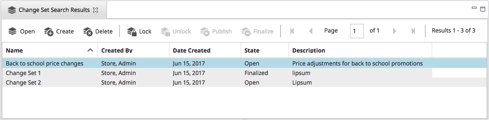

# Chapter 10: Change Sets

Let&#39;s assume you need to change prices for 200 different products in your storefront on a specific date. You could change each price on your production server on that date, but that would be very time-consuming. Also, any errors you make would immediately display to shoppers, which could negatively impact your business.

A better practice is to apply your changes in a staging environment, validate the changes, and then move the changes in bulk to the production environment. However, managing changes across environments can be complicated and time-consuming. How do you know which objects are ready to move to production? Once you&#39;ve applied changes to your staging environment, how do you prevent modified objects from being changed again before they are moved to the production environment?

Change Sets allow you to group objects and control who can modify them. After making changes to objects in a Change Set, you can lock the Change Set to prevent any further changes. Then, using the Data Sync Tool, you can move the changed objects to your production environment. Once the changes are applied to your production environment, you can unlock the Change Set and make the objects available again for editing.

When an object is assigned to a Change Set, the Change Set&#39;s status determines if the object can be modified. There are four Change Set states:

| **State** | **Icon** | **Description** |
| --- | --- | --- |
| OPEN |  | The Change Set is open. Users with appropriate permissions can add and edit objects in the Change Set. When an object is added to the Change Set, it cannot be added to any other Change Set until it is finalized. |
| LOCKED |  | The Change Set is locked. Objects cannot be added to the Change Set. Objects in the Change Set cannot be modified until the Change Set is finalized. |
| PUBLISHING |  | The Change Set is set for publishing. This is the state that the Data Sync Tool will look for when moving objects from one environment to another. Objects in the Change Set cannot be modified until the Change Set is finalized. |
| FINALIZED |  | The Change Set has been finalized and all objects have been synchronized to the production server. Once a Change Set is finalized, its objects can be added to other Change Sets and edited. |

**Note** :If Change Sets are enabled, users must select a Change Set before they can create certain types of business objects, including Products, Categories and Promotions.

## Change Set Workflow

The Change Set workflow is as follows: you create a Change Set within Elastic Path Commerce, name the Change Set, and add items to Change Set that you want to move to the production environment.

Change Sets are used with Elastic Path Commerce&#39;s _Data Sync Tool_—a tool for synchronizing changes between Elastic Path Commerce deployments. The typical workflow for this process is illustrated below. As shown, once you created a Change Set, made your changes, and locked the Change Set, you use the Data Sync Tool to export the modified objects from the source system and import them to a target system. During import, the Data Sync Tool merges the changes for each object in the Change Set with the object in the target system.

The Data Sync Tool can export and import Change Sets in one step or, if the source and target systems cannot communicate directly (due to firewall rules, for example), in two steps. In the case of a two-step export/import, run the Data Sync Tool from a location that has access to the source&#39;s database. The Change Set data exports to the Data Sync Tool file system. Then you can move the exported package to another machine where the Data Sync Tool has access to the target&#39;s database.

When you synchronize a Change Set, the items belonging to the Change Set on the source system normally change from a _Locked_ to a _Finalized_ state. However, the use of the Change Set status workflow is particular to your organization. For example, while one retailer may want the items in a Change Set to be &quot;Finalized&quot; immediately after the Change Set has been successfully moved, another retailer might want the Change Set to stay in a _Locked_ state on the source system awaiting further verification.

### User Permissions

To perform Change Sets tasks, a user needs &quot;Change Set&quot; permissions. To view a Change Set, an Elastic Path Commerce user must be associated with that Change Set. On creating a Change Set, the user is automatically associated with that Change Set and is able to associate additional users to the Change Set. Users cannot see Change Sets that they have no association with (either as a creator or through assignment to the Change Set by the creator). For information on adding other users to the Change Set, see the Change Set Users tab.

## Supported Change Set Objects

An up-to-date list of the supported Change Set Objects is available in the Import Export Tool Guide at (http://developers.elasticpath.com).

Elastic Path Commerce can be extended to support other objects types in Change Sets. For more information, see the _Data Sync Tool Guide_ at the Elastic Path documentation site (http://developers.elasticpath.com).

## Object Dependencies

When adding and moving objects in Change Sets, it&#39;s important to be aware of the relationships between different objects. Some objects have dependencies on other objects. When the Data Sync Tool is used to move objects from one deployment to another, all dependencies of that object must exist on the target deployment. If not, the operation will fail. For example, you want to move a new Product from a staging environment to a production environment. The Category that contains that Product is also new and does not exist on the production environment yet. If you attempt to move the Product to production before moving the Category, the operation will fail.

You configure which dependent objects are included when using the Data Sync Tool. For more information, see the latest version of the _Staging to Production Guide_ on the Elastic Path documentation site (http://developers.elasticpath.com).

## Enabling Change Sets

The Change Sets feature must be enabled before it can be used. Change Sets are enabled through the Elastic Path Commerce's system configuration settings.

1. Log on to Elastic Path Commerce as a user with administration permissions.

2. In the main tool bar, click the **Configuration** icon.

3. In the left hand pane, under **System Administration**, click  **System Configuration**.

4. In the list of settings on the top right pane, filter the list of settings to find `COMMERCE/SYSTEM/CHANGESETS/enable`.

5. In the filtered list of results, select `COMMERCE/SYSTEM/CHANGESETS/enable`

6. To the right of the list, under Defined Values, Click **New** and enter **true**. Click **Save**.

After enabling Change Sets in Elastic Path Commerce, you **must** have your system administrator restart the Elastic Path Tomcat server for Change Sets to be visible to other users of Elastic Path Commerce.

> **Note**: Users must have the _Change Set_ permissions in order to work with Changes Sets.

## Creating a Change Set

1. In the main menu bar, select the **Change Set** icon.

2. In the left hand pane, click **Search**.

3. In the top right hand pane, Click **Create** at the top of the _Change Set Search Results_ tab.

    

    The New Change Set dialog box appears.

    

4. Enter a name and description for the Change Set and click **Finish**.

    The new Change Set appears in the _Change Set Search Results_ list within the top right hand pane.

    

    You can now view and add items to the Change Set.

## Viewing a Change Set

1. In the main menu bar, select the **Change Set** icon.

2. In the left hand pane, under the _Change Sets_ search tab, set _Change Set State_ to **All States** (or a specific state to narrow the search results) and click **Search**. The _Changes Set Search Results_ appears.

3. Double-click the Change Set you want to view, and the Change Set details appear in the bottom right hand pane.

4. Select the **Objects** tab to view the objects assigned to the Change Set.

    

    The table below describes the Change Set Object properties.

    | Property | Description |
    | --- | --- |
    | **Selected** | Check box for selecting a Change Set object. Selected objects can be moved to other Change Sets using the Move Selected Objects button. |
    | **Change Type** | Displays icons describing the Change Set object&#39;s type.  - Edit icon –Edited object. - Remove icon – Deleted object.  - Add icon – New object. |
    | **Object Code** | Lists the Change Set object&#39;s code, which is a unique identifier in Elastic Path Commerce. |
    | **Object Name** | Lists the name of the object. |
    | **Object Type** | Lists the object&#39;s type. |
    | **Date Added** | Lists the day the object was added to the Change Set. |
    | **Added By** | Lists the User Role of the person that added the object to the Change Set. |
    |  | This button moves the selected Change Set objects to a different Change Set. |
    |  | This button opens the Change Set object for editing. |

## Adding Objects to a Change Set

You can add a variety of objects to a Change Set. Once an object is added to a Change Set, the object can be edited. For a list of objects supported by Change Sets, see Supported Change Set Objects. See the sections below for steps on adding a new object to a Change Set and steps for adding an existing object to a Change set.

> **Note**: The steps below assume you have _Change Set_ permissions, you have enabled Change Sets (see Enabling Change Sets), and you created a Change Set (see Creating a Change Set).

### Adding a New Object to a Change Set

The steps for creating a new object (product, catalog, price list, category type, etc) for a Change Set are the same steps you normally follow for creating the object, except for the first step you select the Change Set to create the object for. See the other sections in this manual for steps on creating products, catalogs, price lists, etc. The steps below are a guideline for creating new objects for Change Sets.

1. Select the Change Set from the Change Set drop-down list.

    

2. Create the object. See the appropriate section in this manual for steps on creating your object.

    Once you create the object, the new object is added to the selected Change Set. For information on viewing the object in the Change Set, see Viewing a Change Set.

    > **Note** :Objects in Elastic Path Commerce with the Lock icon  show that the object is part of a Change Set.

    

### Adding an Existing Object to a Change Set

1. Select the Change Set from the Change Set drop-down list.

   

2. In Elastic Path Commerce, navigate to the object you want to add to the Change Set and select it.

3. Click **Add to Change Set**  button.

The object is added to the selected Change Set. For information on viewing the object in the Change Set, see Viewing a Change Set.

#### Example: Adding an existing Object to a Change Set

The following example describes how an existing Product is added to a Change Set.

1. In the top menu bar, select the **Catalog Management** icon.

2. In the left hand pane expand the Catalog and double-click the Category that contains the Product. The _Product Listing_ tab appears in the top right pane.

3. If a change set exists, select your **Change Set** from the top menu bar. If there is more than 1 change set, it will appear as a drop down.

    

4. Select the Product in the _Product Listing_ tab. The **Add to Change Set**  button on the top menu bar becomes active showing a key.

5. Click **Add to Change Set**.
  * The selected Product is added to the Change Set.
  * The **Add to Change Set** button changes from a key to a lock.

    

6. Double-click the product in the _Product Listing_ tab. The product details are displayed. Click the _Assigned Change Set_ tab.

    

7. The Change Set information displayed shows you:

    * which Change Set the product is assigned to,
    * the state of the Change Set,
    * who added the product to the Change Set and
    * the date the product was assigned to the Change Set.

    

## Deleting Objects Using a Change Set

You can delete objects from your production server using Change Sets. To delete an object, add the object to a Change Set, delete the object in Elastic Path Commerce, and then use the Data Sync Tool to remove the object from the production server.

> **Note** :The steps below assume you have _Change Set_ permissions, you enabled Change Sets (see Enabling Change Sets), and you created a Change Set (see Creating a Change Set).

1. Use the Change Set drop-down list to select the Change Set.

    

2. In Elastic Path Commerce, navigate to the object and select it.

3. Click the **Add to Change Set**  button to add the object to the Change Set and to enable the object&#39;s delete button.

4. Click the object&#39;s delete button.

    The object is now set for deletion in the selected Change Set. A remove icon  will display by the object in the Change Set. This icon indicates the object is removed from the production server during synchronization.  See Viewing a Change Set for steps on viewing Change Set objects.

    

> **Note** :If you are deleting a Brand and the Brand is part of a Promotion or a Product, the Data Sync tool will not remove the Brand from the production server. You must remove all Brand dependencies before the Brand.

## Editing Change Sets

You can make changes to Change Sets that are in the _Open_ state. While the Change Set is in the _Open_ state, you can move objects to other Change Sets, edit objects, resolve conflicts, and assign users to the Change Set.

> **Note:** You cannot modify a Change Set that is _Locked_  or _Finalized_ .

1. On the top menu bar choose the **Change Set** icon.

2. On the _Change Sets Search_ tab, click **Search**.

    The Change Set Search Results list appears in the top right hand pane.

    

3. Select the Change Set you want to modify, and then click **Open** in the right hand pane menu bar.

    The Change Set panel appears. The panel has four tabs: _Summary_, _Objects_, _Conflicts_, and _Users_.
      * The _Objects_ tab shows the objects in the Change Set. You can double-click any object to edit it. You can also move objects to other Change Sets.
      * The _Conflicts_ tab displays objects that may be in conflict with objects in other Change Sets, giving you the opportunity to resolve issues before attempting to sync data to another deployment.
      * The _Users_ tab allows you to add and remove user permissions for the Change Set.

4. In each Change Set panel tab, you can make the following changes:

    | **Tab** | **Actions** |
    | --- | --- |
    | _Summary_ | - Modify the **Change Set Name** entry.  - Change the **Description** entry. |
    | _Objects_ | - Edit an object included in the Change Set: Edit parameter values for objects in the Change Set. For example, there are 20 products whose prices are increasing in two weeks. You added the products to a Change Set, but have not yet changed their prices. Click   **Open Object** to open each product&#39;s detail window and change the product price. Be sure to save your changes when you are done editing each product.   - Move the object(s) in a Change Set to another Change Set: You may need to reassign an object from the current Change Set to another Change Set. To do this, select the check box for the object(s) you want to reassign, and then click **Move Selected Objects**. In the _Move Objects_ dialog box, select the target Change Set, then click **Move**. (Note that only Change Sets with a status of _Open_ are available.) |
    | _Conflicts_ | Use this tab to ensure that the objects in this Change Set are not in conflict with objects in other Change Sets. (Currently, only conflicts between catalog objects are checked.) |
    | _Users_ | Use this tab to assign users to this Change Set. Assigned users can view and modify the open Change Set.   - To assign a user, click a user name in the _Available Users_ list, then click the forward arrow (Add).       - To un-assign a user, click a user name in the _Assigned Users_ list, then click the back arrow (Remove). |

  5. Click **Save** on the tool bar to save the changes to the Change Set.

## Deleting a Change Set

Change Sets can only be deleted if they do not have any objects assigned to them. (You can delete a Change Set if there are users assigned to it.)

1. In the top menu bar, choose the **Change Set** icon.

2. In the left hand pane, click **Search** in the _Change Set_ search tab.

    The _Change Set Search Results_ list appears in the top right hand pane.

    

3. Select the Change Set you want to delete and click **Delete**.

The deleted Change Set is removed from the _Change Set Search Results_ list.

## Moving Objects to another Change Set

You may need to move an object from one Change Set to another. This might occur if the object is inadvertently assigned to the wrong Change Set.

**Note** :Both Change Sets must be in the _Open_ state.

1. In the top menu bar, choose the **Change Set** icon.

2. In the left hand pane, click **Search** in the _Change Set_ search tab.

  The _Change Set Search Results_ list appears in the top right hand pane.

3. In the _Change Set Search Results_ list, double-click the Change Set containing the object(s) you want to move. Then selected Change Set opens.

4. Click the **Objects** tab.

5. Select the check box(es) for the object(s) you want to reassign, and then click **Move Selected Objects**.

    

6. In the _Move Objects_ dialog box, select the target Change Set and click **Move**. (Note that only Change Sets in the _Open_ state are available.)

The moved object is removed from the current Change Set and reassigned to the target Change Set.

## Checking for Conflicts

 When you&#39;re done making changes to the objects in a Change Set and you want to move those changes to another deployment, verify that there are no conflicts. Conflicts occur if an object in one Change Set depends on an object in another Change Set.

1. In the top menu bar, choose the **Change Set** icon.

2. In the _Change Sets_ search tab in the left hand pane, enter the Change Set name and click **Search**.

3. In the _Change Sets Search Results_ list, double-click the Change Set you want to check for conflicts.

4. Click the _Conflicts_ tab. A list of conflicts is generated. (This may take a while if there are many Change Sets containing many objects.)

    

    * The first column in the list indicates the name of the object in this Change Set with the conflict.
    * The third column indicates the object that it depends on and that is currently in another open or locked Change Set. If you have the appropriate permissions, you can click the **Dependency Name** to display the object&#39;s details.
    * The fifth column contains the name of the conflicting Change Set. If you have the appropriate permissions, you can click the name to display the Change Set&#39;s details.

How you resolve Change Set conflicts depends on your organization&#39;s policies. A large organization may have many Change Sets with different owners and you may need to communicate with other Change Set owners to decide how to resolve conflicts.

## Locking a Change Set

 When you&#39;re done making changes to the objects in a Change Set, you can lock it to prevent further changes.

> **Note** :Before locking a Change Set, it is recommended that you check for conflicts, especially if you are planning to use the Data Sync Tool to move those changes to another deployment. Conflicts may cause the sync operations to fail.

1. In the top menu bar, choose the **Change Set** icon.

2. In the _Change Sets_ search tab in the left hand pane, enter the Change Set name and click **Search**.

3. In the _Change Sets Search Results_ list, select the Change Set you want to lock.

4. Click the **Lock** button () in the top right hand pane menu bar.

The Change Set is now locked and no further changes can be made  to the object until it is either unlocked or finalized.

### Unlocking a Change Set

If you&#39;ve locked a Change Set, but you need to make changes to it again, you can unlock it. This moves it back to the _Open_ state.

1. In the top menu bar, choose the **Change Set** icon.

2. In the _Change Sets_ search tab in the left hand pane, enter the Change Set name and click **Search**.

3. In the _Change Sets Search Results_ list, select the Change Set you want to unlock.

4. Click the **Unlock** button ().

The Change Set is now in the _Open_ state and changes can be made to it.

## Publishing a Change Set

In most environments, the Elastic Path Data Sync Tool is used to move Change Set objects into your production environment.

To publish a change set:

1. In the top menu bar, choose the **Change Set** icon.

2. In the _Change Sets_ search tab in the left hand pane, enter the Change Set name and click **Search**.

3. In the _Change Sets Search Results_ list, select the Change Set you want to Publish.
    > **Note**: A Change Set must be in the **Locked** state to be published.

4. Click the **Publish** button.

The Change Set is now in the _Publishing_ state. When complete, it is automatically be placed in the _Finalized_ state and all objects in the Change Set are unlocked.

## Finalizing a Change Set

When you&#39;re ready to release the objects in a Change Set (usually after the changes have been applied to the target environment), you finalize it.

1. In the top menu bar, choose the **Change Set** icon.

2. On the _Change Sets_ search tab in the left hand pane, set _Change Set State_ to **Locked**.

3. In the _Change Sets Search Results_ list, select the Change Set you want to finalize.

4. Click the **Finalize** button ().

The Change Set is now finalized and its objects are released. After it is finalized, the Change Set can no longer be modified. Note that, for auditing purposes, the objects will continue to be part of this Change Set, but they can now be added to another Change Set and modified.

## Data Sync Tool

The Data Sync Tool is a utility designed to move Change Set objects from one Elastic Path Commerce instance to another. The typical usage scenario for the Data Sync Tool is for syncing changes between staging and production systems.

For information on running the Data Sync Tool, see the _Data Sync Tool Guide_ on the Elastic Path documentation site (http://developers.elasticpath.com).
